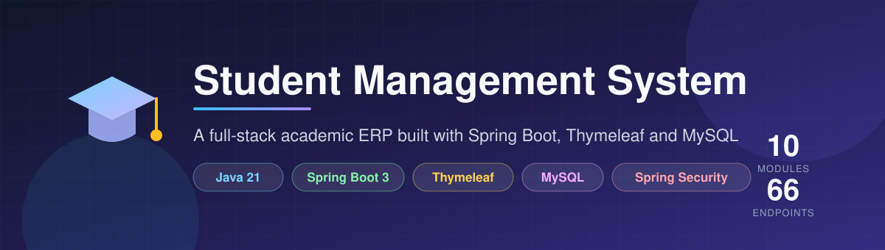
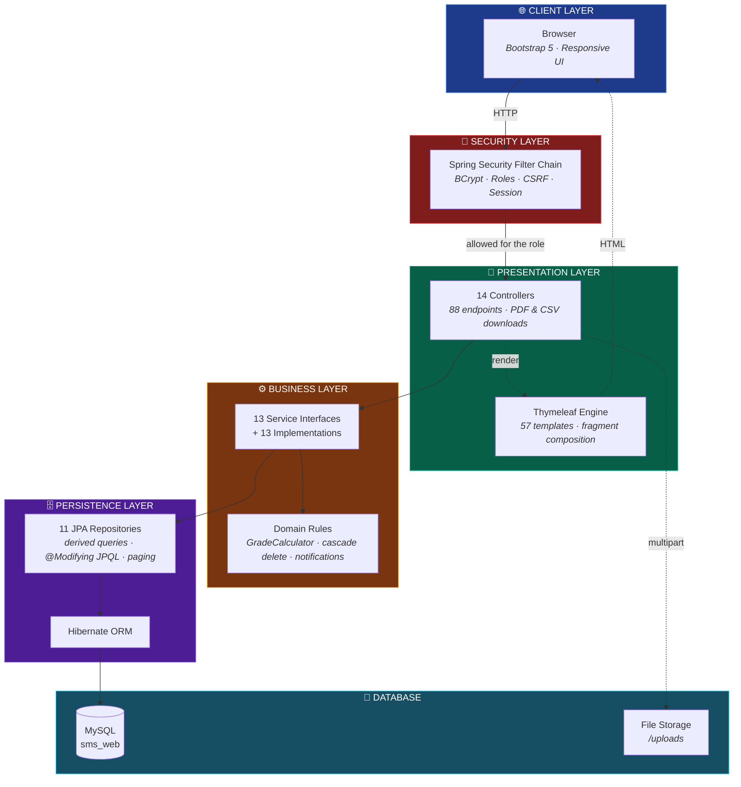
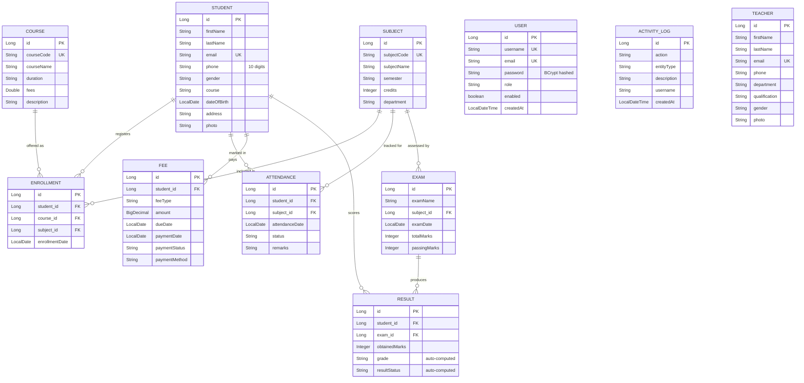
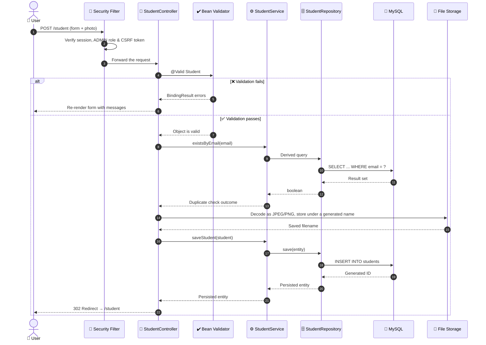
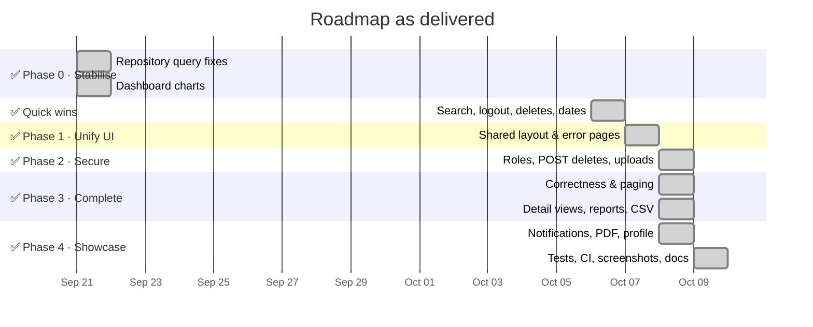
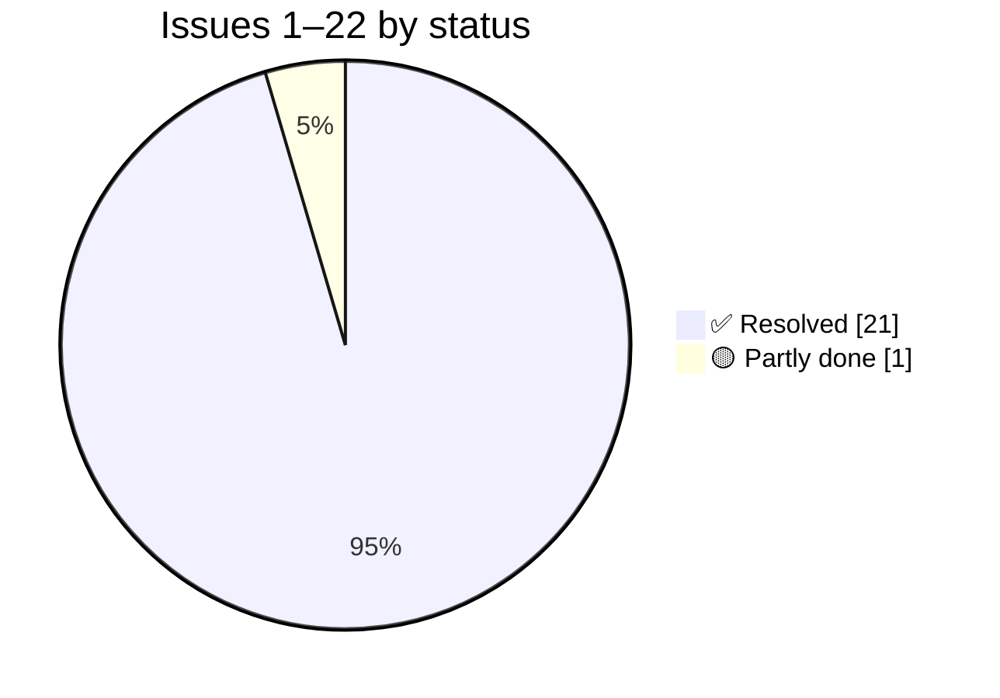

<div align="center">



<br/>


<br/>

[](https://github.com/anurag-joshi-1403/StudentManagementSystem/actions/workflows/ci.yml)


### 🎓 A full-stack academic ERP for managing students, faculty, academics and finance.

**Project Roadmap & Engineering Plan** · *Last verified against source: 9 Oct 2026*

</div>

---

## 📑 Table of Contents

| | Section | | Section |
|---|---|---|---|
| 🎯 | [Project Overview](#-project-overview) | 🗺️ | [Development Roadmap](#️-development-roadmap) |
| 🧰 | [Tech Stack](#-tech-stack) | 🧪 | [Engineering Backlog](#-engineering-backlog) |
| 🏛️ | [System Architecture](#️-system-architecture) | 🚀 | [Getting Started](#-getting-started) |
| 🗃️ | [Database Design](#️-database-design) | 🔮 | [Future Scope](#-future-scope) |
| 🔄 | [Request Lifecycle](#-request-lifecycle) | 🎓 | [What This Project Demonstrates](#-what-this-project-demonstrates) |
| ✅ | [Feature Matrix](#-feature-matrix) | 👤 | [Author](#-author) |

---

## 🎯 Project Overview

> A **Spring Boot MVC** web application that digitises the day-to-day administration of an educational
> institution — from student records and faculty management through to enrollment, attendance,
> examinations, results and fee collection.

<table>
<tr>
<td width="50%" valign="top">

**📦 What's inside**

- 🔐 BCrypt login with **Admin / Teacher / Student** roles and user admin
- 👨‍🎓 Student & faculty records with validated photo upload
- 📚 Course and subject catalogue with unique codes
- 📝 Enrollment linking students ↔ courses ↔ subjects
- 🗓️ Attendance, daily or **bulk** for a whole class, with a 75% report
- 💰 Fees with printable receipts, **PDF** and overdue flags
- 🧾 Exam schedule, results with pass rates
- 🏆 **Automatic grading** and a marksheet with **PDF**
- 📥 CSV import and export · 🔔 live notifications · 📰 activity log
- 🧪 55 tests and GitHub Actions CI

</td>
<td width="50%" valign="top">

**📐 By the numbers**

| Metric | Count |
|---|:---:|
| Record modules + auth | `9` + `1` |
| HTTP endpoints | `88` |
| JPA entities | `11` |
| Repositories | `11` |
| Service interfaces / impls | `13` / `13` |
| Thymeleaf templates | `57` |
| Automated tests | `55` |
| Lines of Java | `7,423` |

</td>
</tr>
</table>

---

## 🧰 Tech Stack

<div align="center">

| Layer | Technology | Purpose |
|:---:|---|---|
| ☕ **Language** | `Java 21` | Modern LTS runtime |
| 🍃 **Framework** | `Spring Boot 3.5.16` | Application backbone, auto-configuration |
| 🔐 **Security** | `Spring Security 6` | Authentication, BCrypt, session management |
| 🗄️ **Persistence** | `Spring Data JPA` + `Hibernate` | ORM and derived query methods |
| 🐬 **Database** | `MySQL 8.0` | Relational data store (`sms_web`) |
| 🎨 **View Layer** | `Thymeleaf` + `Bootstrap 5` | Server-rendered UI with fragment composition |
| ✔️ **Validation** | `Jakarta Bean Validation` | Declarative constraint enforcement, forms and CSV rows |
| 📄 **Documents** | `OpenPDF 3` · `Apache Commons CSV` | Marksheet and receipt PDFs · CSV import and export |
| 🧪 **Testing** | `JUnit 5` · `Mockito` · `H2` | Unit, repository and security tests without MySQL |
| ⚙️ **CI** | `GitHub Actions` | Runs the tests on every push |
| 🛠️ **Build** | `Maven` | Dependency management (wrapper included) |

</div>

---

## 🏛️ System Architecture

A textbook **layered MVC architecture** — each layer talks only to the one beneath it, keeping
persistence concerns out of the controllers and HTTP concerns out of the services.



---

## 🗃️ Database Design

Eleven entities with **nine foreign-key relationships**, modelling the full academic lifecycle from
admission through to results, plus a standalone activity log.



> 💡 **Referential integrity is handled in the service layer.** Deleting a Student transactionally clears
> its Attendance, Enrollment, Fee and Result rows before removing the parent — no orphaned foreign keys.
> Subject, Course and Exam deletes clear their own dependent rows the same way, and `DeleteCascadeTest`
> checks all four. Codes, emails and enrollments (student, course, subject) are unique in the database.

---

## 🔄 Request Lifecycle

How a single request — creating a student with a photo — travels through the stack:



---

## ✅ Feature Matrix

<div align="center">

| # | Module | Backend | UI | Highlights | Status |
|:---:|---|:---:|:---:|---|:---:|
| 1 | 🔐 **Authentication** | ✅ | ✅ | BCrypt · 3 roles · seeded admin · profile & password · user admin | `████████████` **100%** |
| 2 | 👨‍🎓 **Student** | ✅ | ✅ | CRUD · paged search · photo · marksheet + PDF · attendance % · CSV | `████████████` **100%** |
| 3 | 👨‍🏫 **Teacher** | ✅ | ✅ | CRUD · 4-field search · photo · unique email | `████████████` **100%** |
| 4 | 📚 **Course** | ✅ | ✅ | CRUD · detail · unique code | `████████████` **100%** |
| 5 | 📖 **Subject** | ✅ | ✅ | CRUD · detail with its exams · unique code | `████████████` **100%** |
| 6 | 📝 **Enrollment** | ✅ | ✅ | 3-way mapping · detail · no duplicates | `████████████` **100%** |
| 7 | 💰 **Fee** | ✅ | ✅ | Printable receipt · PDF · overdue flags · CSV export | `████████████` **100%** |
| 8 | 🗓️ **Attendance** | ✅ | ✅ | Keyword + date filter · bulk entry · 75% report | `████████████` **100%** |
| 9 | 🧾 **Exam** | ✅ | ✅ | Schedule by month · results with pass rate | `████████████` **100%** |
| 10 | 🏆 **Result** | ✅ | ✅ | **Auto grade + pass/fail engine** · marks ≤ total | `████████████` **100%** |
| 11 | 📊 **Dashboard** | ✅ | ✅ | Real-data stat cards · Chart.js · live notifications · recent activity | `████████████` **100%** |

</div>

### 🏅 Engineering highlights already shipped

<table>
<tr>
<td width="33%" valign="top">

**🔐 Security Foundation**

`SecurityConfig` with BCrypt, a custom `UserDetailsService`, Admin / Teacher / Student URL rules, POST-only changes with CSRF, and `sec:authorize` in every template.

</td>
<td width="33%" valign="top">

**🔗 Transactional Integrity**

Cascade deletes using `@Transactional` + `@Modifying` bulk JPQL, so removing a parent record never leaves orphaned foreign keys behind.

</td>
<td width="33%" valign="top">

**🧮 Business Logic Engine**

`GradeCalculator` derives pass/fail from each exam's own threshold and a six-band grade that can't contradict it; the marksheet reuses it for the overall grade.

</td>
</tr>
<tr>
<td valign="top">

**🎨 Component-Based UI**

Every page renders through `layout.html`, composing `sidebar`, `navbar`, `footer` and `notification` fragments, with 11 hand-written CSS files and print styles.

</td>
<td valign="top">

**🔍 Search & Pagination**

One paged query per module: multi-field `ContainingIgnoreCase` search or an AND-semantics `@Query`, 5 per page, sorted so rows can't shift.

</td>
<td valign="top">

**📤 File Upload Pipeline**

Photos decoded as real JPEG/PNG, capped at 2 MB, stored under generated names, and served through a `WebMvcConfigurer` handler behind login.

</td>
</tr>
</table>

---

## 🗺️ Development Roadmap

<div align="center">



</div>

### ✅ Phase 0 — Stabilise the Build · **COMPLETE**

> **Completed 21 Sep 2026** · *Two repository defects were aborting application startup.*

Both defects lived in one file — [`EnrollmentRepository.java`](Student-Management-System-web/src/main/java/com/anurag/sms/repository/EnrollmentRepository.java)

**1️⃣ Invalid derived query** — *resolved*

`findTop5ByOrderByAttendanceDateDesc()` declared `List<Attendance>` on an **Enrollment** repository and
sorted by a property `Enrollment` doesn't own. Spring Data validates method names eagerly at bootstrap, so
this one unused method aborted the entire application context. Removed, along with its now-unused import.

**2️⃣ JPQL targeting the wrong entity** — *resolved*

```diff
- @Query("DELETE FROM Attendance a WHERE a.subject.id = :subjectId")
+ @Query("DELETE FROM Enrollment e WHERE e.subject.id = :subjectId")
```

As written, subject deletion cleared attendance twice and never cleared enrollments — a guaranteed
foreign-key violation.

**✔️ Verified** — `mvnw clean test` → `Tests run: 1, Failures: 0, Errors: 0` · application boots on `:8080`
with 68 request mappings registered · `/login` returns `200` · unauthenticated `/student` correctly
redirects with `302`.

### ✅ Phase 1 — Make It Feel Like One Application · **COMPLETE**

> **Completed 7 Oct 2026** ([Task Board](TASKS.md) Stage B) · *The single biggest visual payoff available.*

Only `DashboardController` used to render through `layout/layout.html`, so clicking **Students** from the
dashboard made the whole sidebar and navbar disappear. Every page now goes through `LayoutView`.

- [x] 🎨 **Adopt the global layout everywhere** — each view is a `th:fragment="content"` rendered into
      `"layout/layout"`, all 9 modules included.
- [x] 📌 **Pin a single Bootstrap version** — `5.3.8` everywhere.
- [x] 👤 **Bind the navbar to the real session user** via `sec:authentication="name"` instead of the
      hardcoded *"Admin User"*.
- [x] 🧭 **Highlight the active sidebar link** — `class="active"` is currently pinned to Dashboard.
- [x] 🛡️ **Add `@ControllerAdvice`** plus styled `403`, `404`, `409`, `413` and `500` pages, replacing Whitelabel error output.

**✔️ Definition of done** — the shell survives every navigation · bad IDs render a designed 404.

### ✅ Phase 2 — Security & Data Integrity · **COMPLETE** *(one chore deferred)*

> **Completed 8 Oct 2026** (Stage C) · *What turns a demo into something defensible in an interview.*

- [x] 🔑 **Role-based access control** — `ADMIN` / `TEACHER` / `STUDENT` with `.hasRole(...)` route rules,
      `sec:authorize` on every button, and the first admin seeded from environment variables.
- [x] 🚫 **Convert deletes from GET to POST** — all 9 lists use POST forms with the CSRF token; a GET
      delete gets `405`.
- [x] 📎 **Harden file upload** — images decoded server-side, 2 MB cap, generated names, all in
      `FileUploadUtil`; a replaced photo is deleted only after the save succeeds.
- [x] 🔒 **Externalise database credentials** to `${DB_PASSWORD}` *(6 Oct 2026)*
- [ ] 🔑 **Rotate the old password**, which is still in git history *(deferred: other local projects share the MySQL `root` account)*
- [x] 🔇 **Move `show-sql` and `DEBUG` logging** into an `application-dev.properties` profile.
- [x] 🧹 **Untrack `uploads/`** — in `.gitignore`, removed with `git rm --cached`.

**✔️ Definition of done** — a student account receives `403` on admin routes · disguised executables are
rejected on upload · no credentials in source control.

### ✅ Phase 3 — Complete the Feature Set · **COMPLETE**

> **Completed 8 Oct 2026** (Stages D and E)

<table>
<tr>
<td width="50%" valign="top">

**🔧 Correctness**

- [x] ~~`getTotalFees()` returns a record count, not a money sum~~ — `getTotalFeeAmount()` now sums `amount`
- [x] ~~`getUpcomingExams()` has no date filter~~ — now filters on `examDate >= today`
- [x] ~~Search bypasses pagination in all 9 modules~~ — one paged query per module
- [x] ~~Uniqueness only on create~~ — database constraints, checked on edit too
- [x] ~~Marks above the total, negative fees, "Pass · F"~~ — cross-field checks and one `GradeCalculator`
- [x] ~~Add `@Valid` to Exam and Result controllers~~ — both forms now re-render with field errors instead of a 500 page
- [x] ~~Replace the `LocalDate.of(1900,1,1)` null-date sentinel~~ — attendance and exam search use a nullable `@Query` that ANDs keyword and date

</td>
<td width="50%" valign="top">

**✨ New capability**

- [x] 📄 Detail views for the 6 remaining modules
- [x] 🎓 **Student marksheet** — all results, percentage, overall grade
- [x] 🧾 **Printable fee receipt** and overdue flags
- [x] 📈 **Attendance percentage** per student, plus a 75% report
- [x] 📅 **Exam schedule** by month
- [x] ⚡ **Bulk attendance entry** — mark an entire class in one form
- [x] 📥 **CSV import** — validated row by row, with a report
- [x] 📤 **CSV export** for student and fee lists

</td>
</tr>
</table>

### ✅ Phase 4 — Showcase Polish · **COMPLETE**

> **Completed 8–9 Oct 2026** (Stage F) · *The layer recruiters actually see first.*

- [x] 📊 **Chart.js dashboard** — start with the gender split; `maleStudents` and `femaleStudents` are
      **already computed and on the model**, just never rendered. Then fee collection trends and
      enrollments per course.
- [x] 🔔 **Live notifications** — overdue fees, students under 75% and exams this week, built from real data.
- [x] 📰 **Recent-activity feed** — an audit log of creates, updates, deletes and imports.
- [x] 🖨️ **PDF export** for marksheets and receipts (OpenPDF).
- [x] 👤 **User profile page** with change-password, and **admin user management**.
- [x] 🧪 **Test suite** — 55 tests: grade boundaries, cascade deletes, `@WebMvcTest` security, `@DataJpaTest` search.
- [x] ⚙️ **CI** — GitHub Actions runs the tests on every push.
- [x] 📸 **README with screenshots** and setup instructions.

---

## 🧪 Engineering Backlog

> Every non-trivial codebase carries debt. What matters professionally is whether it's **tracked and
> triaged** — this register is maintained deliberately, with file references and an owning phase for each item.
> Issues found after 21 Sep (#23 onward, now up to #37) are tracked in [project_analysis.md](project_analysis.md#-engineering-backlog).
> Of this register's 22 items, **21 are resolved**; only the password rotation (#5) is left.

<details>
<summary><b>✅ Resolved (21 items)</b></summary>

<br/>

| # | Issue | Location | Resolved |
|:---:|---|---|:---:|
| 1 | Invalid derived query aborted Spring context at startup | `EnrollmentRepository.java:22` | `21 Sep 2026` |
| 2 | `deleteBySubjectId` targeted the wrong entity → FK violation | `EnrollmentRepository.java:29-32` | `21 Sep 2026` |
| 9 | "Total Fees" displayed a record count, not a currency sum | `FeeServiceImpl.java` | `21 Sep 2026` |
| 10 | "Upcoming Exams" listed the 5 oldest exams — no date filter | `ExamServiceImpl.java` | `21 Sep 2026` |
| 12 | Exam and Result forms lacked `@Valid`, so invalid input reached Hibernate and showed a 500 page | `ExamController.java` · `ResultController.java` | `6 Oct 2026` |
| 13 | Magic-date sentinel `1900-01-01` stood in for "no date" in search | `AttendanceServiceImpl.java` · `ExamServiceImpl.java` | `6 Oct 2026` |
| 14 | Navbar hardcoded "Admin User" regardless of session | `common/navbar.html` | `21 Sep 2026` |
| 16 | Gender statistics computed but never rendered | `stats-cards.html` · `charts.html` | `21 Sep 2026` |
| 21 | `footer.css` contained a copy of `footer.html` — footer rendered unstyled | `static/css/footer.css` | `21 Sep 2026` |
| 22 | `welcome.css` targeted markup that did not exist; live clock in `dashboard.js` had no elements to update | `welcome.css` · `welcome.html` | `21 Sep 2026` |
| 3 | No role enforcement — every user had full destructive access | Admin / Teacher / Student rules, seeded admin | `8 Oct 2026` |
| 4 | Deletes exposed as GET links — prefetch/CSRF exposure | POST forms on all 9 lists | `8 Oct 2026` |
| 6 | Only the dashboard used the shared layout | Every page through `LayoutView` | `7 Oct 2026` |
| 7 | File upload lacked type/size/filename validation; orphaned old files | `FileUploadUtil` | `8 Oct 2026` |
| 8 | No global exception handler — Whitelabel error pages | `GlobalExceptionHandler` + styled pages | `7 Oct 2026` |
| 11 | Search results weren't paginated | One paged query per module | `8 Oct 2026` |
| 15 | Notifications were three hardcoded placeholder items | `NotificationService` + `NotificationAdvice` | `8 Oct 2026` |
| 17 | Bootstrap version drift (`5.3.3` vs `5.3.8`) | `5.3.8` everywhere | `7 Oct 2026` |
| 18 | Six empty stub classes (3 DTOs + 3 utilities) | Implemented or deleted | `8 Oct 2026` |
| 19 | `uploads/` directory committed to version control | `.gitignore` + `git rm --cached` | `8 Oct 2026` |
| 20 | `webConfig` broke Java class naming convention | Renamed `WebConfig` | `7 Oct 2026` |

</details>

<details open>
<summary><b>🔴 Critical, partly done (1 item)</b></summary>

<br/>

| # | Issue | Location | Status |
|:---:|---|---|:---:|
| 5 | Database password committed in plaintext. Read from `${DB_PASSWORD}` since 6 Oct 2026, but the old value is still in git history and not yet rotated (task A4, deferred: other local projects share the account) | `application.properties` history | 🟡 Env var done |

</details>

<div align="center">



</div>

---

## 🚀 Getting Started

```bash
# 1️⃣  Clone the repository
git clone https://github.com/anurag-joshi-1403/StudentManagementSystem.git
cd StudentManagementSystem/Student-Management-System-web

# 2️⃣  Create the database
mysql -u root -p -e "CREATE DATABASE sms_web;"

# 3️⃣  Configure credentials (avoid committing secrets)
export DB_USERNAME=root
export DB_PASSWORD=your_password
export ADMIN_USERNAME=admin ADMIN_PASSWORD=choose_one   # first admin, created once at startup

# 4️⃣  Build and run
./mvnw clean install      # also runs the 55 tests, which need no MySQL
./mvnw spring-boot:run
```

<div align="center">

🌐 **`http://localhost:8080`** → sign in as the admin → dashboard

</div>

> ✅ **Verified working** — boots against MySQL 8.0 on Java 21+ with 88 endpoints; `./mvnw test` passes on H2.

---

## 🔮 Future Scope

Deliberately parked — these are **production** concerns rather than portfolio concerns. Listing them shows
the trade-off was decided rather than overlooked.

| Area | Item | Rationale for deferring |
|:---:|---|---|
| 🗄️ | Flyway / Liquibase migrations | `ddl-auto=update` is adequate for a demo; migrations matter once real data must survive schema change |
| 🔌 | REST API + OpenAPI/Swagger | This is a server-rendered MVC app; an API is a separate product surface |
| 🐳 | Docker / Kubernetes | Adds setup friction for a reviewer who just wants to run it |
| 🚢 | Continuous delivery | CI now runs the tests on every push; deploying needs a host |
| 📡 | Monitoring & metrics | An in-app activity log exists; there is no production traffic to observe yet |
| 📧 | Email / SMS notifications | In-app notifications exist; sending them out needs external service credentials |
| 🔑 | Forgot-password flow | Needs a mail server; change-password covers the demo need |

<details>
<summary><b>📐 Known schema debt (documented, intentionally unscheduled)</b></summary>

<br/>

- **`Student.course` is a `String`, not a foreign key** to `Course` — a student's course is free text that
  can drift from the actual catalogue. `Enrollment` models this correctly with a real relationship.
- **`Subject` has no relationship to `Course`** — subjects currently float free rather than belonging to a
  programme.

Both are genuine modelling weaknesses. Fixing either requires a data migration plus form and query rework
across several modules — a larger undertaking than a polish pass, so they are recorded here rather than
scheduled.

</details>

---

## 🎓 What This Project Demonstrates

<div align="center">

| Competency | Evidence in this codebase |
|---|---|
| 🏛️ **Layered architecture** | Strict controller → service → repository separation across 9 record modules |
| 🔗 **Relational modelling** | 11 entities, 9 foreign-key relationships, 7 unique constraints, transactional cascade deletes |
| 🔐 **Application security** | Three roles, URL rules plus `sec:authorize`, CSRF on every change, hardened uploads |
| 🗄️ **Data access** | Derived queries, `@Modifying` JPQL, `SELECT new` summaries, `Pageable` paging |
| ✔️ **Validation** | Jakarta constraints, cross-field checks, the same rules on every CSV row |
| 🎨 **Frontend composition** | Thymeleaf fragments, one layout, print styles, hand-authored responsive CSS |
| 🧮 **Business logic** | Grading, marksheets, attendance %, overdue fees, notifications from live data |
| 📄 **Documents** | PDF marksheets and receipts, Excel-safe CSV export, validated import |
| 🧪 **Testing & CI** | 55 tests across unit, `@DataJpaTest`, `@SpringBootTest` and `@WebMvcTest`, run by GitHub Actions |
| 🔍 **Code review skill** | A maintained 37-item backlog with severity triage, 31 resolved |

</div>

---

## 👤 Author

<div align="center">

**Anurag Joshi**

[](https://github.com/anurag-joshi-1403)

<sub>💼 Add your LinkedIn, portfolio and email badges here before sharing this repository.</sub>

<br/><br/>

⭐ *If this project is useful to you, consider starring the repository.*

<br/>

**📘 Companion document:** [project_analysis.md](project_analysis.md) — detailed module-by-module inventory

</div>
