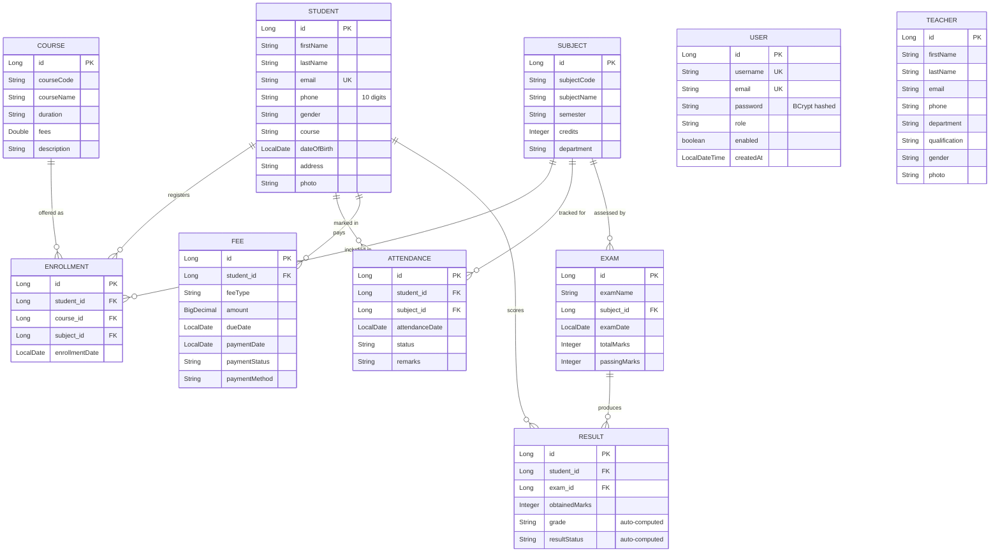
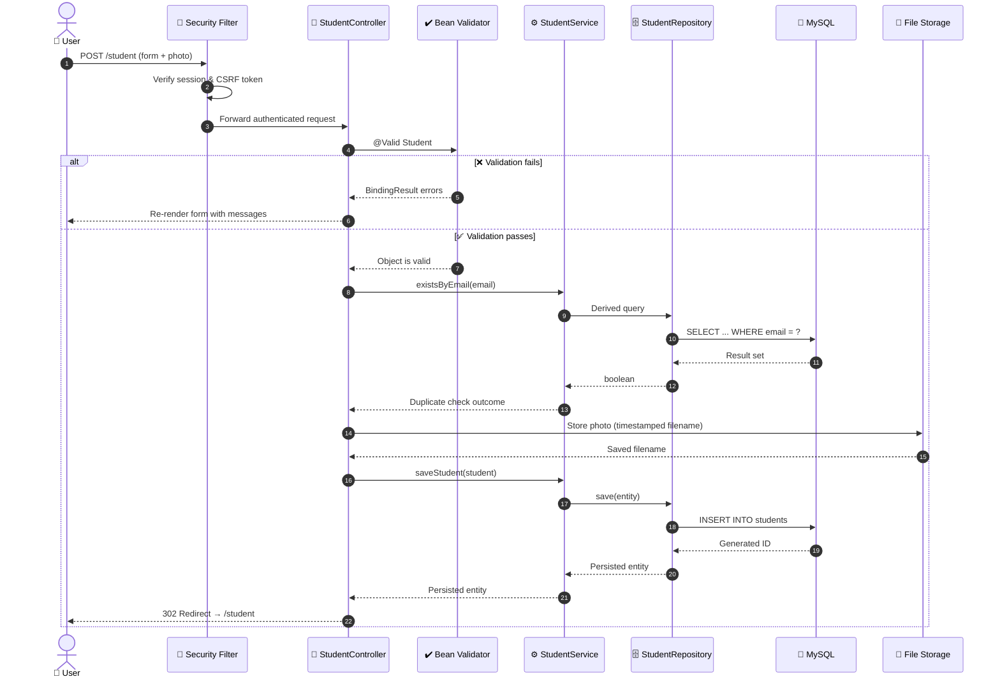
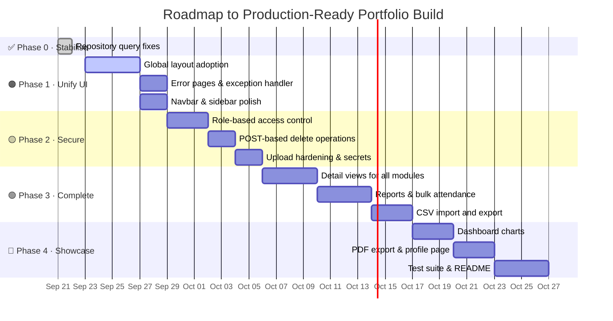
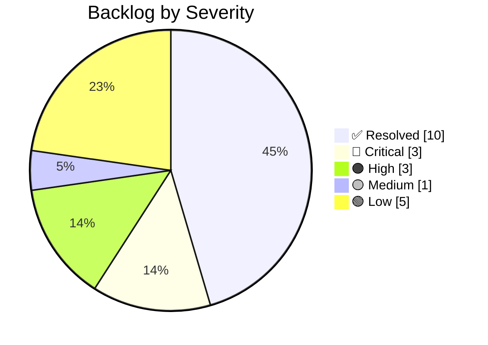

<div align="center">


<br/>


<br/>


### 🎓 A full-stack academic ERP for managing students, faculty, academics and finance.

**Project Roadmap & Engineering Plan** · *Last verified against source: 7 Oct 2026*

</div>

---

## 📑 Table of Contents

| | Section | | Section |
|---|---|---|---|
| 🎯 | [Project Overview](#-project-overview) | 🗺️ | [Development Roadmap](#️-development-roadmap) |
| 🧰 | [Tech Stack](#-tech-stack) | 🧪 | [Engineering Backlog](#-engineering-backlog) |
| 🏛️ | [System Architecture](#️-system-architecture) | 🚀 | [Getting Started](#-getting-started) |
| 🗃️ | [Database Design](#️-database-design) | 🔮 | [Future Scope](#-future-scope) |
| 🔄 | [Request Lifecycle](#-request-lifecycle) | 🎓 | [What This Project Demonstrates](#-what-this-project-demonstrates) |
| ✅ | [Feature Matrix](#-feature-matrix) | 👤 | [Author](#-author) |

---

## 🎯 Project Overview

> A **Spring Boot MVC** web application that digitises the day-to-day administration of an educational
> institution — from student records and faculty management through to enrollment, attendance,
> examinations, results and fee collection.

<table>
<tr>
<td width="50%" valign="top">

**📦 What's inside**

- 🔐 Secure authentication with BCrypt password hashing
- 👨‍🎓 Student & faculty records with photo upload
- 📚 Course and subject catalogue management
- 📝 Enrollment linking students ↔ courses ↔ subjects
- 🗓️ Daily attendance tracking with date filters
- 💰 Fee collection with payment status tracking
- 🧾 Examination scheduling and result processing
- 🏆 **Automatic grade & pass/fail computation**
- 📊 Live dashboard with real-time statistics

</td>
<td width="50%" valign="top">

**📐 By the numbers**

| Metric | Count |
|---|:---:|
| Feature modules | `10` |
| REST endpoints | `66` |
| JPA entities | `10` |
| Repositories | `10` |
| Service classes | `21` |
| Thymeleaf views | `36` |
| Lines of Java | `4,512` |

</td>
</tr>
</table>

---

## 🧰 Tech Stack

<div align="center">

| Layer | Technology | Purpose |
|:---:|---|---|
| ☕ **Language** | `Java 21` | Modern LTS runtime |
| 🍃 **Framework** | `Spring Boot 3.5.16` | Application backbone, auto-configuration |
| 🔐 **Security** | `Spring Security 6` | Authentication, BCrypt, session management |
| 🗄️ **Persistence** | `Spring Data JPA` + `Hibernate` | ORM and derived query methods |
| 🐬 **Database** | `MySQL 8.0` | Relational data store (`sms_web`) |
| 🎨 **View Layer** | `Thymeleaf` + `Bootstrap 5` | Server-rendered UI with fragment composition |
| ✔️ **Validation** | `Jakarta Bean Validation` | Declarative constraint enforcement |
| 🛠️ **Build** | `Maven` | Dependency management (wrapper included) |

</div>

---

## 🏛️ System Architecture

A textbook **layered MVC architecture** — each layer talks only to the one beneath it, keeping
persistence concerns out of the controllers and HTTP concerns out of the services.


---

## 🗃️ Database Design

Ten entities with **nine foreign-key relationships**, modelling the full academic lifecycle from
admission through to results.



> 💡 **Referential integrity is handled in the service layer.** Deleting a Student transactionally clears
> its Attendance, Enrollment, Fee and Result rows before removing the parent — no orphaned foreign keys.
> Subject, Course and Exam deletes clear their own dependent rows the same way.

---

## 🔄 Request Lifecycle

How a single request — creating a student with a photo — travels through the stack:



---

## ✅ Feature Matrix

<div align="center">

| # | Module | Backend | UI | Highlights | Status |
|:---:|---|:---:|:---:|---|:---:|
| 1 | 🔐 **Authentication** | ✅ | ✅ | BCrypt hashing, duplicate username/email guards | `████████████` **100%** |
| 2 | 👨‍🎓 **Student** | ✅ | ✅ | CRUD · search · pagination · photo upload · detail view | `████████████` **100%** |
| 3 | 👨‍🏫 **Teacher** | ✅ | ✅ | CRUD · search · pagination · photo upload · detail view | `████████████` **100%** |
| 4 | 📚 **Course** | ✅ | ✅ | CRUD · search · pagination · duplicate-code guard | `████████████` **100%** |
| 5 | 📖 **Subject** | ✅ | ⚠️ | CRUD · search · pagination — *detail view pending* | `██████████░░` **85%** |
| 6 | 📝 **Enrollment** | ✅ | ⚠️ | 3-way relational mapping — *detail view pending* | `██████████░░` **85%** |
| 7 | 💰 **Fee** | ✅ | ⚠️ | CRUD · search · pagination — *receipt pending* | `█████████░░░` **80%** |
| 8 | 🗓️ **Attendance** | ✅ | ⚠️ | Keyword **+ date** filtering — *summary report pending* | `█████████░░░` **80%** |
| 9 | 🧾 **Exam** | ✅ | ⚠️ | CRUD · search · pagination — *detail view pending* | `██████████░░` **85%** |
| 10 | 🏆 **Result** | ✅ | ⚠️ | **Auto grade + pass/fail engine** — *marksheet pending* | `█████████░░░` **80%** |
| 11 | 📊 **Dashboard** | ✅ | ✅ | Real-data stat cards, Chart.js analytics, live clock, empty states — *notifications still static* | `███████████░` **95%** |

</div>

### 🏅 Engineering highlights already shipped

<table>
<tr>
<td width="33%" valign="top">

**🔐 Security Foundation**

`SecurityConfig` with `BCryptPasswordEncoder`, custom `UserDetailsService`, form login, logout handling, and a public allowlist for static assets.

</td>
<td width="33%" valign="top">

**🔗 Transactional Integrity**

Cascade deletes using `@Transactional` + `@Modifying` bulk JPQL, so removing a parent record never leaves orphaned foreign keys behind.

</td>
<td width="33%" valign="top">

**🧮 Business Logic Engine**

`ResultServiceImpl` computes percentage, assigns letter grades across six bands, and derives pass/fail from each exam's own threshold.

</td>
</tr>
<tr>
<td valign="top">

**🎨 Component-Based UI**

`layout.html` composing reusable `sidebar`, `navbar`, `footer` and `notification` fragments — plus 8 hand-written CSS modules.

</td>
<td valign="top">

**🔍 Search & Pagination**

Spring Data derived queries with multi-field `ContainingIgnoreCase` search and `PageRequest`-driven pagination across all modules.

</td>
<td valign="top">

**📤 File Upload Pipeline**

Multipart photo upload with collision-safe timestamped filenames, served back through a custom `WebMvcConfigurer` resource handler.

</td>
</tr>
</table>

---

## 🗺️ Development Roadmap

<div align="center">



</div>

### ✅ Phase 0 — Stabilise the Build · **COMPLETE**

> **Completed 21 Sep 2026** · *Two repository defects were aborting application startup.*

Both defects lived in one file — [`EnrollmentRepository.java`](Student-Management-System-web/src/main/java/com/anurag/sms/repository/EnrollmentRepository.java)

**1️⃣ Invalid derived query** — *resolved*

`findTop5ByOrderByAttendanceDateDesc()` declared `List<Attendance>` on an **Enrollment** repository and
sorted by a property `Enrollment` doesn't own. Spring Data validates method names eagerly at bootstrap, so
this one unused method aborted the entire application context. Removed, along with its now-unused import.

**2️⃣ JPQL targeting the wrong entity** — *resolved*

```diff
- @Query("DELETE FROM Attendance a WHERE a.subject.id = :subjectId")
+ @Query("DELETE FROM Enrollment e WHERE e.subject.id = :subjectId")
```

As written, subject deletion cleared attendance twice and never cleared enrollments — a guaranteed
foreign-key violation.

**✔️ Verified** — `mvnw clean test` → `Tests run: 1, Failures: 0, Errors: 0` · application boots on `:8080`
with 68 request mappings registered · `/login` returns `200` · unauthenticated `/student` correctly
redirects with `302`.

### 🟠 Phase 1 — Make It Feel Like One Application

> **⏱️ ~1 week** · **Priority: High** · *The single biggest visual payoff available.*

Only `DashboardController` currently renders through `layout/layout.html`. Every other page is a standalone
HTML document — so clicking **Students** from the dashboard makes the whole sidebar and navbar disappear.

- [ ] 🎨 **Adopt the global layout everywhere** — convert each view to a `th:fragment="content"` and return
      `"layout/layout"` with the fragment name on the model. `DashboardController` is the working reference;
      apply that pattern to the 9 remaining modules (~30 templates).
- [ ] 📌 **Pin a single Bootstrap version** — templates currently mix `5.3.3` and `5.3.8`.
- [x] 👤 **Bind the navbar to the real session user** via `sec:authentication="name"` instead of the
      hardcoded *"Admin User"*.
- [x] 🧭 **Highlight the active sidebar link** — `class="active"` is currently pinned to Dashboard.
- [ ] 🛡️ **Add `@ControllerAdvice`** plus styled `404` and `500` pages, replacing Whitelabel error output.

**✔️ Definition of done** — the shell survives every navigation · bad IDs render a designed 404.

### 🟡 Phase 2 — Security & Data Integrity

> **⏱️ ~1 week** · **Priority: High** · *What turns a demo into something defensible in an interview.*

- [ ] 🔑 **Role-based access control** — registration hardcodes `ROLE_STUDENT` and the filter chain only
      requires `.anyRequest().authenticated()`. Introduce `ADMIN` / `TEACHER` / `STUDENT`, add
      `.hasRole(...)` route rules, and gate sidebar entries with `sec:authorize`.
- [ ] 🚫 **Convert deletes from GET to POST** — all 9 list views destroy data through `<a href>` links,
      which browser prefetch or a crawler can trigger and which CSRF protection does not cover.
- [ ] 📎 **Harden file upload** — add content-type allowlisting, size caps and filename sanitisation;
      centralise the duplicated logic into the `FileUploadUtil` stub and delete replaced photos.
- [x] 🔒 **Externalise database credentials** to `${DB_PASSWORD}` *(6 Oct 2026)*
- [ ] 🔑 **Rotate the old password**, which is still in git history *(deferred: other local projects share the MySQL `root` account)*
- [ ] 🔇 **Move `show-sql` and `DEBUG` logging** into an `application-dev.properties` profile.
- [ ] 🧹 **Untrack `uploads/`** — add to `.gitignore` and `git rm --cached`.

**✔️ Definition of done** — a student account receives `403` on admin routes · disguised executables are
rejected on upload · no credentials in source control.

### 🟢 Phase 3 — Complete the Feature Set

> **⏱️ ~1–2 weeks** · **Priority: Medium**

<table>
<tr>
<td width="50%" valign="top">

**🔧 Correctness**

- [x] ~~`getTotalFees()` returns a record count, not a money sum~~ — `getTotalFeeAmount()` now sums `amount`
- [x] ~~`getUpcomingExams()` has no date filter~~ — now filters on `examDate >= today`
- [ ] Search bypasses pagination in all 9 modules — return `Page<T>` instead of `List<T>`
- [x] ~~Add `@Valid` to Exam and Result controllers~~ — both forms now re-render with field errors instead of a 500 page
- [x] ~~Replace the `LocalDate.of(1900,1,1)` null-date sentinel~~ — attendance and exam search use a nullable `@Query` that ANDs keyword and date

</td>
<td width="50%" valign="top">

**✨ New capability**

- [ ] 📄 Detail views for the 6 remaining modules
- [ ] 🎓 **Student marksheet** — all results, percentage, overall grade
- [ ] 🧾 **Printable fee receipt**
- [ ] 📈 **Attendance percentage** per student
- [ ] ⚡ **Bulk attendance entry** — mark an entire class in one form *(highest usability win)*
- [ ] 📥 **CSV import** — sample data and a `CsvHelper` stub already exist
- [ ] 📤 **CSV export** for student and fee lists

</td>
</tr>
</table>

### 🔵 Phase 4 — Showcase Polish

> **⏱️ ~1 week** · **Priority: Low** · *The layer recruiters actually see first.*

- [x] 📊 **Chart.js dashboard** — start with the gender split; `maleStudents` and `femaleStudents` are
      **already computed and on the model**, just never rendered. Then fee collection trends and
      enrollments per course.
- [ ] 🔔 **Database-driven notifications** — the bell currently shows three hardcoded items.
- [ ] 🖨️ **PDF export** for marksheets and receipts (OpenPDF / iText).
- [ ] 👤 **User profile page** with change-password.
- [ ] 🧪 **Test suite** — unit tests for the grade-boundary logic and cascade deletes, `@WebMvcTest` slices
      for controllers, `@DataJpaTest` for custom queries.
- [ ] 📸 **README with screenshots** and setup instructions.

---

## 🧪 Engineering Backlog

> Every non-trivial codebase carries debt. What matters professionally is whether it's **tracked and
> triaged** — this register is maintained deliberately, with file references and an owning phase for each item.
> Issues found after 21 Sep (#23 onward) are tracked in [project_analysis.md](project_analysis.md#-engineering-backlog).

<details>
<summary><b>✅ Resolved (10 items)</b></summary>

<br/>

| # | Issue | Location | Resolved |
|:---:|---|---|:---:|
| 1 | Invalid derived query aborted Spring context at startup | `EnrollmentRepository.java:22` | `21 Sep 2026` |
| 2 | `deleteBySubjectId` targeted the wrong entity → FK violation | `EnrollmentRepository.java:29-32` | `21 Sep 2026` |
| 9 | "Total Fees" displayed a record count, not a currency sum | `FeeServiceImpl.java` | `21 Sep 2026` |
| 10 | "Upcoming Exams" listed the 5 oldest exams — no date filter | `ExamServiceImpl.java` | `21 Sep 2026` |
| 12 | Exam and Result forms lacked `@Valid`, so invalid input reached Hibernate and showed a 500 page | `ExamController.java` · `ResultController.java` | `6 Oct 2026` |
| 13 | Magic-date sentinel `1900-01-01` stood in for "no date" in search | `AttendanceServiceImpl.java` · `ExamServiceImpl.java` | `6 Oct 2026` |
| 14 | Navbar hardcoded "Admin User" regardless of session | `common/navbar.html` | `21 Sep 2026` |
| 16 | Gender statistics computed but never rendered | `stats-cards.html` · `charts.html` | `21 Sep 2026` |
| 21 | `footer.css` contained a copy of `footer.html` — footer rendered unstyled | `static/css/footer.css` | `21 Sep 2026` |
| 22 | `welcome.css` targeted markup that did not exist; live clock in `dashboard.js` had no elements to update | `welcome.css` · `welcome.html` | `21 Sep 2026` |

</details>

<details>
<summary><b>🔴 Critical (3 items)</b> — click to expand</summary>

<br/>

| # | Issue | Location | Phase |
|:---:|---|---|:---:|
| 3 | No role enforcement — every user has full destructive access | `SecurityConfig.java:48` · `UserServiceImpl.java:55` | `2` |
| 4 | Deletes exposed as GET links — prefetch/CSRF exposure | 9 `*-list.html` templates | `2` |
| 5 | Database password committed in plaintext. Read from `${DB_PASSWORD}` since 6 Oct 2026, but the old value is still in git history and not yet rotated | `application.properties` history | `2` |

</details>

<details>
<summary><b>🟠 High (3 items)</b></summary>

<br/>

| # | Issue | Location | Phase |
|:---:|---|---|:---:|
| 6 | Only the dashboard uses the shared layout | All non-dashboard controllers | `1` |
| 7 | File upload lacks type/size/filename validation; orphans old files | `StudentController.java:107` · `TeacherController.java:97` | `2` |
| 8 | No global exception handler — Whitelabel error pages | *(missing `@ControllerAdvice`)* | `1` |

</details>

<details>
<summary><b>🟡 Medium (1 item)</b></summary>

<br/>

| # | Issue | Location | Phase |
|:---:|---|---|:---:|
| 11 | Search results aren't paginated: all 9 search paths return a full `List` | 9 controllers | `3` |

</details>

<details>
<summary><b>🟢 Low (5 items)</b></summary>

<br/>

| # | Issue | Location | Phase |
|:---:|---|---|:---:|
| 15 | Notifications are three hardcoded placeholder items | `common/notification.html` | `4` |
| 17 | Bootstrap version drift (`5.3.3` vs `5.3.8`) | Various templates | `1` |
| 18 | Six empty stub classes (3 DTOs + 3 utilities) | `dto/` · `utility/` | `3–4` |
| 19 | `uploads/` directory committed to version control | `.gitignore` | `2` |
| 20 | `webConfig` breaks Java class naming convention | `config/webConfig.java` | `1` |

</details>

<div align="center">



</div>

---

## 🚀 Getting Started

```bash
# 1️⃣  Clone the repository
git clone https://github.com/anurag-joshi-1403/StudentManagementSystem.git
cd StudentManagementSystem/Student-Management-System-web

# 2️⃣  Create the database
mysql -u root -p -e "CREATE DATABASE sms_web;"

# 3️⃣  Configure credentials (avoid committing secrets)
export DB_USERNAME=root
export DB_PASSWORD=your_password

# 4️⃣  Build and run
./mvnw clean install
./mvnw spring-boot:run
```

<div align="center">

🌐 **`http://localhost:8080`** → register an account → sign in → dashboard

</div>

> ✅ **Verified working** — boots cleanly against MySQL 8.0 on Java 21+, registering 68 request mappings.

---

## 🔮 Future Scope

Deliberately parked — these are **production** concerns rather than portfolio concerns. Listing them shows
the trade-off was decided rather than overlooked.

| Area | Item | Rationale for deferring |
|:---:|---|---|
| 🗄️ | Flyway / Liquibase migrations | `ddl-auto=update` is adequate for a demo; migrations matter once real data must survive schema change |
| 🔌 | REST API + OpenAPI/Swagger | This is a server-rendered MVC app; an API is a separate product surface |
| 🐳 | Docker / Kubernetes | Adds setup friction for a reviewer who just wants to run it |
| 🔁 | CI/CD pipeline | Worth adding once the test suite carries real assertions |
| 📡 | Audit logging & monitoring | No production traffic to observe yet |
| 📧 | Email / SMS notifications | Requires external service credentials |
| 🔑 | Forgot-password flow | Needs a mail server; change-password covers the demo need |

<details>
<summary><b>📐 Known schema debt (documented, intentionally unscheduled)</b></summary>

<br/>

- **`Student.course` is a `String`, not a foreign key** to `Course` — a student's course is free text that
  can drift from the actual catalogue. `Enrollment` models this correctly with a real relationship.
- **`Subject` has no relationship to `Course`** — subjects currently float free rather than belonging to a
  programme.

Both are genuine modelling weaknesses. Fixing either requires a data migration plus form and query rework
across several modules — a larger undertaking than a polish pass, so they are recorded here rather than
scheduled.

</details>

---

## 🎓 What This Project Demonstrates

<div align="center">

| Competency | Evidence in this codebase |
|---|---|
| 🏛️ **Layered architecture** | Strict controller → service → repository separation across 10 modules |
| 🔗 **Relational modelling** | 10 entities, 9 foreign-key relationships, transactional cascade deletes |
| 🔐 **Application security** | Spring Security filter chain, BCrypt hashing, custom `UserDetailsService` |
| 🗄️ **Data access** | Derived query methods, `@Modifying` JPQL, `Pageable` pagination |
| ✔️ **Validation** | Declarative Jakarta constraints wired to `BindingResult` error rendering |
| 🎨 **Frontend composition** | Thymeleaf fragments, reusable layout, hand-authored responsive CSS |
| 🧮 **Business logic** | Percentage computation, six-band grading, exam-specific pass thresholds |
| 📤 **File handling** | Multipart upload with collision-safe naming and custom resource mapping |
| 🔍 **Code review skill** | A maintained 33-item backlog with severity triage and owning phases |

</div>

---

## 👤 Author

<div align="center">

**Anurag Joshi**

[](https://github.com/anurag-joshi-1403)

<sub>💼 Add your LinkedIn, portfolio and email badges here before sharing this repository.</sub>

<br/><br/>

⭐ *If this project is useful to you, consider starring the repository.*

<br/>

**📘 Companion document:** [project_analysis.md](project_analysis.md) — detailed module-by-module inventory

</div>
