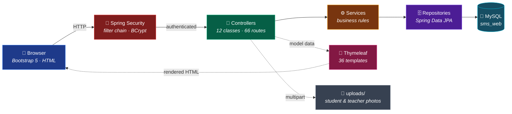
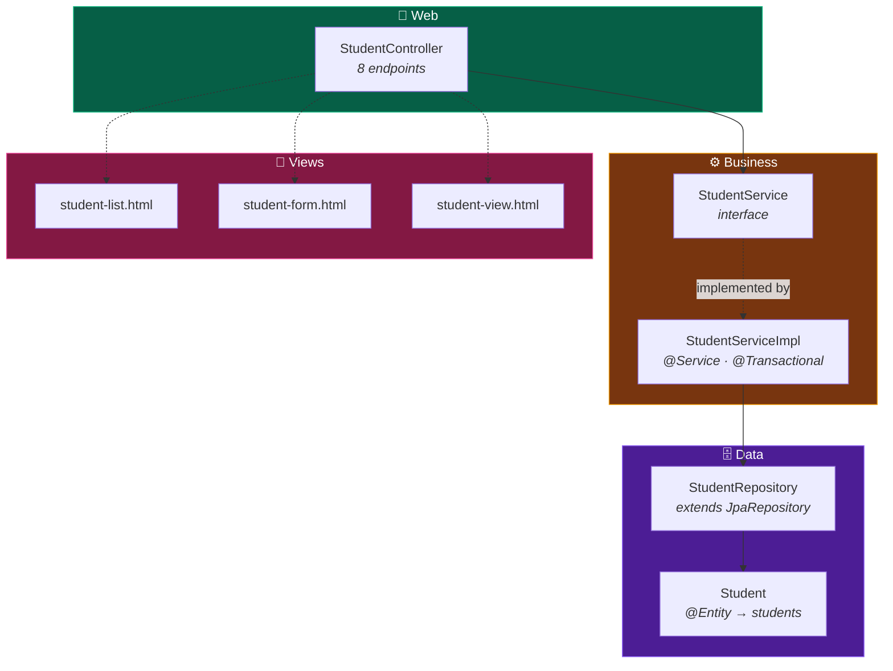
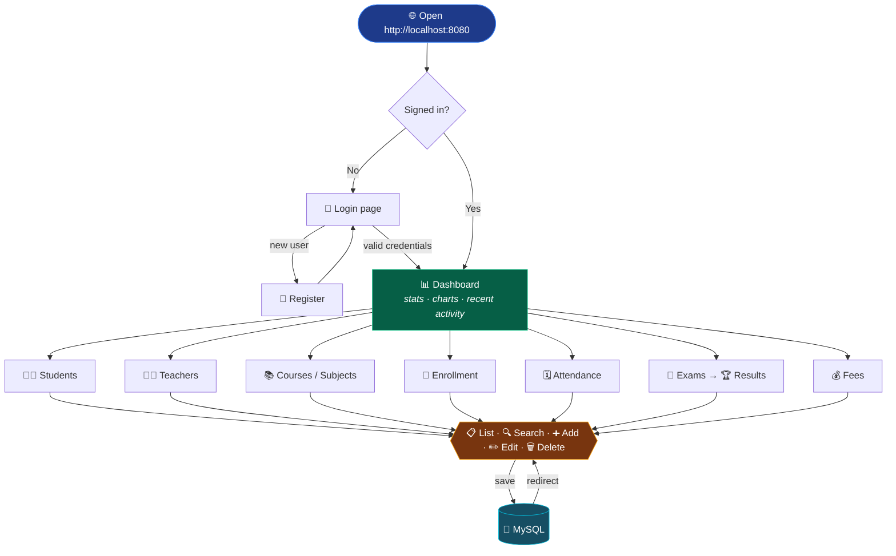
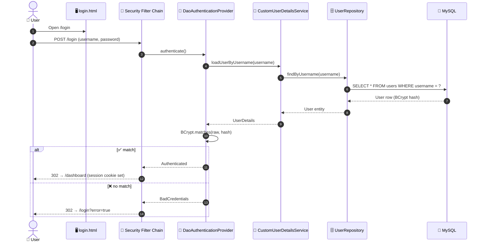
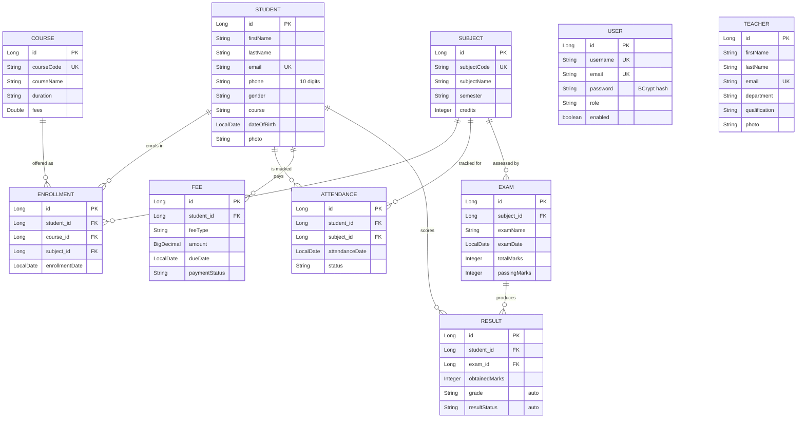
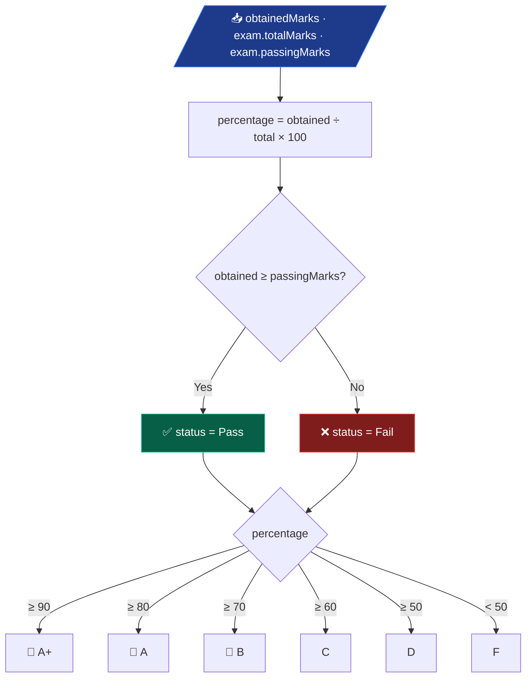

<div align="center">


<br/>


<br/>


<br/>

### 🎓 A full-stack web app that runs the daily administration of a college — students, teachers, courses, attendance, exams, results and fees — from one dashboard.

<br/>

[🚀 Quick Start](#-getting-started) · [🧱 Architecture](#-architecture) · [💾 Database](#-database-schema) · [📖 Keywords Explained](#-keywords-explained) · [🗺️ Roadmap](PROJECT_ROADMAP.md)

</div>

---

## 📑 Table of Contents

| | Section | | Section |
|:---:|---|:---:|---|
| 🎯 | [About the Project](#-about-the-project) | 🧮 | [Grade Engine](#-grade-engine) |
| ✨ | [Features](#-features) | 🔗 | [Data Integrity](#-data-integrity) |
| 🧰 | [Tech Stack](#-tech-stack) | 📁 | [Project Structure](#-project-structure) |
| 🧱 | [Architecture](#-architecture) | 🌐 | [Routes](#-routes) |
| 🧩 | [Anatomy of a Module](#-anatomy-of-a-module) | 🚀 | [Getting Started](#-getting-started) |
| 🧭 | [User Journey](#-user-journey) | 📖 | [Keywords Explained](#-keywords-explained) |
| 🔐 | [Login Flow](#-login-flow) | 📊 | [Project Status](#-project-status) |
| 💾 | [Database Schema](#-database-schema) | 👤 | [Author](#-author) |

---

## 🎯 About the Project

> **Student Management System (SMS)** is a server-rendered **Spring Boot MVC** application.
> An administrator logs in, lands on a live dashboard, and manages every academic record of the
> institution through ten CRUD modules that share one layout, one security layer and one database.

<table>
<tr>
<td width="50%" valign="top">

**🧠 Why it exists**

Colleges still track admissions, attendance and fees across spreadsheets and paper. This project
puts all of it behind a single login with searchable, paginated screens and a dashboard that
reads real numbers from the database — not hardcoded placeholders.

</td>
<td width="50%" valign="top">

**📐 By the numbers**

| Metric | Count |
|---|:---:|
| Feature modules | `10` |
| HTTP endpoints | `66` |
| JPA entities / repositories | `10` / `10` |
| Service classes | `21` |
| Thymeleaf templates | `36` |
| Lines of Java | `4.4k` |

</td>
</tr>
</table>

---

## ✨ Features

<div align="center">

| | | |
|:---:|:---:|:---:|
| 🔐 **Secure Login**<br/><sub>BCrypt hashing · session auth · duplicate guards</sub> | 👨‍🎓 **Students**<br/><sub>CRUD · photo upload · search · pagination</sub> | 👨‍🏫 **Teachers**<br/><sub>CRUD · department · qualification · photo</sub> |
| 📚 **Courses & Subjects**<br/><sub>Catalogue with codes, credits, semesters</sub> | 📝 **Enrollment**<br/><sub>Links Student ↔ Course ↔ Subject</sub> | 🗓️ **Attendance**<br/><sub>Daily marking · keyword + date filter</sub> |
| 🧾 **Exams**<br/><sub>Schedule with total & passing marks</sub> | 🏆 **Results**<br/><sub>**Auto grade** & pass/fail computation</sub> | 💰 **Fees**<br/><sub>Paid / pending tracking · totals</sub> |
| 📊 **Live Dashboard**<br/><sub>Real stat cards · Chart.js analytics · live clock</sub> | 🔍 **Search Everywhere**<br/><sub>Multi-field case-insensitive search</sub> | 🔗 **Safe Deletes**<br/><sub>Transactional cascade — no orphan rows</sub> |

</div>

---

## 🧰 Tech Stack

<div align="center">

| Layer | Technology | What it does here |
|:---:|:---|:---|
| ☕ |  | Language & runtime (LTS) |
| 🍃 |  | App framework — auto-config, embedded Tomcat, DI |
| 🔐 |  | Login, logout, session, URL protection, BCrypt |
| 🗄️ |   | Object ↔ table mapping, derived queries, pagination |
| 🐬 |  | Relational database (`sms_web`) |
| 🎨 |    | Server-rendered HTML, responsive UI, dashboard charts |
| ✔️ |  | `@NotBlank`, `@Email`, `@Pattern` form checks |
| 🛠️ |   | Build & dependency management, boilerplate reduction |

</div>

---

## 🧱 Architecture

A classic **layered MVC** design. Every request passes through security first, then flows
strictly downward — controllers never touch the database, services never touch HTTP.



| Layer | Responsibility | Example |
|:---:|---|---|
| 🎯 **Controller** | Map URL → handler, validate input, pick a view | `StudentController` |
| ⚙️ **Service** | Business rules, transactions, calculations | `ResultServiceImpl` computes grades |
| 🗄️ **Repository** | Talk to the database — no SQL written by hand | `StudentRepository` |
| 📦 **Entity** | Java class = database table | `Student` → `students` |
| 🎨 **View** | HTML template filled with model data | `student/student-list.html` |

---

## 🧩 Anatomy of a Module

All ten modules follow the **same shape**, so once you understand one you understand them all.
Here is the **Student** module:



> 💡 **Interface + Impl** — controllers depend on `StudentService` (the contract), not
> `StudentServiceImpl` (the code). Swapping or mocking the implementation never touches the controller.

---

## 🧭 User Journey



Every module exposes the same five actions — **list, search, add, edit, delete** — with pagination
on the list page and validation on the form.

---

## 🔐 Login Flow

How Spring Security authenticates a user against the `users` table:



**Registration** (`POST /register`) checks that the username and email are unused, hashes the
password with **BCrypt**, assigns `ROLE_STUDENT`, and saves the user — the raw password is never stored.

---

## 💾 Database Schema

Ten tables, **eight foreign-key relationships**. Hibernate creates them automatically from the
entity classes (`ddl-auto=update`) — no SQL script needed.



<sub>`PK` primary key · `FK` foreign key · `UK` unique. `USER` and `TEACHER` are standalone tables.</sub>

---

## 🧮 Grade Engine

When a result is saved, `ResultServiceImpl` computes the **grade** and **pass/fail** status
automatically — the form only asks for the marks obtained.



| Percentage | 90–100 | 80–89 | 70–79 | 60–69 | 50–59 | < 50 |
|:---:|:---:|:---:|:---:|:---:|:---:|:---:|
| **Grade** | 🥇 A+ | 🥈 A | 🥉 B | C | D | F |

> Pass/fail uses **each exam's own** `passingMarks`, so a 40-mark quiz and a 100-mark final can
> have different thresholds.

---

## 🔗 Data Integrity

Deleting a parent record never leaves orphaned rows. `deleteStudent()` runs inside one
`@Transactional` boundary — if any step fails, **everything rolls back**.


Each child delete is a `@Modifying` JPQL bulk query in its repository — e.g.
`DELETE FROM Fee f WHERE f.student.id = :studentId`. The same pattern protects `deleteSubject()`.

---

## 📁 Project Structure

```
Student-Management-System-web/
├── 📄 pom.xml                          # Maven dependencies & build
├── 📁 uploads/                         # Uploaded photos (served at /student-images, /teacher-images)
└── 📁 src/main/
    ├── 📁 java/com/anurag/sms/
    │   ├── 🚀 SmswebApplication.java   # Entry point (@SpringBootApplication)
    │   ├── 📁 config/                  # SecurityConfig · webConfig (static resource mapping)
    │   ├── 📁 controller/              # 12 controllers — one per module + Auth, Home, Dashboard
    │   ├── 📁 service/                 # 10 interfaces + CustomUserDetailsService
    │   │   └── 📁 impl/                # 10 implementations (@Service)
    │   ├── 📁 repository/              # 10 Spring Data JPA repositories
    │   ├── 📁 entity/                  # 10 JPA entities (@Entity)
    │   ├── 📁 dto/                     # UserRegistrationDto (+ stubs)
    │   └── 📁 utility/                 # Helper stubs (FileUploadUtil, DateUtil, CsvHelper)
    └── 📁 resources/
        ├── ⚙️ application.properties   # DB, Hibernate, multipart, port
        ├── 📁 static/
        │   ├── 📁 css/                 # theme · sidebar · navbar · stats-cards · charts …
        │   └── 📁 js/                  # dashboard.js · charts.js · notification.js
        └── 📁 templates/
            ├── 📁 layout/              # layout.html — the app shell
            ├── 📁 common/              # navbar · sidebar · footer · notification fragments
            ├── 📁 dashboard/           # stats-cards · charts · recent-* · upcoming-exams
            ├── 📁 auth/                # login · register
            └── 📁 {student,teacher,course,subject,enrollment,attendance,exam,result,fee}/
                                        # list · form (· view) per module
```

---

## 🌐 Routes

<details>
<summary><b>All 66 endpoints, grouped by module</b> — click to expand</summary>

<br/>

| Module | Base path | Endpoints |
|:---:|---|---|
| 🏠 Home | `/` | `GET /` → redirect to dashboard |
| 🔐 Auth | `/login` `/register` | `GET /login` · `GET /register` · `POST /register` · `POST /login` & `/logout` handled by Spring Security |
| 📊 Dashboard | `/dashboard` | `GET /dashboard` |
| 👨‍🎓 Student | `/student` | `GET /` · `GET /view/{id}` · `GET /search` · `GET /new` · `POST /` · `GET /edit/{id}` · `GET /delete/{id}` · `GET /page/{n}` |
| 👨‍🏫 Teacher | `/teacher` | `GET /` · `GET /new` · `POST /` · `GET /edit/{id}` · `GET /view/{id}` · `GET /delete/{id}` |
| 📚 Course | `/course` | `GET /` · `GET /new` · `POST /` · `GET /edit/{id}` · `GET /view/{id}` · `GET /delete/{id}` |
| 📖 Subject | `/subject` | `GET /` · `GET /new` · `POST /` · `GET /edit/{id}` · `GET /delete/{id}` |
| 📝 Enrollment | `/enrollment` | `GET /` · `GET /new` · `POST /` · `GET /edit/{id}` · `GET /delete/{id}` |
| 🗓️ Attendance | `/attendance` | `GET /` · `GET /new` · `POST /save` · `GET /edit/{id}` · `POST /update/{id}` · `GET /delete/{id}` · `GET /search` · `GET /page/{n}` |
| 🧾 Exam | `/exam` | `GET /` · `GET /new` · `POST /save` · `GET /edit/{id}` · `POST /update/{id}` · `GET /delete/{id}` · `GET /search` · `GET /page/{n}` |
| 🏆 Result | `/result` | `GET /` · `GET /new` · `POST /save` · `GET /edit/{id}` · `POST /update/{id}` · `GET /delete/{id}` · `GET /search` · `GET /page/{n}` |
| 💰 Fee | `/fee` | `GET /` · `GET /search` · `GET /new` · `POST /save` · `GET /edit/{id}` · `POST /update/{id}` · `GET /delete/{id}` |

**Public** (no login needed): `/`, `/login`, `/register`, `/css/**`, `/js/**`, `/images/**`, `/uploads/**`.
**Everything else** requires an authenticated session.

</details>

---

## 🚀 Getting Started

### Prerequisites

| Tool | Version | Check |
|---|---|---|
| ☕ Java JDK | 21+ | `java -version` |
| 🐬 MySQL | 8.0+ | `mysql --version` |
| 🛠️ Maven | *(wrapper included)* | — |
| 🐙 Git | any | `git --version` |

### Run it

```bash
# 1️⃣  Clone
git clone https://github.com/anurag-joshi-1403/StudentManagementSystem.git
cd StudentManagementSystem/Student-Management-System-web

# 2️⃣  Create the database (tables are generated automatically on first run)
mysql -u root -p -e "CREATE DATABASE sms_web;"

# 3️⃣  Point the app at your MySQL — edit src/main/resources/application.properties
#     spring.datasource.username=root
#     spring.datasource.password=<your-password>

# 4️⃣  Build & run
./mvnw spring-boot:run          # macOS / Linux
mvnw.cmd spring-boot:run        # Windows
```

<div align="center">

🌐 Open **http://localhost:8080** → **Register** an account → **Sign in** → you're on the dashboard.

</div>

> 🔧 Change the port with `server.port` in `application.properties`. Uploaded photos land in
> `Student-Management-System-web/uploads/`.

---

## 📖 Keywords Explained

Short, plain-English definitions of the terms used in this project — enough to follow the code.

<details open>
<summary><b>🍃 Spring &amp; Architecture</b></summary>

<br/>

| Term | Meaning in one line |
|---|---|
| **Spring Boot** | Framework that auto-configures a Java web app so it runs with one command and an embedded server. |
| **MVC** | *Model-View-Controller* — data (Model), HTML (View) and request handling (Controller) kept separate. |
| **Controller** | Class that receives an HTTP request, calls a service, and returns which page to render. |
| **Service** | Class holding business rules (e.g. grade calculation). Sits between controller and repository. |
| **Repository** | Interface that talks to the database. Spring Data writes the SQL from the method name. |
| **Entity** | A Java class that maps to a database table (`@Entity`). One object = one row. |
| **DTO** | *Data Transfer Object* — a plain class that carries form fields (e.g. `UserRegistrationDto`). |
| **Bean** | Any object Spring creates and manages for you. |
| **Dependency Injection** | Spring builds the objects a class needs and passes them into its constructor — no `new`. |
| **`@Configuration` / `@Bean`** | "Here is how to build this object; keep it for me." Used in `SecurityConfig`. |
| **Layered architecture** | Each layer only calls the one below it: Controller → Service → Repository → DB. |
| **`redirect:/student`** | After a form `POST`, send the browser to a `GET` page so refresh doesn't resubmit (PRG pattern). |

</details>

<details open>
<summary><b>🗄️ Database &amp; Persistence</b></summary>

<br/>

| Term | Meaning in one line |
|---|---|
| **JPA** | *Java Persistence API* — the standard for mapping Java objects to relational tables. |
| **Hibernate** | The library that implements JPA and generates the actual SQL. |
| **ORM** | *Object-Relational Mapping* — objects in, table rows out (and back). |
| **Derived query** | `findByEmail(String)` — Spring Data reads the method name and builds the query. |
| **JPQL** | SQL-like language written against **entities** (`DELETE FROM Fee f WHERE f.student.id = :id`). |
| **`@Modifying`** | Marks a JPQL query that changes data (update / delete) instead of reading it. |
| **`@Transactional`** | All-or-nothing: if any step inside fails, every change is rolled back. |
| **Foreign key (FK)** | A column that points to another table's primary key — `enrollment.student_id → students.id`. |
| **Pagination** | Show a long list in pages: `PageRequest.of(page, size)` returns a `Page<T>`. |
| **`ddl-auto=update`** | Hibernate creates or alters tables to match the entities on startup. |
| **Cascade delete** | Remove child rows before the parent so no row points at something that no longer exists. |

</details>

<details open>
<summary><b>🔐 Security</b></summary>

<br/>

| Term | Meaning in one line |
|---|---|
| **Spring Security** | Handles login, logout, sessions and which URLs need authentication. |
| **Filter chain** | A series of checks every request passes through *before* it reaches a controller. |
| **BCrypt** | One-way password hashing with a salt — the stored hash can't be turned back into the password. |
| **`UserDetailsService`** | Tells Spring Security how to load a user by username (`CustomUserDetailsService`). |
| **`DaoAuthenticationProvider`** | Combines the `UserDetailsService` and password encoder to verify a login. |
| **Session** | After login the server remembers you via a `JSESSIONID` cookie until logout. |
| **CSRF** | An attack where another site submits a form as you. Spring adds a hidden token to block it. |
| **Role** | A label like `ROLE_STUDENT` used to decide what a user is allowed to do. |

</details>

<details open>
<summary><b>🎨 Frontend &amp; Tooling</b></summary>

<br/>

| Term | Meaning in one line |
|---|---|
| **Thymeleaf** | HTML template engine — `th:text`, `th:each`, `th:if` are filled with server data before sending. |
| **Fragment** | A reusable chunk of HTML (navbar, sidebar, footer) included into many pages. |
| **Layout** | `layout.html` — the app shell; each page injects only its own content into it. |
| **Bootstrap** | CSS framework for a responsive grid, buttons, forms and tables. |
| **Chart.js** | JavaScript library drawing the dashboard's doughnut and bar charts. |
| **Bean Validation** | `@NotBlank`, `@Email`, `@Pattern` on entity fields — checked when `@Valid` is on the parameter. |
| **`BindingResult`** | Holds validation errors so the form can re-render with messages instead of crashing. |
| **Multipart** | The form encoding used to upload files (student / teacher photos). |
| **Maven / `pom.xml`** | Build tool and its config file — lists dependencies, compiles, and packages the `.jar`. |
| **`mvnw`** | Maven *wrapper* — downloads the right Maven version so you don't install it yourself. |
| **Lombok** | Annotation library that generates getters/setters/constructors at compile time. |

</details>

---

## 📊 Project Status

<div align="center">


</div>

| Area | Status | Notes |
|---|:---:|---|
| 🔐 Auth · 👨‍🎓 Student · 👨‍🏫 Teacher · 📚 Course | 🟢 Complete | CRUD, search, pagination, detail views |
| 📖 Subject · 📝 Enrollment · 🧾 Exam | 🟢 Backend · 🟡 UI | Detail view page pending |
| 💰 Fee · 🗓️ Attendance · 🏆 Result | 🟢 Backend · 🟡 UI | Receipt / report views pending |
| 📊 Dashboard | 🟢 Complete | Real data, Chart.js — notifications still static |
| 🛡️ Role-based access | 🔴 Planned | All users currently share one role |
| 🧪 Tests | 🟡 Minimal | Context-load test only |

> 🗺️ The full phased plan, engineering backlog and severity triage live in
> **[PROJECT_ROADMAP.md](PROJECT_ROADMAP.md)**. A module-by-module inventory is in
> **[project_analysis.md](project_analysis.md)**.

---

## 👤 Author

<div align="center">

**Anurag Joshi**

[](https://github.com/anurag-joshi-1403)

<sub>💼 Add LinkedIn and portfolio badges here before sharing.</sub>

<br/><br/>

⭐ *If this project helped you, consider starring the repository.*

<br/>

<sub>Built with ☕ Java 21 · 🍃 Spring Boot 3.5 · 🐬 MySQL 8 — last verified against source on 21 Sep 2026</sub>

</div>
