<div align="center">


<br/>


<br/>

[](https://github.com/anurag-joshi-1403/StudentManagementSystem/actions/workflows/ci.yml)


<br/>

### 🎓 A full-stack web app that runs the daily administration of a college — students, teachers, courses, attendance, exams, results and fees — from one dashboard.

<br/>

[📸 Screenshots](#-screenshots) · [🚀 Quick Start](#-getting-started) · [🧱 Architecture](#-architecture) · [💾 Database](#-database-schema) · [🧪 Tests](#-tests--ci) · [📖 Keywords Explained](#-keywords-explained) · [🗺️ Roadmap](PROJECT_ROADMAP.md)

</div>

---

## 📑 Table of Contents

| | Section | | Section |
|:---:|---|:---:|---|
| 🎯 | [About the Project](#-about-the-project) | 🧮 | [Grade Engine](#-grade-engine) |
| 📸 | [Screenshots](#-screenshots) | 🔗 | [Data Integrity](#-data-integrity) |
| ✨ | [Features](#-features) | 📁 | [Project Structure](#-project-structure) |
| 🧰 | [Tech Stack](#-tech-stack) | 🌐 | [Routes](#-routes) |
| 🧱 | [Architecture](#-architecture) | 🧪 | [Tests & CI](#-tests--ci) |
| 🧩 | [Anatomy of a Module](#-anatomy-of-a-module) | 🚀 | [Getting Started](#-getting-started) |
| 🧭 | [User Journey](#-user-journey) | 📖 | [Keywords Explained](#-keywords-explained) |
| 🔐 | [Login Flow](#-login-flow) & [Roles](#-roles) | 📊 | [Project Status](#-project-status) |
| 💾 | [Database Schema](#-database-schema) | 👤 | [Author](#-author) |

---

## 🎯 About the Project

> **Student Management System (SMS)** is a server-rendered **Spring Boot MVC** application.
> Admins, teachers and students sign in to a live dashboard and work with every academic record of
> the institution through nine record modules that share one layout, one role-based security layer
> and one database, plus marksheets, receipts, reports, CSV and PDF export.

<table>
<tr>
<td width="50%" valign="top">

**🧠 Why it exists**

Colleges still track admissions, attendance and fees across spreadsheets and paper. This project
puts all of it behind a single login with searchable, paginated screens, a dashboard that reads
real numbers from the database, and alerts for what needs attention: overdue fees, low attendance
and exams this week.

</td>
<td width="50%" valign="top">

**📐 By the numbers**

| Metric | Count |
|---|:---:|
| Record modules + auth | `9` + `1` |
| HTTP endpoints | `88` |
| JPA entities / repositories | `11` / `11` |
| Service interfaces / implementations | `13` / `13` |
| Thymeleaf templates | `57` |
| Automated tests | `55` |
| Lines of Java | `7.4k` |

</td>
</tr>
</table>

---

## 📸 Screenshots

<div align="center">

| 📊 Dashboard | 👨‍🎓 Student list |
|:---:|:---:|
| 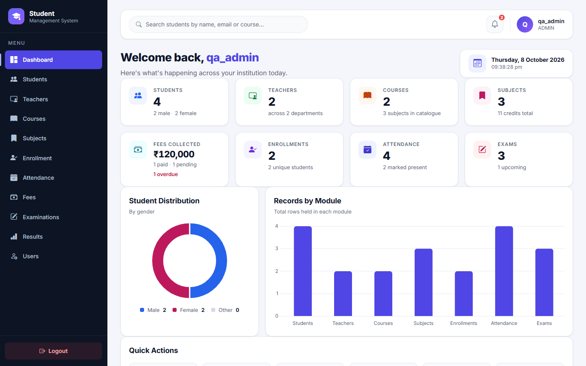 | 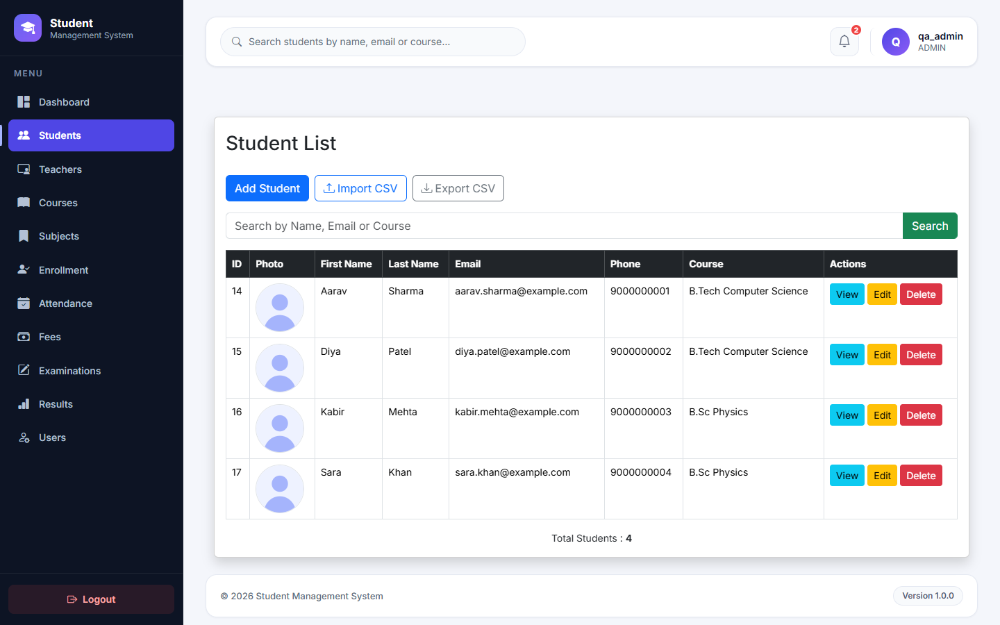 |
| **🎓 Marksheet** | **🧾 Fee receipt** |
| 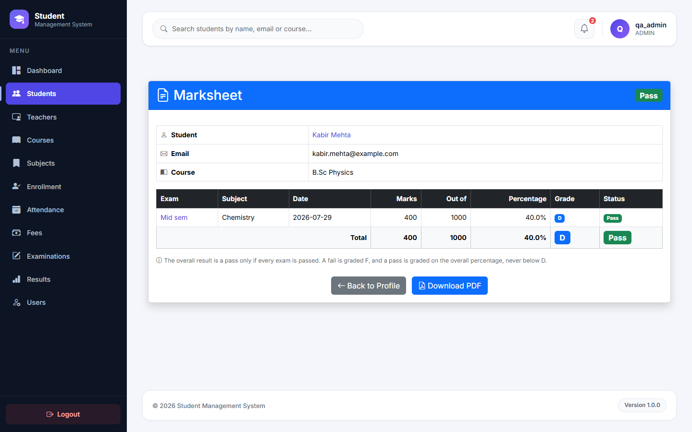 | 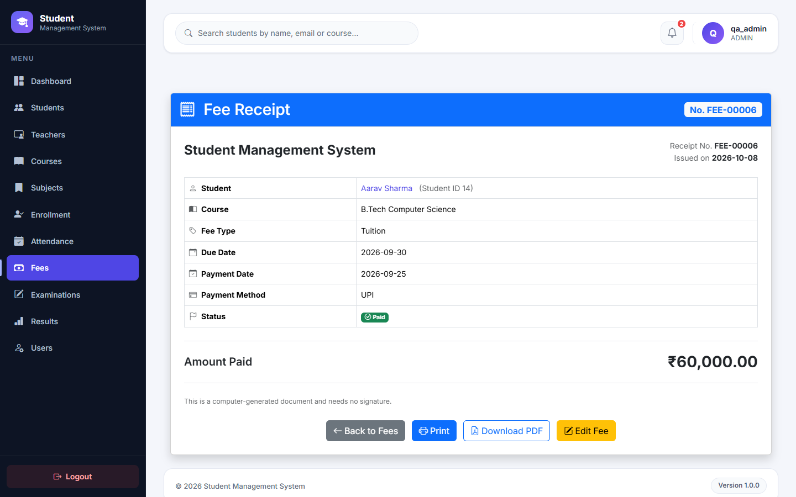 |
| **📈 Attendance report** | **🛡️ Access denied** |
| 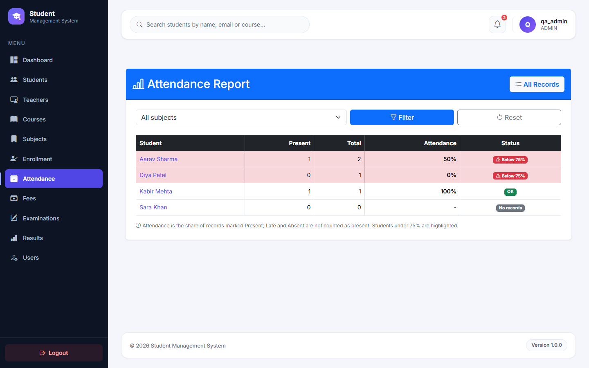 | 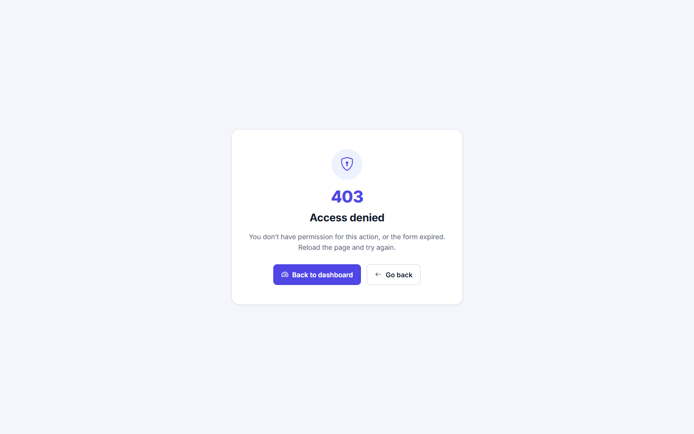 |

<sub>Made-up demo data on <code>@example.com</code>. The 403 page is what a student sees on <code>/fee</code>.</sub>

</div>

---

## ✨ Features

<div align="center">

| | | |
|:---:|:---:|:---:|
| 🔐 **Secure Login & Roles**<br/><sub>BCrypt · Admin / Teacher / Student · POST + CSRF on every change</sub> | 👨‍🎓 **Students**<br/><sub>CRUD · photo upload · profile · attendance %</sub> | 👨‍🏫 **Teachers**<br/><sub>CRUD · department · qualification · photo</sub> |
| 📚 **Courses & Subjects**<br/><sub>Unique codes · credits · subject page lists its exams</sub> | 📝 **Enrollment**<br/><sub>Student ↔ Course ↔ Subject · no duplicates</sub> | 🗓️ **Attendance**<br/><sub>Daily or **bulk** for a whole class · report under 75%</sub> |
| 🧾 **Exams**<br/><sub>Schedule by month · results with pass rate</sub> | 🏆 **Results & Marksheet**<br/><sub>**Auto grade** · totals · overall grade · **PDF**</sub> | 💰 **Fees**<br/><sub>Printable receipt · **PDF** · overdue flags</sub> |
| 📊 **Live Dashboard**<br/><sub>Real stat cards · Chart.js · recent activity</sub> | 🔔 **Notifications**<br/><sub>Overdue fees · low attendance · exams this week</sub> | 📥 **CSV Import & Export**<br/><sub>Row-by-row validation · Excel-safe export</sub> |
| 👤 **Profile & Password**<br/><sub>Own details · change password</sub> | 🛠️ **User Admin**<br/><sub>Enable / disable accounts · change roles</sub> | 🧪 **Tested**<br/><sub>55 tests on H2 · GitHub Actions CI</sub> |

</div>

---

## 🧰 Tech Stack

<div align="center">

| Layer | Technology | What it does here |
|:---:|:---|:---|
| ☕ |  | Language & runtime (LTS) |
| 🍃 |  | App framework — auto-config, embedded Tomcat, DI |
| 🔐 |  | Login, logout, session, URL protection, BCrypt |
| 🗄️ |   | Object ↔ table mapping, derived queries, pagination |
| 🐬 |  | Relational database (`sms_web`) |
| 🎨 |    | Server-rendered HTML, responsive UI, dashboard charts |
| ✔️ |  | `@NotBlank`, `@Email`, `@Pattern` form checks, also run on every CSV row |
| 📄 |   | Marksheet and receipt PDFs · student CSV import, student and fee CSV export |
| 🧪 |    | Unit, repository and controller-security tests on an in-memory database |
| ⚙️ |  | Runs the tests on every push and pull request |
| 🛠️ |  | Build & dependency management (wrapper included) |

</div>

---

## 🧱 Architecture

A classic **layered MVC** design. Every request passes through security first, then flows
strictly downward — controllers never touch the database, services never touch HTTP.

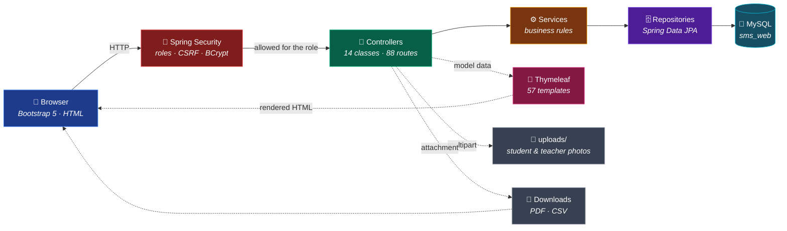

| Layer | Responsibility | Example |
|:---:|---|---|
| 🎯 **Controller** | Map URL → handler, validate input, pick a view | `StudentController` |
| ⚙️ **Service** | Business rules, transactions, calculations | `ResultServiceImpl` computes grades |
| 🗄️ **Repository** | Talk to the database — no SQL written by hand | `StudentRepository` |
| 📦 **Entity** | Java class = database table | `Student` → `students` |
| 🎨 **View** | HTML template filled with model data | `student/student-list.html` |

---

## 🧩 Anatomy of a Module

All nine record modules follow the **same shape**, so once you understand one you understand them all.
Here is the **Student** module, the largest:

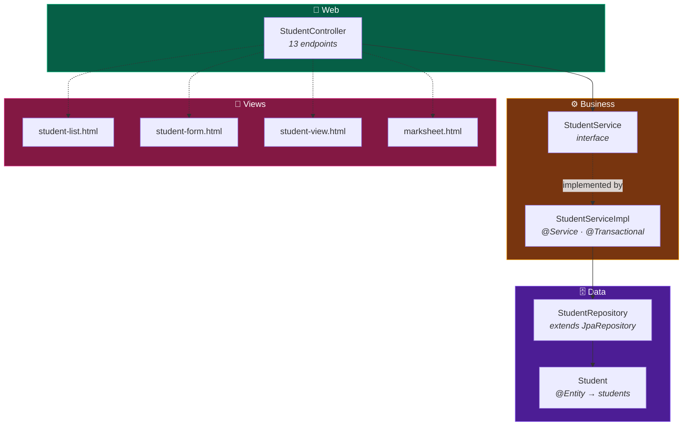

> 💡 **Interface + Impl** — controllers depend on `StudentService` (the contract), not
> `StudentServiceImpl` (the code). Swapping or mocking the implementation never touches the controller.

---

## 🧭 User Journey

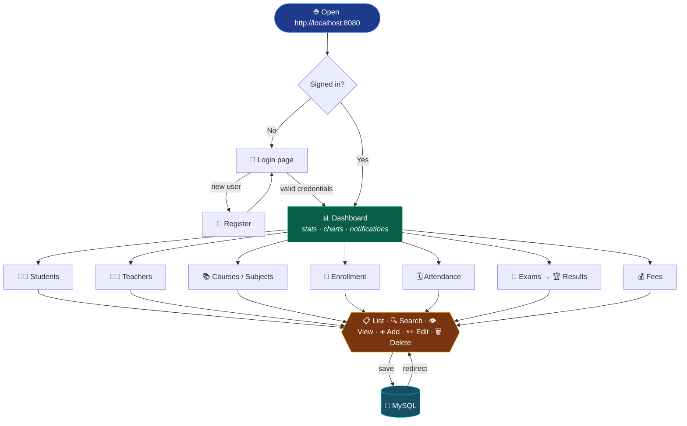

Every module exposes the same six actions — **list, search, view, add, edit, delete** — with
pagination on the list page, validation on the form, and buttons shown only to roles allowed to
use them.

---

## 🔐 Login Flow

How Spring Security authenticates a user against the `users` table:

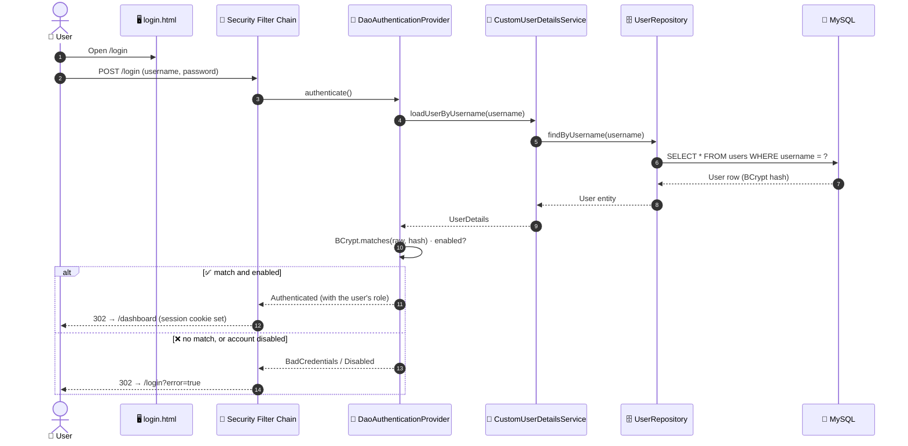

**Registration** (`POST /register`) checks that the username and email are unused, hashes the
password with **BCrypt**, assigns `ROLE_STUDENT` (view-only), and saves the user — the raw
password is never stored. The first **admin** is created at startup from the `ADMIN_USERNAME` and
`ADMIN_PASSWORD` environment variables; after that, admins promote accounts on the **Users** page.

---

## 👥 Roles

Three roles, enforced on the server by URL rules in `SecurityConfig` (the first matching rule wins)
and mirrored in the UI with `sec:authorize`, so nobody sees a button they can't use.

| Area | 🛠️ Admin | 👩‍🏫 Teacher | 🎓 Student |
|---|:---:|:---:|:---:|
| Dashboard, lists, detail pages, marksheets, reports, exam schedule | ✅ | ✅ | ✅ |
| Add / edit / delete attendance, exams and results · bulk attendance | ✅ | ✅ | ❌ |
| Add / edit / delete students, teachers, courses, subjects, enrollments | ✅ | ❌ | ❌ |
| Student CSV import and export | ✅ | ❌ | ❌ |
| Fees: everything, viewing included (receipts, PDFs, export) | ✅ | ❌ | ❌ |
| User accounts: enable, disable, change role | ✅ | ❌ | ❌ |
| Own profile and password | ✅ | ✅ | ✅ |

<sub>Every change is a POST carrying a CSRF token; a typed GET delete URL gets 405. A disabled account
can't sign in, and admins can't disable or demote themselves. A forbidden page shows the styled 403 page.</sub>

---

## 💾 Database Schema

Eleven tables, **nine foreign-key relationships**. Hibernate creates them automatically from the
entity classes (`ddl-auto=update`) — no SQL script needed.

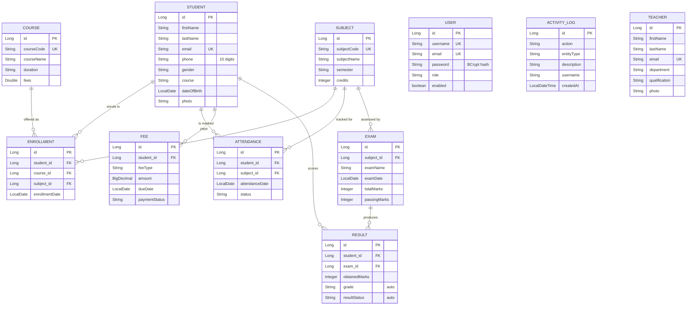

<sub>`PK` primary key · `FK` foreign key · `UK` unique in the database. An enrollment is also unique per
(student, course, subject). `USER`, `TEACHER` and `ACTIVITY_LOG` are standalone tables; the log stores
names as text, so its lines still read correctly after the record is deleted. Duplicate codes and emails
are reported on the form, on create and on edit, before the database constraint is reached.</sub>

---

## 🧮 Grade Engine

When a result is saved, the **grade** and **pass/fail** status are computed automatically. The form
only asks for the marks obtained. The rules live in one class, `GradeCalculator`, so every screen
that shows a grade agrees.

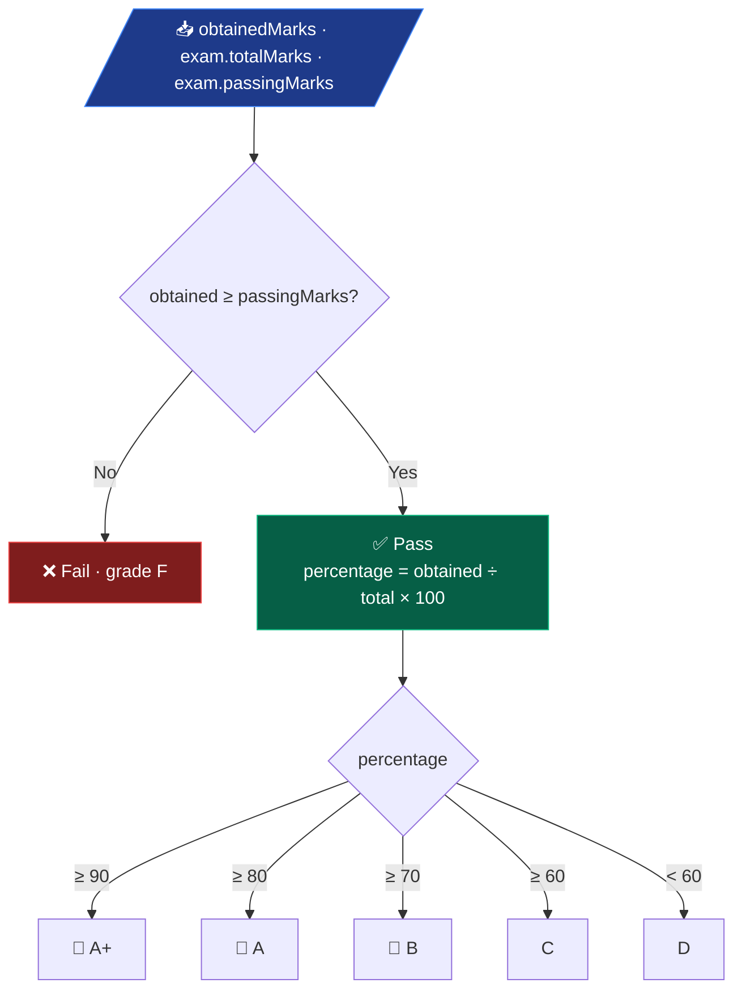

| Status | Pass, 90–100% | Pass, 80–89% | Pass, 70–79% | Pass, 60–69% | Pass, below 60% | Fail |
|:---:|:---:|:---:|:---:|:---:|:---:|:---:|
| **Grade** | 🥇 A+ | 🥈 A | 🥉 B | C | D | F |

> Pass/fail uses **each exam's own** `passingMarks`, so a 40-mark quiz and a 100-mark final can
> have different thresholds. A fail is always **F** and a pass is never below **D**, so the grade
> and the status can't contradict each other: 40/100 with a pass mark of 33 is **D · Pass**.
> Obtained marks can't exceed the exam's total, and passing marks can't exceed the total either.
>
> 🎓 The **marksheet** applies the same rule to the whole record: it totals every exam (865/1100 =
> 78.6% → **B**) and is a pass only if every exam is passed, so one failed exam makes it **F · Fail**.
> `GradeCalculatorTest` checks every band edge (89.99% vs 90%, 49.99% vs 50%) and the exact pass mark.

---

## 🔗 Data Integrity

Every parent delete removes its dependent rows first, so it never trips a foreign-key error and
never leaves orphans. Each one runs inside a single `@Transactional` boundary: if any step
fails, **everything rolls back**. `deleteStudent()` is the largest:

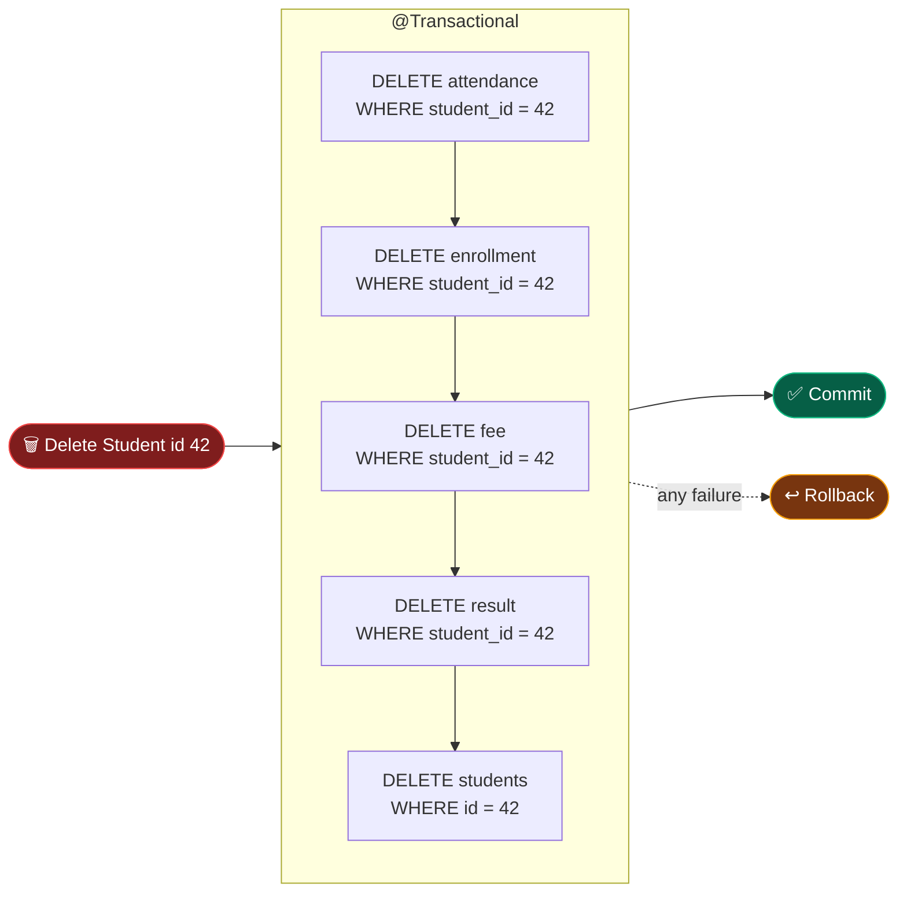

Each child delete is a `@Modifying` JPQL bulk query in its repository, for example
`DELETE FROM Fee f WHERE f.student.id = :studentId`. The same pattern covers every table that
other rows point at:

| Deleting a… | Clears first, in order |
|---|---|
| 👨‍🎓 Student | attendance → enrollments → fees → results |
| 📖 Subject | attendance → enrollments → results of its exams → exams |
| 📚 Course | enrollments |
| 🧾 Exam | results |

<sub>Bulk JPQL deletes cannot join, so a subject's exam results are matched with a subquery:
`DELETE FROM Result r WHERE r.exam.id IN (SELECT e.id FROM Exam e WHERE e.subject.id = :subjectId)`.</sub>

> 🧪 `DeleteCascadeTest` builds one of everything, deletes each parent and checks its children are gone.
> It flushes after every delete, because H2 enforces foreign keys like MySQL: with the exam's
> results delete removed, the test fails with a referential-integrity error.

---

## 📁 Project Structure

```
.github/workflows/ci.yml                # GitHub Actions: ./mvnw -B test on every push
docs/screenshots/                       # README screenshots
Student-Management-System-web/
├── 📄 pom.xml                          # Maven dependencies & build
├── 📁 uploads/                         # Uploaded photos, not in git (served at /student-images, /teacher-images)
└── 📁 src/
    ├── 📁 main/java/com/anurag/sms/
    │   ├── 🚀 SmswebApplication.java   # Entry point (@SpringBootApplication)
    │   ├── 📁 config/                  # SecurityConfig (role rules) · WebConfig · AdminSeeder (first admin)
    │   ├── 📁 controller/              # 14 controllers + LayoutView · FileDownload · NotificationAdvice
    │   ├── 📁 service/                 # 13 interfaces + CustomUserDetailsService
    │   │   └── 📁 impl/                # 13 implementations (@Service)
    │   ├── 📁 repository/              # 11 Spring Data JPA repositories
    │   ├── 📁 entity/                  # 11 JPA entities (@Entity)
    │   ├── 📁 dto/                     # 7 records and forms: Marksheet · AttendanceSummary · BulkAttendanceForm …
    │   ├── 📁 exception/               # GlobalExceptionHandler · ResourceNotFoundException (404)
    │   └── 📁 utility/                 # GradeCalculator · CsvHelper · FileUploadUtil · Pages
    ├── 📁 main/resources/
    │   ├── ⚙️ application.properties   # DB (from env), Hibernate, multipart limits, institution name
    │   ├── ⚙️ application-dev.properties # SQL echo + DEBUG logging, only with the dev profile
    │   ├── 📁 static/                  # css/ (11 files) · js/ (3) · images/default-avatar.svg
    │   └── 📁 templates/               # 57 templates
    │       ├── 📁 layout/ · common/    # app shell · navbar · sidebar · notifications · error page
    │       ├── 📁 dashboard/           # stat cards · charts · recent students, fees, activity · upcoming exams
    │       ├── 📁 error/               # 403 · 404 · 409 · 413 · 500
    │       ├── 📁 auth/ · profile/ · admin/
    │       └── 📁 {student,teacher,course,subject,enrollment,attendance,exam,result,fee}/
    │                                   # list · form · view, plus marksheet, receipt, report, schedule, bulk, import
    └── 📁 test/                        # 55 tests · application.properties points at in-memory H2
```

---

## 🌐 Routes

<details>
<summary><b>All 88 endpoints (60 GET · 28 POST), grouped by module</b> — click to expand</summary>

<br/>

| Module | Base path | Endpoints | Changes allowed for |
|:---:|---|---|:---:|
| 🏠 Home | `/` | `GET /` → redirect to dashboard | — |
| 🔐 Auth | `/login` `/register` | `GET /login` · `GET /register` · `POST /register` · `POST /login` & `POST /logout` handled by Spring Security | public |
| 📊 Dashboard | `/dashboard` | `GET /dashboard` | — |
| 👤 Profile | `/profile` | `GET /` · `POST /password` | everyone, own account |
| 🛠️ Users | `/admin/users` | `GET /` · `POST /{id}/enabled` · `POST /{id}/role` | Admin (viewing too) |
| 👨‍🎓 Student | `/student` | `GET /` · `GET /search` · `GET /page/{n}` · `GET /view/{id}` · `GET /{id}/marksheet` · `GET /{id}/marksheet.pdf` · `GET /new` · `POST /` · `GET /edit/{id}` · `POST /delete/{id}` · `GET /import` · `POST /import` · `GET /export` | Admin |
| 👨‍🏫 Teacher | `/teacher` | `GET /` · `GET /view/{id}` · `GET /new` · `POST /` · `GET /edit/{id}` · `POST /delete/{id}` | Admin |
| 📚 Course | `/course` | `GET /` · `GET /view/{id}` · `GET /new` · `POST /` · `GET /edit/{id}` · `POST /delete/{id}` | Admin |
| 📖 Subject | `/subject` | `GET /` · `GET /view/{id}` · `GET /new` · `POST /` · `GET /edit/{id}` · `POST /delete/{id}` | Admin |
| 📝 Enrollment | `/enrollment` | `GET /` · `GET /view/{id}` · `GET /new` · `POST /` · `GET /edit/{id}` · `POST /delete/{id}` | Admin |
| 🗓️ Attendance | `/attendance` | `GET /` · `GET /search` · `GET /page/{n}` · `GET /view/{id}` · `GET /report` · `GET /new` · `POST /save` · `GET /edit/{id}` · `POST /update/{id}` · `POST /delete/{id}` · `GET /bulk` · `POST /bulk` | Admin · Teacher |
| 🧾 Exam | `/exam` | `GET /` · `GET /search` · `GET /page/{n}` · `GET /view/{id}` · `GET /schedule` · `GET /new` · `POST /save` · `GET /edit/{id}` · `POST /update/{id}` · `POST /delete/{id}` | Admin · Teacher |
| 🏆 Result | `/result` | `GET /` · `GET /search` · `GET /page/{n}` · `GET /view/{id}` · `GET /new` · `POST /save` · `GET /edit/{id}` · `POST /update/{id}` · `POST /delete/{id}` | Admin · Teacher |
| 💰 Fee | `/fee` | `GET /` · `GET /search` · `GET /view/{id}` · `GET /{id}/receipt.pdf` · `GET /export` · `GET /new` · `POST /save` · `GET /edit/{id}` · `POST /update/{id}` · `POST /delete/{id}` | Admin (viewing too) |

**Public** (no login needed): `/`, `/login`, `/register`, `/css/**`, `/js/**`, `/images/**`.
**Everything else** requires a signed-in session, including uploaded photos, which are served
at `/student-images/**` and `/teacher-images/**`. Viewing is open to every role unless the last
column says otherwise. The `/page/{n}` routes are kept so old links still work.

</details>

---

## 🧪 Tests & CI

**55 tests**, run with `./mvnw test`. They use an in-memory **H2** database in MySQL mode
(`src/test/resources/application.properties`), so they need no MySQL server and no password, and
**GitHub Actions** runs them on every push and pull request.

| Test class | Kind | What it proves |
|---|:---:|---|
| `GradeCalculatorTest` · 22 | unit | Every grade band edge, fail is always F, pass/fail at exactly the pass mark |
| `MarksheetTest` · 3 | unit | Totals, overall percentage and grade match the hand calculations |
| `CsvHelperTest` · 5 | unit | Any column order, Excel's BOM, row errors, export → import round trip |
| `SearchRepositoryTest` · 10 | `@DataJpaTest` | Attendance and exam search with date only, keyword only, both and neither |
| `DeleteCascadeTest` · 5 | `@SpringBootTest` | Deleting a student, course, exam or subject removes its children; an unknown id changes and logs nothing |
| `StudentControllerSecurityTest` · 9 | `@WebMvcTest` | Student and teacher get 403 on delete, admin is redirected, no CSRF token is 403, GET delete is 405 |
| `SmswebApplicationTests` · 1 | `@SpringBootTest` | The whole application context starts |

---

## 🚀 Getting Started

### Prerequisites

| Tool | Version | Check |
|---|---|---|
| ☕ Java JDK | 21+ | `java -version` |
| 🐬 MySQL | 8.0+ | `mysql --version` |
| 🛠️ Maven | *(wrapper included)* | — |
| 🐙 Git | any | `git --version` |

### Run it

```bash
# 1️⃣  Clone
git clone https://github.com/anurag-joshi-1403/StudentManagementSystem.git
cd StudentManagementSystem/Student-Management-System-web

# 2️⃣  Create the database (tables are generated automatically on first run)
mysql -u root -p -e "CREATE DATABASE sms_web;"

# 3️⃣  Give the app your MySQL password; it is read from the environment, never committed
export DB_PASSWORD=<your-password>      # macOS / Linux
setx DB_PASSWORD "<your-password>"      # Windows (then open a new terminal)
#     DB_USERNAME is optional and defaults to root

# 4️⃣  Create the first admin: used once, at startup, while no admin exists
export ADMIN_USERNAME=admin ADMIN_PASSWORD=<choose-one>     # Windows: setx each one

# 5️⃣  Build & run
./mvnw spring-boot:run          # macOS / Linux
mvnw.cmd spring-boot:run        # Windows

# 🧪  Run the tests (no MySQL needed)
./mvnw test
```

<div align="center">

🌐 Open **http://localhost:8080** → sign in as the admin → you're on the dashboard.
Anyone who **registers** gets a view-only student account; promote it on the **Users** page.

</div>

> 🔧 Optional settings: `INSTITUTION_NAME` (printed on receipts and PDFs), `server.port` in
> `application.properties`, and the `dev` profile (`-Dspring-boot.run.profiles=dev`) for SQL and
> DEBUG logging. Uploaded photos land in `Student-Management-System-web/uploads/`.
> A sample import file with made-up students is in [`student.CSV`](student.CSV).

---

## 📖 Keywords Explained

Short, plain-English definitions of the terms used in this project — enough to follow the code.

<details open>
<summary><b>🍃 Spring &amp; Architecture</b></summary>

<br/>

| Term | Meaning in one line |
|---|---|
| **Spring Boot** | Framework that auto-configures a Java web app so it runs with one command and an embedded server. |
| **MVC** | *Model-View-Controller* — data (Model), HTML (View) and request handling (Controller) kept separate. |
| **Controller** | Class that receives an HTTP request, calls a service, and returns which page to render. |
| **Service** | Class holding business rules (e.g. grade calculation). Sits between controller and repository. |
| **Repository** | Interface that talks to the database. Spring Data writes the SQL from the method name. |
| **Entity** | A Java class that maps to a database table (`@Entity`). One object = one row. |
| **DTO** | *Data Transfer Object* — a plain class that carries form fields (e.g. `UserRegistrationDto`). |
| **Bean** | Any object Spring creates and manages for you. |
| **Dependency Injection** | Spring builds the objects a class needs and passes them into its constructor — no `new`. |
| **`@Configuration` / `@Bean`** | "Here is how to build this object; keep it for me." Used in `SecurityConfig`. |
| **Layered architecture** | Each layer only calls the one below it: Controller → Service → Repository → DB. |
| **`redirect:/student`** | After a form `POST`, send the browser to a `GET` page so refresh doesn't resubmit (PRG pattern). |

</details>

<details open>
<summary><b>🗄️ Database &amp; Persistence</b></summary>

<br/>

| Term | Meaning in one line |
|---|---|
| **JPA** | *Java Persistence API* — the standard for mapping Java objects to relational tables. |
| **Hibernate** | The library that implements JPA and generates the actual SQL. |
| **ORM** | *Object-Relational Mapping* — objects in, table rows out (and back). |
| **Derived query** | `findByEmail(String)` — Spring Data reads the method name and builds the query. |
| **JPQL** | SQL-like language written against **entities** (`DELETE FROM Fee f WHERE f.student.id = :id`). |
| **`@Modifying`** | Marks a JPQL query that changes data (update / delete) instead of reading it. |
| **`@Transactional`** | All-or-nothing: if any step inside fails, every change is rolled back. |
| **Foreign key (FK)** | A column that points to another table's primary key — `enrollment.student_id → students.id`. |
| **Pagination** | Show a long list in pages: `PageRequest.of(page, size)` returns a `Page<T>`. |
| **`ddl-auto=update`** | Hibernate creates or alters tables to match the entities on startup. |
| **Cascade delete** | Remove child rows before the parent so no row points at something that no longer exists. |

</details>

<details open>
<summary><b>🔐 Security</b></summary>

<br/>

| Term | Meaning in one line |
|---|---|
| **Spring Security** | Handles login, logout, sessions and which URLs need authentication. |
| **Filter chain** | A series of checks every request passes through *before* it reaches a controller. |
| **BCrypt** | One-way password hashing with a salt — the stored hash can't be turned back into the password. |
| **`UserDetailsService`** | Tells Spring Security how to load a user by username (`CustomUserDetailsService`). |
| **`DaoAuthenticationProvider`** | Combines the `UserDetailsService` and password encoder to verify a login. |
| **Session** | After login the server remembers you via a `JSESSIONID` cookie until logout. |
| **CSRF** | An attack where another site submits a form as you. Spring adds a hidden token to block it. |
| **Role** | A label like `ROLE_STUDENT` used to decide what a user is allowed to do. |
| **`hasRole(...)`** | A URL rule in `SecurityConfig`: only these roles may open this path; others get 403. |
| **`sec:authorize`** | Thymeleaf attribute that leaves a button out of the page unless the user has the role. |
| **Formula injection** | A CSV cell starting with `=` that Excel would run; the export prefixes `'` so it stays text. |

</details>

<details open>
<summary><b>🎨 Frontend &amp; Tooling</b></summary>

<br/>

| Term | Meaning in one line |
|---|---|
| **Thymeleaf** | HTML template engine — `th:text`, `th:each`, `th:if` are filled with server data before sending. |
| **Fragment** | A reusable chunk of HTML (navbar, sidebar, footer) included into many pages. |
| **Layout** | `layout.html` — the app shell; each page injects only its own content into it. |
| **Bootstrap** | CSS framework for a responsive grid, buttons, forms and tables. |
| **Chart.js** | JavaScript library drawing the dashboard's doughnut and bar charts. |
| **Bean Validation** | `@NotBlank`, `@Email`, `@Pattern` on entity fields — checked when `@Valid` is on the parameter. |
| **`BindingResult`** | Holds validation errors so the form can re-render with messages instead of crashing. |
| **Multipart** | The form encoding used to upload files (student / teacher photos). |
| **Maven / `pom.xml`** | Build tool and its config file — lists dependencies, compiles, and packages the `.jar`. |
| **`mvnw`** | Maven *wrapper* — downloads the right Maven version so you don't install it yourself. |
| **`@ControllerAdvice`** | Code that applies to every controller: the error pages and the navbar's notifications. |
| **Lazy variable** | A model value Thymeleaf only computes if the page reads it, so redirects skip the queries. |

</details>

<details open>
<summary><b>🧪 Testing &amp; Delivery</b></summary>

<br/>

| Term | Meaning in one line |
|---|---|
| **JUnit 5** | The test framework: each `@Test` method is one check that passes or fails. |
| **Mockito / `@MockitoBean`** | Replaces a real service with a stand-in, so a test checks one layer on its own. |
| **H2** | A database that lives in memory for the length of the test run — no server to install. |
| **`@DataJpaTest`** | Starts only the repositories and an in-memory database, to test queries fast. |
| **`@WebMvcTest`** | Starts only the web layer and security, to test URLs, status codes and redirects. |
| **`@WithMockUser`** | Runs a test as a pretend signed-in user with a given role. |
| **CI** | *Continuous Integration* — GitHub runs the tests on every push and shows ✅ or ❌. |

</details>

---

## 📊 Project Status

<div align="center">


</div>

| Area | Status | Notes |
|---|:---:|---|
| 👨‍🎓 All nine record modules | 🟢 Complete | CRUD, search, pagination, detail pages, validation, safe deletes |
| 🎓 Marksheet · 🧾 Receipt · 📈 Reports | 🟢 Complete | Pages, print styles, PDF downloads, attendance report, exam schedule |
| 📥 CSV · 👥 Bulk attendance | 🟢 Complete | Validated import, Excel-safe export, one form per class |
| 🛡️ Roles · 🛠️ User admin · 👤 Profile | 🟢 Complete | Admin / Teacher / Student, enable/disable, roles, change password |
| 📊 Dashboard · 🔔 Notifications · 📰 Activity | 🟢 Complete | Live data, alerts from real conditions, audit trail for admins |
| 🧪 Tests · ⚙️ CI | 🟢 Complete | 55 tests on H2, GitHub Actions on every push |
| 🔑 Old DB password | 🟡 Deferred | Read from the environment now; rotating the old one (task A4) waits, since other local projects share the account |

> 🗺️ The full phased plan, engineering backlog and severity triage live in
> **[PROJECT_ROADMAP.md](PROJECT_ROADMAP.md)**. A module-by-module inventory is in
> **[project_analysis.md](project_analysis.md)**.

---

## 👤 Author

<div align="center">

**Anurag Joshi**

[](https://github.com/anurag-joshi-1403)

<sub>💼 Add LinkedIn and portfolio badges here before sharing.</sub>

<br/><br/>

⭐ *If this project helped you, consider starring the repository.*

<br/>

<sub>Built with ☕ Java 21 · 🍃 Spring Boot 3.5 · 🐬 MySQL 8 — last verified against source on 9 Oct 2026</sub>

</div>
