<div align="center">


<br/>

# ✅ Task Board

**All the remaining work, split into small steps you can each finish in one sitting**


*Built from the 6 Oct 2026 audit in [project_analysis.md](project_analysis.md) · commit `9d957c6`*

[📘 README](README.md) · [📋 Analysis](project_analysis.md) · [🗺️ Roadmap](PROJECT_ROADMAP.md)

</div>

---

## 🧭 How to Use This Board

1. **Work from top to bottom.** Tasks are ordered so each one builds on the ones before it. When a task depends on one from another stage, it says 🔗 **Needs**.
2. **Each task is one sitting and one commit.** Tasks take between 5 minutes and 2 hours.
3. **Run the ✅ Done when check** in the running app before you tick the box.
4. **Tick it off**: change `- [ ]` to `- [x]` and update the **Done** column in the progress table.

| Symbol | Meaning |
|:---:|---|
| `#23` | Issue number in the [Engineering Backlog](project_analysis.md#-engineering-backlog), which has the full file and line details |
| ⏱ | Rough time estimate |
| 📂 | Files to change. Java paths are relative to `Student-Management-System-web/src/main/java/com/anurag/sms/` and templates to `…/src/main/resources/templates/` |
| 🔗 | Another task that has to be done first |
| ✅ | How to check the task is finished |

<sub>Run commands from `Student-Management-System-web/`: `./mvnw spring-boot:run` in Git Bash, `.\mvnw.cmd spring-boot:run` in PowerShell.
Suggested commit style: `fix(student): search no longer crashes (#23)`.</sub>

---

## 📊 Progress

| Stage | What it gets you | Tasks | Time | Done |
|---|---|:---:|:---:|:---:|
| 🧰 [0 · Get Ready](#-stage-0--get-ready) | App running with linked test data | 2 | ~35 min | ✅ 2 / 2 |
| ⚡ [A · Quick Wins](#-stage-a--quick-wins) | Every crash and broken button a reviewer would hit is fixed | 12 | ~4.5 h | 11 / 12 · A4 deferred |
| 🟠 [B · One Application](#-stage-b--one-application) | Sidebar on every page, designed error pages | 18 | ~10 h | ✅ 18 / 18 |
| 🟡 [C · Security](#-stage-c--security--data-integrity) | Roles, POST deletes, safe uploads, no secrets in git | 15 | ~8 h | ✅ 15 / 15 |
| 🟢 [D · Correctness](#-stage-d--correctness) | Paged search, unique codes, valid marks | 14 | ~7 h | ✅ 14 / 14 |
| 🟢 [E · New Features](#-stage-e--new-features) | Detail pages, marksheet, receipts, reports, CSV | 20 | ~16 h | ✅ 20 / 20 |
| 🔵 [F · Showcase](#-stage-f--showcase-polish) | Notifications, PDF, profile, tests, CI, screenshots | 20 | ~17 h | 18 / 20 · F18, F19 wait for your commit |
| | **Total** | **101** | **~63 h** | **98 / 101** |

```mermaid
flowchart LR
    S0["🧰 0 · Get ready<br/><b>2 tasks</b>"]
    A["⚡ A · Quick wins<br/><b>12 tasks</b><br/><i>~4.5 h</i>"]
    B["🟠 B · One app<br/><b>18 tasks</b><br/><i>~10 h</i>"]
    C["🟡 C · Security<br/><b>15 tasks</b><br/><i>~8 h</i>"]
    D["🟢 D · Correctness<br/><b>14 tasks</b><br/><i>~7 h</i>"]
    E["🟢 E · Features<br/><b>20 tasks</b><br/><i>~16 h</i>"]
    F["🔵 F · Showcase<br/><b>20 tasks</b><br/><i>~17 h</i>"]

    S0 --> A --> B --> C --> D --> E --> F

    style S0 fill:#334155,stroke:#94a3b8,color:#fff
    style A fill:#7f1d1d,stroke:#ef4444,color:#fff
    style B fill:#7c2d12,stroke:#f97316,color:#fff
    style C fill:#713f12,stroke:#eab308,color:#fff
    style D fill:#065f46,stroke:#10b981,color:#fff
    style E fill:#065f46,stroke:#10b981,color:#fff
    style F fill:#1e3a8a,stroke:#3b82f6,color:#fff
```



> 💡 **If you only have one evening**, do Stage A. It fixes the student search, logout and the three
> failing deletes, which are the flows a reviewer is most likely to try first.

---

## 🧰 Stage 0 · Get Ready

**Goal:** a running app with enough linked data to test every task below.

- [x] **0.1 · Confirm the app runs** · ⏱ 15 min
  - Start MySQL, run the app, open `http://localhost:8080`, register an account and sign in.
  - ✅ **Done when** the dashboard loads with your username in the navbar.

- [x] **0.2 · Add a small set of linked test data** · ⏱ 20 min
  - Add 2 courses, 3 subjects, 4 students, 2 teachers, 2 enrollments, a few attendance rows, 2 fees, 2 exams (one dated in the future) and 2 results.
  - Several bugs only appear when records are linked. For example, deleting a course fails only when that course has an enrollment.
  - ✅ **Done when** every sidebar page shows at least one row.

> 🧪 **Test data on hand** (added 6 Oct 2026, all made-up `@example.com` people). Use it for the checks below:
>
> | To reproduce | Use |
> |---|---|
> | A1 search crash | search `Aarav` in the navbar |
> | A5 course delete | course `BTECH-CSE`, which has Aarav's enrollment |
> | A6 exam delete | exam *Mid sem* on `MATH01`, which has Aarav's result (780/1000) |
> | A7 subject delete | subject `MATH01`, whose exam has a result |
> | A8 date search | attendance on `2026-10-01` (3 rows) and `2026-10-02` (1 row) |
> | A9 date search | exams on `2026-07-29`, `2026-07-31` and `2026-12-10` (the future one) |
> | D12 grade rule | Kabir's 400/1000 on *Mid sem* `CHEM01` (pass mark 250) was **F · Pass**; since D12 it is **D · Pass** |
> | E10 overdue fee | Diya's *Pending* tuition fee was due `2026-09-30` |
>
> **Test accounts** (passwords were given in chat, not stored here): `qa_admin` (ADMIN), `qa_teacher` (TEACHER), `qa_tester` (STUDENT). Disable or delete them before sharing the app (F12).

---

## ⚡ Stage A · Quick Wins

**Goal:** fix every crash and broken button a reviewer is likely to click in their first few minutes. **About 70 lines of code in total.**

- [x] **A1 · Fix the student-search crash** · `#23` · ⏱ 10 min
  - In `searchStudents()`, also add `currentPage = 1`, `totalPages = 1` and `totalItems = students.size()` to the model. The list's pager does arithmetic on these values and crashes when they're missing.
  - 📂 `controller/StudentController.java:52-61`
  - ✅ **Done when** searching from the navbar box shows matching students instead of an error page.

- [x] **A2 · Make logout actually log out** · `#24` · ⏱ 15 min
  - Because CSRF protection is on, Spring Security only accepts `POST /logout`. Replace the sidebar `<a th:href="@{/logout}">` with a `<form th:action="@{/logout}" method="post">` that contains a `<button type="submit" class="logout-btn">`.
  - Add `width: 100%; border: 0; font: inherit; cursor: pointer;` to `.logout-btn` so the button looks like the old link.
  - 📂 `common/sidebar.html:134-137` · `static/css/sidebar.css:144`
  - ✅ **Done when** Logout takes you to `/login?logout=true`, and opening `/dashboard` afterwards sends you back to login.

- [x] **A3 · Read database credentials from environment variables** · `#5` · ⏱ 15 min
  - Use `spring.datasource.username=${DB_USERNAME:root}` and `spring.datasource.password=${DB_PASSWORD}`.
  - Set the variable once on Windows with `setx DB_PASSWORD "your-password"`, then restart VS Code.
  - 📂 `application.properties:5-6`
  - ✅ **Done when** the app starts and the properties file no longer contains a password.

- [ ] **A4 · Change the leaked MySQL password** · `#5` · ⏱ 10 min
  - The old password is already on GitHub in the commit history, so removing it from the file isn't enough on its own. In MySQL, run `ALTER USER 'root'@'localhost' IDENTIFIED BY '<new password>';`, then update `DB_PASSWORD`.
  - ✅ **Done when** the old password no longer works in MySQL and the app still starts.
  - ⏸️ **Deferred on 6 Oct 2026.** `root` only accepts connections from this PC, which limits the risk. Changing it would also cut off 7 other local project databases (`student_management`, `spring_boot_db`, `online_inventory_system`, `college_2`, `project_1`, `jsp`, `myfirstsql`) and saved Workbench connections. When you do it, update those projects' settings at the same time. Option: give this app its own MySQL user limited to `sms_web`, so that changing the `root` password never affects it.

- [x] **A5 · Fix course delete** · `#25` · ⏱ 20 min
  - Add `deleteByCourseId` to `EnrollmentRepository`, copying the existing `deleteBySubjectId` (`DELETE FROM Enrollment e WHERE e.course.id = :courseId`).
  - Inject `EnrollmentRepository` into `CourseServiceImpl`, mark `deleteCourse()` `@Transactional`, and clear the enrollments before calling `deleteById`.
  - 📂 `repository/EnrollmentRepository.java` · `service/impl/CourseServiceImpl.java:43`
  - ✅ **Done when** a course with an enrollment can be deleted and its enrollment is removed too.

- [x] **A6 · Fix exam delete** · `#25` · ⏱ 15 min
  - Add `ResultRepository.deleteByExamId` (`DELETE FROM Result r WHERE r.exam.id = :examId`), then make `deleteExam()` `@Transactional` and clear the results first.
  - 📂 `repository/ResultRepository.java` · `service/impl/ExamServiceImpl.java:56`
  - ✅ **Done when** an exam with results can be deleted.

- [x] **A7 · Fix subject delete when its exams have results** · `#25` · ⏱ 15 min
  - Add `ResultRepository.deleteByExamSubjectId` using a subquery, because a bulk JPQL delete can't join through `r.exam.subject`:
    `DELETE FROM Result r WHERE r.exam.id IN (SELECT e.id FROM Exam e WHERE e.subject.id = :subjectId)`
  - Call it **before** `examRepository.deleteBySubjectId(id)`.
  - 📂 `service/impl/SubjectServiceImpl.java:69`
  - ✅ **Done when** a subject whose exam has results can be deleted.

- [x] **A8 · Make the attendance search filter by date** · `#26` `#13` · ⏱ 45 min
  - Replace the derived OR-query with one that combines keyword AND date and treats both as optional:
    ```java
    @Query("""
        SELECT a FROM Attendance a
        WHERE (:kw IS NULL
               OR LOWER(a.student.firstName)   LIKE LOWER(CONCAT('%', :kw, '%'))
               OR LOWER(a.subject.subjectName) LIKE LOWER(CONCAT('%', :kw, '%')))
          AND (:date IS NULL OR a.attendanceDate = :date)
        """)
    List<Attendance> search(@Param("kw") String kw, @Param("date") LocalDate date);
    ```
  - In the controller and service, stop turning a missing keyword into `""`. Pass `null` for a blank keyword instead, and remove the `1900-01-01` placeholder date.
  - 📂 `repository/AttendanceRepository.java` · `service/impl/AttendanceServiceImpl.java:63` · `controller/AttendanceController.java:125`
  - ✅ **Done when** a date alone returns only that day's rows, keyword plus date returns rows matching both, and an empty search returns everything.

- [x] **A9 · Make the exam search filter by date** · `#26` `#13` · ⏱ 30 min
  - Repeat A8 for exams (exam name and subject name, with `examDate`), and remove the placeholder date there too.
  - 📂 `repository/ExamRepository.java` · `service/impl/ExamServiceImpl.java:62-67` · `controller/ExamController.java:97`
  - ✅ **Done when** the three checks from A8 pass on the Exam page.

- [x] **A10 · Validate the Exam form** · `#12` · ⏱ 30 min
  - Add `@Valid` + `BindingResult` to `saveExam` and `updateExam`. On errors, add `subjects` back to the model and return the form, as `AttendanceController.saveAttendance` does. In `updateExam`, call `exam.setId(id)` before returning so the form still posts to the update URL.
  - Under each input, add `<div class="text-danger" th:if="${#fields.hasErrors('totalMarks')}" th:errors="*{totalMarks}"></div>`.
  - 📂 `controller/ExamController.java:48,72` · `exam/exam-form.html`
  - ✅ **Done when** total marks of `0` shows "Total marks must be greater than 0" and nothing is saved.
  - 📝 **Found while doing this (6 Oct 2026):**
    - The constraints did run before, but only inside Hibernate at insert time, so invalid input gave a **500 page**, not a silent save. The `#12` wording in `project_analysis.md` ("never run") needs correcting in A12.
    - **New bug, fixed:** every edit form with a date (Exam, Attendance, Student, Fee, Enrollment) opened with an **empty date box**. Spring printed dates in a short local style (`12/10/26`) that `<input type="date">` rejects, so no edit could be saved without retyping the date. One line, `spring.mvc.format.date=iso` in `application.properties`, fixes all five.
    - Still open: typing letters into a number field (only possible by bypassing the browser) shows Spring's raw "Failed to convert…" message. Fix it with a `messages.properties` entry such as `typeMismatch.java.lang.Integer=Please enter a whole number.`

- [x] **A11 · Validate the Result form** · `#12` · ⏱ 30 min
  - Same as A10 for `saveResult` and `updateResult`. Add `students` and `exams` back to the model on errors. Expect the same "before" behaviour as A10: a 500 page, not a silent save.
  - 📂 `controller/ResultController.java:51,78` · `result/result-form.html`
  - ✅ **Done when** marks of `-5` show "Marks cannot be negative".

- [x] **A12 · Correct the facts in the README and roadmap** · ⏱ 30 min
  - Work through the [Documentation Drift](project_analysis.md#-documentation-drift) table. Now that A5–A7 are done, the "safe deletes" claim is true, so reword it rather than deleting it.
  - 📂 `README.md` · `PROJECT_ROADMAP.md`
  - ✅ **Done when** every row in the drift table is either fixed or no longer applies.

---

## 🟠 Stage B · One Application

**Goal:** the sidebar and navbar stay visible on every page, and errors show designed pages instead of the Whitelabel page.

> 📝 **Done 7 Oct 2026, with these extras beyond the task text:**
> - **B1/B3:** one shared error-page fragment (`common/error-page.html`) styled from `theme.css`, plus a `409` page for constraint errors.
> - **B4:** Bootstrap's reboot tightened heading line-height on the dashboard; `theme.css` now sets headings to `line-height: inherit`, which made the dashboard pixel-identical again apart from the live clock and chart anti-aliasing.
> - **B6:** removed the student list's duplicate "Student Management System" `<h1>`; the other 8 list pages never had one.
> - **B7:** dropped `teacher-view`'s `body { background }` rule, which would have overridden the app canvas inside the shell.
> - **B16:** the student pages also had a broken fallback image (`/images/default-user.png` never existed); all four fallbacks now use `images/default-avatar.svg`.
> - **B17:** removing Lombok also removed the `maven-compiler-plugin` block, which existed only to run Lombok's annotation processor.
> - **B18:** `git mv` staged the rename. Run `mvnw clean` once if your IDE reports a "wrong name" error for `WebConfig`.

- [x] **B1 · Add styled error pages** · `#8` · ⏱ 45 min
  - Create `error/404.html`, `error/403.html` (Stage C needs it), `error/500.html` and a generic `error.html` for any other status (for example 405). Spring Boot picks these up by status code with no controller code. Give each one a "Back to dashboard" button.
  - ✅ **Done when** `/does-not-exist` shows your 404 page.

- [x] **B2 · Use one "not found" exception in all services** · `#8` · ⏱ 30 min
  - Create `exception/ResourceNotFoundException` with `@ResponseStatus(HttpStatus.NOT_FOUND)`. Use it in place of the bare `orElseThrow()` and `new RuntimeException(...)` calls in the 9 `get…ById` methods.
  - 📂 `service/impl/`: Attendance `:30` · Course `:29` · Enrollment `:29` · Exam `:41` · Fee `:38` · Result `:31` · Student `:55` · Subject `:48` · Teacher `:30`
  - ✅ **Done when** `/student/view/99999` shows the 404 page.

- [x] **B3 · Show a friendly message for linked-record errors** · `#8` · ⏱ 30 min
  - Add a `@ControllerAdvice` class `GlobalExceptionHandler` with an `@ExceptionHandler(DataIntegrityViolationException.class)` that renders an error page saying "This record is still linked to other records."
  - ✅ **Done when** temporarily removing the A5 cleanup and deleting an enrolled course shows your page. Put the cleanup back afterwards.

- [x] **B4 · Load Bootstrap in the shared layout** · `#6` `#17` · ⏱ 45 min
  - Module pages are built with Bootstrap classes, but `layout.html` deliberately doesn't load Bootstrap's CSS. Add Bootstrap **5.3.8** CSS **before** `theme.css` so your own styles take precedence, and add `bootstrap.bundle.min.js` before the other scripts.
  - Check the dashboard. If Bootstrap changes its look, fix the conflicting rules in your CSS (usually `body`, headings, `.card` and `.btn`).
  - 📂 `layout/layout.html:20-40`
  - ✅ **Done when** the dashboard looks the same as it did without Bootstrap.

- [x] **B5 · Add a small helper for layout views** · ⏱ 20 min
  - Every converted page needs the same three model attributes: `title`, `activeNav` and `content`. Put them in one helper, for example `LayoutView.render(model, "student/student-list :: content", "student", "Students")`, which returns `"layout/layout"`.
  - Switch `DashboardController` to the helper to prove it works.
  - ✅ **Done when** the dashboard still renders, now through the helper.

> 🔁 **Layout conversion recipe** for B6–B14
> 1. In each template, put `th:fragment="content"` on the element that wraps the page body. Delete the page's own Bootstrap `<link>` and `<script>` tags, since the layout loads them now, and move any page-only `<style>` or `<script>` inside the fragment.
> 2. In the controller, route **every** `return "module/page"` through the B5 helper, including the returns inside `if (result.hasErrors())` blocks. If you miss one, a validation error will drop the sidebar.
> 3. Use the `activeNav` key the sidebar already expects: `student`, `teacher`, `course`, `subject`, `enrollment`, `attendance`, `fee`, `exam`, `result`.
> 4. **Check:** sidebar and navbar are visible · the right item is highlighted · add, edit, delete and search still work · a validation error shows the form inside the layout.

- [x] **B6 · Convert Student** · `#6` · ⏱ 1 h *(the first one takes longest)*
  - 📂 `student-list` · `student-form` · `student-view` · `StudentController`
  - ✅ **Done when** the recipe checks pass and student photos still display.
- [x] **B7 · Convert Teacher** · `#6` · ⏱ 45 min
  - 📂 `teacher-list` · `teacher-form` · `teacher-view` (move its inline `<style>` into the fragment) · `TeacherController`
  - ✅ **Done when** the recipe checks pass.
- [x] **B8 · Convert Course** · `#6` · ⏱ 40 min
  - 📂 `course-list` · `course-form` · `course-view` · `CourseController`
  - ✅ **Done when** the recipe checks pass.
- [x] **B9 · Convert Subject and swap Font Awesome for Bootstrap Icons** · `#6` `#31` · ⏱ 40 min
  - 📂 `subject-list` · `subject-form` · `SubjectController`
  - ✅ **Done when** the recipe checks pass and the page loads no Font Awesome.
- [x] **B10 · Convert Enrollment and swap Font Awesome for Bootstrap Icons** · `#6` `#31` · ⏱ 40 min
  - 📂 `enrollment-list` · `enrollment-form` · `EnrollmentController`
  - ✅ **Done when** the recipe checks pass and the page loads no Font Awesome.
- [x] **B11 · Convert Attendance** · `#6` · ⏱ 30 min
  - 📂 `attendance-list` · `attendance-form` · `AttendanceController`
  - ✅ **Done when** the recipe checks pass.
- [x] **B12 · Convert Fee** · `#6` · ⏱ 30 min
  - 📂 `fee-list` · `fee-form` · `FeeController`
  - ✅ **Done when** the recipe checks pass.
- [x] **B13 · Convert Exam** · `#6` · ⏱ 30 min
  - 📂 `exam-list` · `exam-form` · `ExamController`
  - ✅ **Done when** the recipe checks pass, including the A10 validation errors.
- [x] **B14 · Convert Result** · `#6` · ⏱ 30 min
  - 📂 `result-list` · `result-form` · `ResultController`
  - ✅ **Done when** the recipe checks pass, including the A11 validation errors.

- [x] **B15 · Use one Bootstrap version everywhere** · `#17` · ⏱ 10 min
  - After B6–B14, only `auth/login.html` and `auth/register.html` still load Bootstrap themselves, and both use 5.3.3. Move them to 5.3.8.
  - ✅ **Done when** `git grep "bootstrap@5.3.3"` returns nothing.

- [x] **B16 · Use a local default avatar** · `#31` · ⏱ 15 min
  - Add `static/images/default-avatar.svg` and use `@{/images/default-avatar.svg}` in place of `via.placeholder.com`.
  - 📂 `teacher/teacher-list.html:79` · `teacher/teacher-view.html:48`
  - ✅ **Done when** a teacher without a photo shows your avatar and the DevTools Network tab shows no request to `via.placeholder.com`.

- [x] **B17 · Remove dead code** · `#30` · ⏱ 30 min
  - Remove Lombok from `pom.xml` (the dependency and its annotation-processor and exclude entries), and remove `"/uploads/**"` from the permit list in `SecurityConfig`.
  - Delete the unused `AttendanceRepository.findTop5ByOrderByAttendanceDateDesc`, `StudentRepository.countByCourse`, `ExamRepository.findTop5ByOrderByExamDateAsc` and `UserRepository.findByEmail`.
  - Change `StudentService.getRecentStudents()` to return `List<Student>` instead of `Object`.
  - ✅ **Done when** `./mvnw clean test` passes and the app starts.

- [x] **B18 · Rename `webConfig` to `WebConfig`** · `#20` · ⏱ 5 min
  - Windows ignores letter case in file names, so rename in two steps: `git mv webConfig.java Tmp.java`, then `git mv Tmp.java WebConfig.java`. Rename the class to match.
  - ✅ **Done when** the build passes and photos still load.

---

## 🟡 Stage C · Security & Data Integrity

**Goal:** a STUDENT account gets `403` on admin actions, deletes can't be triggered by a link, uploads accept only real images, and no secrets are in git.

> 📝 **Done 8 Oct 2026, with these decisions and extras:**
> - **C1:** a failed teacher-photo save now returns to the form with an error instead of silently saving without the photo.
> - **C3:** `git rm --cached` staged the removal of the 5 photos; they stay on disk and in old commits (history rewrite is Parked).
> - **C4–C6:** icon-only delete buttons gained `aria-label="Delete"`. A typed GET delete URL now gets 405, a POST without the CSRF token gets 403.
> - **C7/C8:** matrix confirmed; `anurag_00` promoted to ADMIN. `AdminSeeder` creates an admin on a fresh database only when `ADMIN_USERNAME` and `ADMIN_PASSWORD` are set (optional `ADMIN_EMAIL`), never creates a second one, and refuses to take over an existing username.
> - **C10/C11:** non-admins also lose the dashboard's fee card and recent-payments panel; lists whose Actions column would be empty hide the column. The Fee list needs no gating because the page itself is admin-only. Still open: the hard-coded notification menu mentions a fee payment (replaced in F1–F2).
> - **C12–C15:** photos are decoded as JPEG/PNG and stored under a random name; the "WEBP" hint was wrong and is gone. Old photos are deleted only after the record is saved. Deleting a student or teacher that does not exist now gives 404 instead of a silent redirect.

> ⚠️ Do Stage B first. C4–C6 and C10 edit the same templates that B6–B14 convert.

- [x] **C1 · Replace debug prints with a logger** · `#29` · ⏱ 20 min
  - Remove the `System.out.println` calls in `DashboardController:47` and `TeacherController.viewTeacher`.
  - In the teacher photo upload, replace `e.printStackTrace()` with an SLF4J `log.error(...)` and show an error on the form. At the moment a failed upload quietly saves the teacher without a photo.
  - ✅ **Done when** `git grep -n -e "System.out" -e "printStackTrace" -- "*.java"` returns nothing.

- [x] **C2 · Move noisy logging into a `dev` profile** · `#29` · ⏱ 20 min
  - Create `application-dev.properties` and move `show-sql`, `format_sql` and the two DEBUG/TRACE `logging.level` lines into it.
  - Run with `./mvnw spring-boot:run -Dspring-boot.run.profiles=dev` when you want the detail.
  - ✅ **Done when** a normal run prints no SQL and a dev run does.

- [x] **C3 · Stop tracking uploaded photos** · `#19` · ⏱ 10 min
  - Add `uploads/` to `Student-Management-System-web/.gitignore`, then run `git rm -r --cached Student-Management-System-web/uploads`. The files stay on disk.
  - The 5 photos are still in earlier commits. If they're personal, removing them from history with `git filter-repo` is a separate decision, because it rewrites published history.
  - ✅ **Done when** adding a photo in the app doesn't show up in `git status`.

> 🔁 **POST-delete recipe** for C4–C6. Change the controller's `@GetMapping("/x/delete/{id}")` to `@PostMapping`, then replace the list's `<a>` with:
> ```html
> <form th:action="@{/student/delete/{id}(id=${student.id})}" method="post" class="d-inline"
>       onsubmit="return confirm('Delete this student?');">
>   <button type="submit" class="btn btn-danger btn-sm">Delete</button>
> </form>
> ```
> Thymeleaf adds the CSRF token automatically because the form uses `th:action`.

- [x] **C4 · POST deletes: Student, Teacher, Course** · `#4` · ⏱ 45 min
  - ✅ **Done when** Delete still works from the list, and typing `/student/delete/1` in the address bar shows an error page and doesn't delete anything.
- [x] **C5 · POST deletes: Subject, Enrollment, Attendance** · `#4` · ⏱ 45 min
  - ✅ **Done when** the C4 checks pass for these three modules.
- [x] **C6 · POST deletes: Fee, Exam, Result** · `#4` · ⏱ 45 min
  - All 9 list pages already ask for confirmation in the link's `onclick`. Move each page's existing message into the form's `onsubmit`.
  - ✅ **Done when** the C4 checks pass for these three modules.

- [x] **C7 · Decide who can do what** · `#3` · ⏱ 20 min *(planning only, no code)*
  - Confirm or edit this starting matrix, then write the final version here:

    | Area | ADMIN | TEACHER | STUDENT |
    |---|:---:|:---:|:---:|
    | Dashboard, list and view pages | ✅ | ✅ | ✅ |
    | Students, Teachers, Courses, Subjects, Enrollments: add, edit, delete | ✅ | ❌ | ❌ |
    | Attendance, Exams, Results: add, edit, delete | ✅ | ✅ | ❌ |
    | Fees (including viewing, and the dashboard's fee card and recent-payments panel) | ✅ | ❌ | ❌ |

  - Showing a student only their own records needs a User → Student link, which is in [Parked](#-parked).
  - ✅ **Done when** the matrix above is final.
  - ✔️ **Confirmed on 8 Oct 2026:** the matrix above, with `anurag_00` as the first admin.

- [x] **C8 · Create the first admin** · `#3` · ⏱ 30 min
  - Quickest option: `UPDATE users SET role = 'ROLE_ADMIN' WHERE username = '<you>';`
  - Better for a fresh clone: an `ApplicationRunner` (e.g. `config/AdminSeeder`) that creates an admin from `ADMIN_USERNAME` and `ADMIN_PASSWORD` when no admin exists yet (add `existsByRole(String role)` to `UserRepository`). Keep the `ROLE_` prefix: `UserServiceImpl` already stores `ROLE_STUDENT`, and that prefix is what `hasRole("ADMIN")` checks for.
  - ✅ **Done when** the admin can log in and restarting the app doesn't create a second admin.

- [x] **C9 · Restrict routes in `SecurityConfig`** · `#3` · ⏱ 45 min · 🔗 **Needs** B1, C4–C6
  - Spring Security uses the first rule that matches, so put the specific rules first:
    ```java
    .requestMatchers("/", "/login", "/register", "/css/**", "/js/**", "/images/**").permitAll()

    // Fees: admin only, including viewing
    .requestMatchers("/fee", "/fee/**").hasRole("ADMIN")

    // Attendance, exams, results: teachers can make changes too
    .requestMatchers("/attendance/new", "/attendance/edit/**", "/exam/new", "/exam/edit/**",
                     "/result/new", "/result/edit/**").hasAnyRole("ADMIN", "TEACHER")
    .requestMatchers(HttpMethod.POST, "/attendance/**", "/exam/**", "/result/**")
            .hasAnyRole("ADMIN", "TEACHER")

    // Everything else: any signed-in user can view, only ADMIN can change
    .requestMatchers("/*/new", "/*/edit/**").hasRole("ADMIN")
    .requestMatchers(HttpMethod.POST, "/student", "/student/**", "/teacher", "/teacher/**",
                     "/course", "/course/**", "/subject", "/subject/**",
                     "/enrollment", "/enrollment/**").hasRole("ADMIN")

    .anyRequest().authenticated()
    ```
  - 📂 `config/SecurityConfig.java:33-48`
  - ✅ **Done when** a newly registered account opening `/student/new` sees your 403 page, and the admin can still open it.

- [x] **C10 · Hide the sidebar and dashboard items a role can't use** · `#3` · ⏱ 30 min
  - Add `xmlns:sec="http://www.thymeleaf.org/extras/spring-security"`. Wrap the Fees sidebar link and the dashboard quick-action buttons in `sec:authorize="hasRole('ADMIN')"` (or `hasAnyRole('ADMIN','TEACHER')` where C7 allows teachers).
  - 📂 `common/sidebar.html` · `dashboard/quick-actions.html`
  - ✅ **Done when** a STUDENT account sees no Fees link and no "Add" quick actions.

- [x] **C11 · Hide Add, Edit and Delete buttons on list pages** · `#3` · ⏱ 45 min
  - Apply the same `sec:authorize` wrapping to the buttons on all 9 `*-list.html` pages and the 3 `*-view.html` pages.
  - ✅ **Done when** a STUDENT account sees read-only lists everywhere. This completes **#3**.

- [x] **C12 · Write `FileUploadUtil`** · `#7` `#18` · ⏱ 45 min
  - One method, for example `String saveImage(MultipartFile file, String folder)`, that:
    - accepts only JPEG and PNG files, and confirms the content really is an image with `ImageIO.read(file.getInputStream()) != null`
    - generates the file name itself (`UUID.randomUUID() + ".jpg"`) and never uses the name the browser sent
    - throws `IllegalArgumentException` with a readable message when it rejects a file
  - 📂 `utility/FileUploadUtil.java` (currently empty)
  - ✅ **Done when** it compiles. C13 puts it to use.

- [x] **C13 · Use `FileUploadUtil` for Student and Teacher photos** · `#7` · ⏱ 30 min · 🔗 **Needs** C12
  - Replace the two copy-pasted upload blocks. On `IllegalArgumentException`, call `result.rejectValue("photo", "invalid", e.getMessage())` and return the form.
  - 📂 `StudentController.java:105-121` · `TeacherController.java:93-120`
  - ✅ **Done when** a `.html` file, or a text file renamed to `.jpg`, is rejected with a message, and a real photo still uploads.

- [x] **C14 · Lower the upload size limit** · `#7` · ⏱ 20 min
  - Set `max-file-size=2MB` and `max-request-size=3MB`. Handle `MaxUploadSizeExceededException` in `GlobalExceptionHandler` (B3) with a friendly message.
  - If the browser shows "connection reset" for very large files instead of your message, set `server.tomcat.max-swallow-size=-1`.
  - 📂 `application.properties:22-23`
  - ✅ **Done when** a 5 MB photo shows your message.

- [x] **C15 · Delete old photos when they're replaced** · `#7` · ⏱ 30 min
  - Add `FileUploadUtil.delete(folder, fileName)`. Call it when an edit uploads a new photo and when a student or teacher is deleted.
  - ✅ **Done when** replacing a photo removes the old file from `uploads/student-images/`.

---

## 🟢 Stage D · Correctness

**Goal:** search results are paged, codes are unique, and marks and amounts make sense.

> 📝 **Done 8 Oct 2026, with these decisions and extras:**
> - **D1–D5:** the list and the search are now one paged query per module (`searchX(keyword, page)`; a blank keyword lists everything), sorted by id so rows cannot shift between pages. Pager links carry the keyword and dates. A typed `page=0` or negative page shows page 1 instead of a 500, and the student list no longer shows a "1, 0" pager when nothing matches. Old `/x/page/{n}` URLs still work. Page size and sort live in `utility/Pages`.
> - **D6:** the constraints are declared with `@Table(uniqueConstraints = …)`. `@Column(unique = true)` was tried first, but Hibernate's `ddl-auto=update` only applies that when it creates a table. MySQL's case-insensitive collation means `math01` and `MATH01` count as the same code.
> - **D7/D8:** duplicate checks ask the database directly (`existsBy…AndIdNot`), so an edit can keep its own value. Enrollments also got a unique constraint on (student, course, subject).
> - **D12:** decided that a fail is always **F** and a pass is never below **D**. The rules are in `utility/GradeCalculator`; the two existing test results were re-saved so their stored grades follow the rule. The README's Grade Engine section was updated to match.
> - **D13:** `git rm` / `git mv` staged the four deletions and the `CsvHelper` rename.

- [x] **D1 · Page the `/exam` and `/result` lists** · `#11` · ⏱ 10 min
  - Make `listExams()` and `listResults()` call `findPaginated(1, model)`, as Student and Attendance already do.
  - ✅ **Done when** with 6 or more exams, `/exam` shows 5 of them and a pager.

- [x] **D2 · Paged search for Student (the pattern for D3–D5)** · `#11` · ⏱ 1 h
  - Repository: add a `Pageable` parameter and return `Page<Student>`. Controller: add `keyword`, `currentPage`, `totalPages` and `totalItems` to the model.
  - Give the search endpoint a `page` parameter (default 1), and make the pager links keep the keyword: `@{/student/search(keyword=${keyword}, page=${i})}`.
  - ✅ **Done when** a broad search shows 5 results per page and page 2 is still filtered.
- [x] **D3 · Paged search for Teacher, Course and Subject** · `#11` · ⏱ 1 h
  - ✅ **Done when** the D2 check passes on all three.
- [x] **D4 · Paged search for Enrollment and Fee** · `#11` · ⏱ 45 min
  - This also removes Fee's hardcoded `totalPages = 1`.
  - ✅ **Done when** the D2 check passes on both.
- [x] **D5 · Paged search for Attendance, Exam and Result** · `#11` · ⏱ 1 h · 🔗 **Needs** A8, A9
  - The `@Query` methods from A8 and A9 only need an extra `Pageable` parameter.
  - ✅ **Done when** the D2 check passes on all three, with a date filter applied.

- [x] **D6 · Add unique constraints in the database** · `#27` · ⏱ 20 min
  - First look for existing duplicates and fix them: `SELECT course_code, COUNT(*) FROM courses GROUP BY course_code HAVING COUNT(*) > 1;` (and the same for `subjects.subject_code` and `teachers.email`).
  - Then add `@Column(unique = true)` to `Course.courseCode`, `Subject.subjectCode` and `Teacher.email`.
  - ✅ **Done when** `SHOW INDEX FROM courses;` lists a unique index on `course_code`.

- [x] **D7 · Check for duplicates on edit too** · `#27` · ⏱ 45 min
  - Course, Subject and Teacher only check for duplicates when a record is created. Copy the pattern in `StudentController.java:85-103`, which flags a clash only when the value changed and belongs to another record.
  - ✅ **Done when** changing course B's code to course A's code shows an error on the form.

- [x] **D8 · Block duplicate enrollments** · `#27` · ⏱ 30 min
  - Add `existsByStudentIdAndCourseIdAndSubjectId(...)` to `EnrollmentRepository` and check it when saving.
  - ✅ **Done when** enrolling the same student in the same course and subject twice shows an error.

- [x] **D9 · Passing marks can't exceed total marks** · `#28` · ⏱ 20 min · 🔗 **Needs** A10
  - In `ExamController`, after the `@Valid` check: `if (passing > total) result.rejectValue("passingMarks", …)`.
  - ✅ **Done when** passing 60 out of 50 shows an error.
- [x] **D10 · Obtained marks can't exceed the exam's total** · `#28` · ⏱ 20 min · 🔗 **Needs** A11
  - Compare against `result.getExam().getTotalMarks()` in `ResultController`.
  - ✅ **Done when** 120 out of 100 shows an error.
- [x] **D11 · Reject negative fee amounts** · `#28` · ⏱ 5 min
  - Add `@PositiveOrZero` to `Fee.amount`.
  - 📂 `entity/Fee.java:27`
  - ✅ **Done when** an amount of `-100` shows an error.
- [x] **D12 · Decide whether a pass can be graded F, and move the grade logic out** · `#28` · ⏱ 45 min
  - Today 40/100 with a pass mark of 33 gives "Pass · F". Choose one rule: either anyone who passes gets at least a D, or the grade bands start at the pass mark.
  - Move the grade bands from `ResultServiceImpl.calculateResult` into a small `GradeCalculator` class. The marksheet (E8) and the tests (F14) use it too.
  - ✅ **Done when** 40/100 with a pass mark of 33 no longer gives grade F.

- [x] **D13 · Delete the empty stub classes** · `#18` · ⏱ 10 min
  - Delete `CourseDTO`, `StudentDTO`, `TeacherDTO` and `DateUtil`, since nothing uses them. Rename `CscHelper` to `CsvHelper` for E17.
  - ✅ **Done when** the build passes.

- [x] **D14 · Search teachers by email and department too** · ⏱ 15 min
  - 📂 `repository/TeacherRepository.java:12`
  - ✅ **Done when** searching a department name finds its teachers.

---

## 🟢 Stage E · New Features

**Goal:** fill the feature gaps listed in the roadmap.

> 🔁 **Detail-page recipe** for E1–E6: add `GET /x/view/{id}`, create `x-view.html` by copying `course/course-view.html`, render it through the layout helper (B5), and add a **View** button to each list row. Wrap the page's Edit button in the same `sec:authorize` check as C11.

- [x] **E1 · Subject detail page** · ⏱ 45 min. Also list the exams for this subject.
  - ✅ **Done when** View on a subject opens its page and shows its exams.
- [x] **E2 · Exam detail page** · ⏱ 45 min. Also list the results, with a pass count.
  - ✅ **Done when** View on an exam shows its results and how many passed.
- [x] **E3 · Result detail page** · ⏱ 30 min
  - ✅ **Done when** View on a result opens its page.
- [x] **E4 · Fee detail page** · ⏱ 30 min. E9 turns this into the receipt.
  - ✅ **Done when** View on a fee opens its page.
- [x] **E5 · Enrollment detail page** · ⏱ 30 min
  - ✅ **Done when** View on an enrollment opens its page.
- [x] **E6 · Attendance detail page** · ⏱ 30 min
  - ✅ **Done when** View on an attendance row opens its page.

**🎓 Student marksheet**

- [x] **E7 · Gather the marksheet data** · ⏱ 30 min
  - Add `ResultRepository.findByStudentId(Long id)`. Add a service method that returns a `Marksheet` record holding the rows, total obtained, total possible, overall percentage and overall grade (from `GradeCalculator`).
  - ✅ **Done when** the method returns correct totals for a student with 2 results.
- [x] **E8 · Marksheet page** · ⏱ 1 h · 🔗 **Needs** D12, E7
  - Add `GET /student/{id}/marksheet` with a table of exams and a totals row, and link to it from `student-view.html`.
  - ✅ **Done when** the totals and grade match a hand calculation.

**💰 Fees**

- [x] **E9 · Printable fee receipt** · ⏱ 45 min · 🔗 **Needs** E4
  - Add the institution name, a receipt number (the fee id), the student, fee type, amount, date and payment method. Add a **Print** button (`window.print()`) and `@media print` CSS that hides the sidebar and navbar.
  - ✅ **Done when** the print preview shows only the receipt.
- [x] **E10 · Flag overdue fees** · ⏱ 45 min
  - Add `FeeRepository.findByPaymentStatusNotAndDueDateBefore("Paid", LocalDate.now())` plus a matching count. Show a red **Overdue** badge in the fee list and an overdue count on the dashboard's Fees card.
  - ✅ **Done when** an unpaid fee with a past due date shows the badge.

**🗓️ Attendance**

- [x] **E11 · Attendance percentage per student** · ⏱ 30 min
  - Add `countByStudentId` and `countByStudentIdAndStatus(id, "Present")`, and show "Attendance: 87% (26/30)" on `student-view.html`.
  - ✅ **Done when** the percentage matches the student's attendance rows.
- [x] **E12 · Attendance report** · ⏱ 1.5 h
  - Add `GET /attendance/report` with one row per student showing present, total and percentage, and highlight anyone under 75%. Use a `record AttendanceSummary(...)` filled by a JPQL `SELECT new …` query with `GROUP BY`. A subject filter is optional.
  - ✅ **Done when** the report agrees with E11 for each student.

**🧾 Exams**

- [x] **E13 · Exam schedule** · ⏱ 45 min
  - Add `GET /exam/schedule` showing upcoming exams grouped by month. Build a `TreeMap<YearMonth, List<Exam>>` in the service.
  - ✅ **Done when** exams appear under the correct month, in date order.

**👥 Bulk attendance**

- [x] **E14 · Bulk attendance form** · ⏱ 1.5 h
  - Pick a subject and a date to get a table of every student, each with Present, Absent and Late options. Back it with a `BulkAttendanceForm { subjectId, date, List<Entry> entries }` class and bind the rows with `th:field="*{entries[__${stat.index}__].status}"`.
  - ✅ **Done when** the form shows one row per student.
- [x] **E15 · Save bulk attendance** · ⏱ 1 h · 🔗 **Needs** E14
  - Save one `Attendance` per entry, and skip students who already have a row for that subject and date (`existsByStudentIdAndSubjectIdAndAttendanceDate`). Redirect with a message like "Saved 28 · skipped 2".
  - ✅ **Done when** submitting the same class twice saves nothing the second time.

> 📝 **E1–E15 done 8 Oct 2026, with these decisions and extras:**
> - **E1–E6:** every list now has a View button for all roles; Edit and Delete stay gated as in C9. Detail pages link to each other (result → student, exam, subject). Exam pages list results highest first with passed, failed and pass rate.
> - **E7/E8:** `Marksheet` is a record in `dto/` that totals the rows. The overall result follows D12: it is a pass only if every exam is passed, a fail is F, and a pass is graded on the overall percentage, never below D. Checked by hand: 780/1000 + 85/100 = 865/1100 = 78.6% → B · Pass; 400/1000 + 20/100 = 38.2% with one fail → F · Fail. The query is `findByStudentIdOrderByExamExamDateAsc`, so rows come out in date order.
> - **E9:** the fee page is the receipt. An unpaid fee prints as a "Fee Statement" with "Amount Due". The institution name comes from `sms.institution-name` (env `INSTITUTION_NAME`, default "Student Management System"). The `@media print` rules live in `theme.css`, so any page prints without the sidebar, navbar and footer. They also reset header and badge colours, because browsers drop backgrounds when printing.
> - **E10:** the rule lives in `Fee.isOverdue()`, with matching repository queries; the dashboard shows "N overdue" in red only when N > 0.
> - **E11/E12:** both read the same `AttendanceSummary` record. Late and Absent count as not present. The report starts from Student with a LEFT JOIN, so a student with no records shows "No records" rather than disappearing.
> - **E14/E15:** a student who already has a record for that subject and date shows as "Already recorded", with no options, and is skipped. The save re-checks the database, ignores the same student twice in one post, and ignores unknown ids. After saving you land on that day's list with "Saved N · skipped M". `/attendance/bulk` was added to the ADMIN/TEACHER rule. The bound list limit was raised from Spring's 256 rows to 2000.
> - **Found, not fixed:** the dashboard's "Fees Collected" adds up **every** fee, pending ones included (₹120,000 shown, ₹60,000 actually paid), because `FeeRepository.sumAllAmounts()` has no `WHERE paymentStatus = 'Paid'`. Separately, the single attendance form still allows two records for the same student, subject and date; only the bulk form checks for that.

**📥 CSV import and export**

- [x] **E16 · Decide the CSV format** · ⏱ 20 min *(planning only)*
  - `student.CSV` has `ID, Name, Email, Course, Marks`, but a Student needs first and last name, phone, gender, date of birth and address. Recommended: use a header that matches the form (`firstName,lastName,email,phone,gender,course,dateOfBirth,address`) and replace the sample file with **made-up** people. The current sample contains real-looking names and email addresses in a public repository.
  - ✅ **Done when** `student.CSV` uses the new header with sample data.
- [x] **E17 · Write the CSV parser** · ⏱ 1 h · 🔗 **Needs** D13, E16
  - Add `org.apache.commons:commons-csv`. Write `CsvHelper.parseStudents(InputStream)` that returns the parsed students plus a list of row errors.
  - ✅ **Done when** parsing the sample file returns every row.
- [x] **E18 · Student import page** · ⏱ 1.5 h · 🔗 **Needs** E17
  - Add `GET` and `POST /student/import` with a file input. Validate each row (Bean Validation plus the duplicate-email check), save the valid rows, and report "12 imported · 2 skipped (row 4: email exists)". Add `/student/import` to the ADMIN rules from C9.
  - ✅ **Done when** importing the sample file twice imports everything the first time and skips everything the second time.
- [x] **E19 · Export students to CSV** · ⏱ 45 min
  - Add `GET /student/export` returning `text/csv` with `Content-Disposition: attachment; filename=students.csv`, using the E16 header so an exported file can be imported again.
  - ✅ **Done when** the exported file imports cleanly into an empty database.
- [x] **E20 · Export fees to CSV** · ⏱ 30 min
  - Add `GET /fee/export`.
  - ✅ **Done when** the file opens correctly in Excel.

> 📝 **E16–E20 done 8 Oct 2026.** ✔️ Confirmed by you: the form-field header, made-up people in `student.CSV`, and rows with an unknown course skipped.
> - **E16:** `student.CSV` now has 10 invented students on `@example.com`, using the two existing course names. The old rows (real-looking names and Gmail addresses) are still in git history; rewriting it is Parked.
> - **E17:** `commons-csv` 1.14.1 is pinned in `pom.xml`, since Spring Boot doesn't manage its version. Columns may come in any order and header names ignore case. Excel's byte order mark is stripped. Gender is normalised to Male/Female/Other. Row numbers match the spreadsheet (header = row 1). A broken file (no header, unclosed quote, empty) gets one clear message instead of an error page.
> - **E18:** each row runs the Student form's own Bean Validation, then the email checks (database and earlier rows, ignoring case), then the course check. Matching is case-insensitive, and the stored course name's spelling is used. The page redirects after import, so a refresh cannot import twice. Only `.csv` names are accepted. Checked: the sample imports 10 · 0 the first time and 0 · 10 the second.
> - **E19/E20:** both exports start with a UTF-8 BOM so Excel reads them as UTF-8, and use CRLF line ends. Cells starting with `=`, `+`, `-` or `@` get a leading `'`, so Excel shows them as text rather than running a formula; import strips it, so a round trip keeps the value. Checked: an export imported into a fresh, empty schema (courses added first, since rows need an existing course) gave 16 · 0 with every field identical. Excel opened both files with numbers as numbers and dates as dates, and the formula-looking name stayed text.
> - **Routes:** `/student/import` and `/student/export` were added to the ADMIN rule; `/fee/export` is covered by `/fee/**`. Role matrix: 46/46, including the 14 Stage E routes.

---

## 🔵 Stage F · Showcase Polish

**Goal:** the features recruiters notice first: live notifications, PDFs, a profile page, real tests with CI, and screenshots.

**🔔 Notifications** · `#15`

- [x] **F1 · Build notifications from existing data** · ⏱ 45 min · 🔗 **Needs** E10, E12
  - Don't add a table. Generate them from overdue fees, exams in the next 7 days and students under 75% attendance. Return a `List<Notification>` (a record with icon, text and link).
  - ✅ **Done when** the method returns one item for each condition in your test data.
- [x] **F2 · Show notifications on every page** · ⏱ 45 min · 🔗 **Needs** F1
  - Add a `@ControllerAdvice` with `@ModelAttribute("notifications")` so every page gets the list (skip it when nobody is signed in). Render it in `common/notification.html` and set the badge to `${#lists.size(notifications)}`, hidden when it's 0.
  - 📂 `common/notification.html` · `common/navbar.html:30`
  - ✅ **Done when** paying an overdue fee removes its notification and lowers the badge count.

**📰 Recent activity**

- [x] **F3 · `ActivityLog` entity and repository** · ⏱ 30 min
  - Fields: `action` (Created, Updated or Deleted), `entityType`, `description`, `username` and `createdAt`.
  - ✅ **Done when** the `activity_log` table appears in MySQL.
- [x] **F4 · Record activity** · ⏱ 1 h · 🔗 **Needs** F3
  - Write an entry from the save and delete methods of Student, Teacher, Fee and Result. Get the username from `SecurityContextHolder`.
  - ✅ **Done when** adding a student creates a log row with your username.
- [x] **F5 · Recent-activity panel on the dashboard** · ⏱ 45 min · 🔗 **Needs** F4
  - Show the last 10 entries (`findTop10ByOrderByCreatedAtDesc`) in a new dashboard fragment.
  - ✅ **Done when** the dashboard shows your latest actions.

**🖨️ PDF export**

- [x] **F6 · Set up PDF generation** · ⏱ 45 min
  - Add OpenPDF (`com.github.librepdf:openpdf`) and a `PdfService` that builds a simple document with a title and a table.
  - ✅ **Done when** a test endpoint downloads a valid PDF.
- [x] **F7 · Marksheet PDF** · ⏱ 1 h · 🔗 **Needs** E7, F6
  - Add `GET /student/{id}/marksheet.pdf` and a **Download PDF** button on the marksheet.
  - ✅ **Done when** the PDF matches the marksheet page.
- [x] **F8 · Fee receipt PDF** · ⏱ 45 min · 🔗 **Needs** E9, F6
  - Add `GET /fee/{id}/receipt.pdf`.
  - ✅ **Done when** the PDF matches the receipt page.

**👤 Profile and users**

- [x] **F9 · Profile page** · ⏱ 45 min
  - Add `GET /profile` showing full name, username, email, role and member-since date (`createdAt`), and link to it from the navbar avatar.
  - ✅ **Done when** each role sees its own details.
- [x] **F10 · Change password** · ⏱ 1 h · 🔗 **Needs** F9
  - Use a `ChangePasswordDto` with current, new and confirm fields (`@Size(min = 8)`). Check the current password with `passwordEncoder.matches(...)`, then save `passwordEncoder.encode(newPassword)`.
  - ✅ **Done when** the old password stops working and the new one works.
- [x] **F11 · Admin user list** · ⏱ 45 min · 🔗 **Needs** C9
  - Add `GET /admin/users` showing username, email, role and enabled. Add `/admin/**` → `hasRole("ADMIN")` to `SecurityConfig`.
  - ✅ **Done when** a STUDENT gets 403 and the admin sees every account.
- [x] **F12 · Enable or disable accounts and change roles** · ⏱ 1 h · 🔗 **Needs** F11
  - Use POST actions only, and stop admins from disabling or demoting themselves.
  - ✅ **Done when** a disabled account can no longer log in.

**🧪 Tests and CI**

- [x] **F13 · Run tests without MySQL** · ⏱ 30 min
  - Add `com.h2database:h2` with `test` scope, and create `src/test/resources/application.properties` with `spring.datasource.url=jdbc:h2:mem:sms;MODE=MySQL` and `spring.jpa.hibernate.ddl-auto=create-drop`. During tests this file replaces the main one, so it needs every setting the tests use.
  - ✅ **Done when** `./mvnw test` passes with MySQL stopped.
- [x] **F14 · Unit tests for `GradeCalculator`** · ⏱ 45 min · 🔗 **Needs** D12
  - Test each band edge (89.99 vs 90, 49.99 vs 50) and pass/fail at exactly the pass mark.
  - ✅ **Done when** all the tests pass.
- [x] **F15 · Repository tests for search** · ⏱ 1 h · 🔗 **Needs** A8, A9, F13
  - Use `@DataJpaTest` to cover date only, keyword only, both, and neither.
  - ✅ **Done when** all four cases pass for both Attendance and Exam.
- [x] **F16 · Delete tests** · ⏱ 1 h · 🔗 **Needs** F13
  - Use `@SpringBootTest` + `@Transactional`: create a Student, Course, Exam and Subject, each with child records, delete it, and assert the children are gone with no exception.
  - ✅ **Done when** all four delete paths are covered and pass.
- [x] **F17 · Controller security tests** · ⏱ 1.5 h · 🔗 **Needs** C9
  - Use `@WebMvcTest(StudentController.class)` with `@Import(SecurityConfig.class)`, and `@MockitoBean` for the services and `CustomUserDetailsService`. With `@WithMockUser(roles = "STUDENT")`, a POST delete should return 403. As ADMIN, it should redirect.
  - ✅ **Done when** both cases pass.
- [ ] **F18 · GitHub Actions CI** · ⏱ 30 min · 🔗 **Needs** F13
  - Add `.github/workflows/ci.yml` that runs `./mvnw -B test` on Java 21 (Temurin) with `working-directory: Student-Management-System-web`. Run `git update-index --chmod=+x Student-Management-System-web/mvnw` so Linux can execute the wrapper. Add the CI badge to the README.
  - ✅ **Done when** a push shows a green check on GitHub.

**📸 Final presentation**

- [ ] **F19 · Take screenshots** · ⏱ 45 min
  - Capture the dashboard, a student list, a student view with marksheet, a fee receipt, the attendance report and a 403 page, using made-up data only. Save them to `docs/screenshots/`.
  - ✅ **Done when** 6 PNGs are committed.
- [x] **F20 · Final documentation pass** · ⏱ 1 h
  - Add the screenshots to the README and update its badges (test count, CI), feature matrix and numbers. Refresh the health check in `project_analysis.md` and the roadmap's phase checkboxes.
  - ✅ **Done when** every number in the three documents matches the code.

> 📝 **Stage F done 8–9 Oct 2026, with these decisions and extras.** F18 and F19 are built and checked
> locally; they tick once you commit and the push shows a green check.
> - **F1/F2:** notifications are built from live data each time a page renders them. Overdue fees go to admins only, students under 75% to admins and teachers, and exams in the next 7 days to everyone. The list is a Thymeleaf `LazyContextVariable`, so redirects and downloads run no queries. **Found and fixed:** the bell never opened, because `notification.js` put `show` on the wrapper while the CSS shows the inner panel. It now also sets `aria-expanded` and closes on Escape.
> - **F3–F5:** besides Student, Teacher, Fee and Result, the log records CSV imports (one line per file) and user-admin actions. Lines store names as text, so they still read after a delete. The panel is admin-only, because it includes fees. **Found and fixed:** a delete of an id that doesn't exist logged a "Deleted … #99999" line, because Spring Data's `deleteById` ignores missing ids. It now deletes and logs nothing, and a test covers it.
> - **F6–F8:** OpenPDF 3.0.5. Its packages moved to `org.openpdf.text` in 3.x. PDFs use the built-in Helvetica font, which has no ₹ glyph, so amounts read "Rs. 60,000.00". F6's "test endpoint" is covered by the two real endpoints and a `@WebMvcTest`; no throwaway route was added.
> - **F9–F12:** the profile lives at `/profile`, and the navbar avatar links to it. Password changes need at least 8 characters, must differ from the current one, and never echo the password back into the form. User admin is POST only; admins can't disable or demote themselves; changes apply from the next sign-in. **Found and fixed before shipping:** a confirm dialog that would have put the username inside JavaScript (an XSS vector), and Users-page notes left as HTML comments, which the browser receives.
> - **F13:** H2 in MySQL mode, plus `spring-security-test`. MySQL was not stopped, because 7 other local databases use it. Instead, tests ran with `DB_PASSWORD` unset and the log names only `jdbc:h2:mem:sms`; CI runs where no MySQL exists at all.
> - **F14–F17:** 55 tests in all: the required ones plus `MarksheetTest`, `CsvHelperTest`, paging and blank-keyword cases, an unknown-id delete case, and 7 extra security cases (CSRF missing, GET delete, signed out, export, PDF). To prove `DeleteCascadeTest` has teeth, I removed the exam's results delete; the test then failed with H2's referential-integrity error.
> - **F18:** `.github/workflows/ci.yml` uses checkout v7, setup-java v6 (Temurin 21, Maven cache) and upload-artifact v7, which uploads the reports on failure. `mvnw` is LF and is now staged as `100755`. All 111 template and static paths match the files case-sensitively, as Linux requires. The README's CI badge goes live after the first push.
> - **F19:** `docs/screenshots/` holds dashboard, student list, marksheet, fee receipt, attendance report and 403. They show only `@example.com` demo people. The Users page was left out, because it shows real accounts. The dashboard still shows "Fees Collected ₹120,000" (#34).
> - **F20:** every number was re-measured from the source: 88 endpoints, 57 templates, 11 entities, 7,423 lines of Java, 55 tests, 51/51 route checks. The route table was rebuilt from the controllers, all 15 Mermaid diagrams were validated, and new low-severity issues #34–#37 were added to `project_analysis.md`.

---

## 🧊 Parked

These are recorded but deliberately not scheduled, because each one needs a schema migration or an outside service:

- `Student.course` as a real foreign key to `Course`, and a Subject → Course link
- Students seeing only their own records, which needs a User → Student link
- Forgot or reset password, which needs a mail server
- Removing the old password and photos from git history (`git filter-repo`), which rewrites published history
- The production items in the roadmap's [Future Scope](PROJECT_ROADMAP.md#-future-scope): Flyway, a REST API, Docker and monitoring

<div align="center">

<sub>Every one of the 23 open backlog issues maps to at least one task above. When a stage is finished, update the
matching phase checkboxes in <a href="PROJECT_ROADMAP.md">PROJECT_ROADMAP.md</a>.</sub>

</div>
