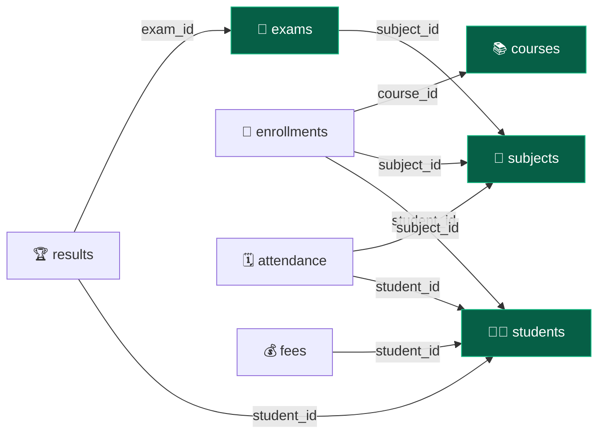
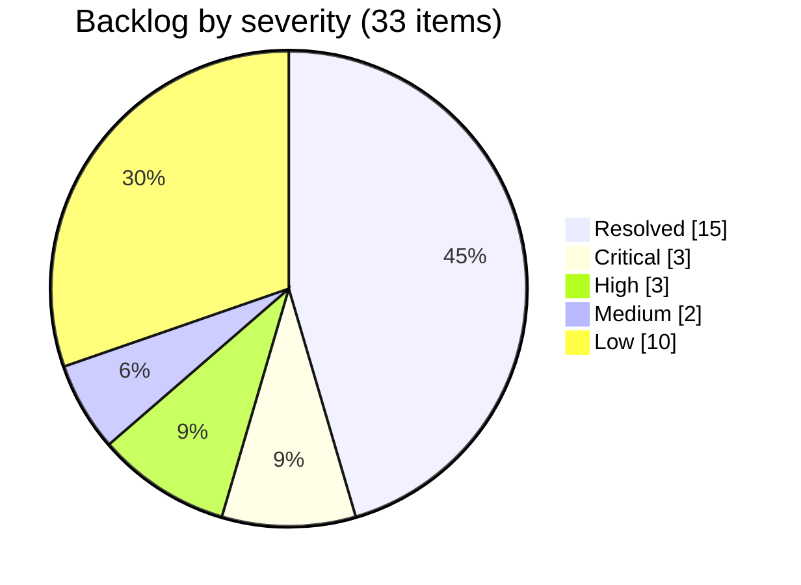
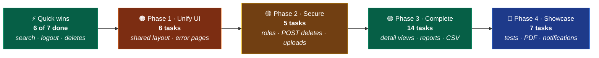

 

# 📋 Project Analysis

**Module-by-module inventory · code-health audit · engineering backlog**

*Last verified against source: **7 Oct 2026** · commit `fefbd5a`*

[📘 README](README.md) · [🗺️ Roadmap](PROJECT_ROADMAP.md) · [✅ Task Board](TASKS.md) · [🧪 Backlog](#-engineering-backlog) · [🚧 Remaining Work](#-remaining-work)

---

## 📑 Table of Contents

| | Section | | Section |
|:---:|---|:---:|---|
| 🩺 | [Health Check at a Glance](#-health-check-at-a-glance) | 🧪 | [Engineering Backlog](#-engineering-backlog) |
| 📐 | [Codebase by the Numbers](#-codebase-by-the-numbers) | 🧱 | [Stubs and Dead Code](#-stubs-and-dead-code) |
| 🧰 | [Tech Stack](#-tech-stack) | 📝 | [Documentation Drift](#-documentation-drift) |
| 🧩 | [Module Inventory](#-module-inventory) | 🚧 | **[Remaining Work](#-remaining-work)** |
| 🔗 | [Referential Integrity](#-referential-integrity) | 📊 | [Completion Summary](#-completion-summary) |
| 🔐 | [Security Review](#-security-review) | 🔬 | [How This Was Verified](#-how-this-was-verified) |

---

## 🩺 Health Check at a Glance

| Check | Result | Evidence |
|---|:---:|---|
| 🛠️ **Compile & package** | 🟢 Pass | `mvnw test` → `BUILD SUCCESS` |
| 🚀 **Startup** | 🟢 Pass | Context boots against MySQL · **68** request mappings (66 app + 2 Spring `/error`) |
| 🔑 **Authentication** | 🟢 Solid | BCrypt, custom `UserDetailsService`, CSRF tokens on every `th:action` form, POST logout |
| 🧮 **Business logic** | 🟢 Working | Grade engine, gender split, fee totals, upcoming-exam filter all read real data |
| ✔️ **Form validation** | 🟢 Working | Bean Validation runs on all 10 entity forms and re-renders field errors |
| 🧪 **Test suite** | 🟡 Smoke only | `Tests run: 1, Failures: 0` — `contextLoads()` has no assertions |
| 🔍 **Search** | 🟢 Working | Keyword search works in all 9 modules · attendance and exam date filters combine with the keyword |
| 🔗 **Referential integrity** | 🟢 Solid | All four parent deletes (Student, Course, Exam, Subject) clear dependent rows in one transaction |
| 🎨 **UI consistency** | 🟡 Partial | Dashboard uses the shared layout · 9 modules are standalone pages |
| 🛡️ **Authorization** | 🔴 Missing | Single role, open self-registration, state-changing GET links |

> 🔄 **6 Oct 2026:** a line-by-line audit of all 63 Java files and 36 templates found **9 new issues
> (#23–#31)**. Stage A of the [Task Board](TASKS.md) then fixed **six issues** (#12, #13, #23, #24,
> #25, #26) and part of #5, each one reproduced before the fix and re-checked after it. Testing turned
> up two more: **#32** (fixed) and **#33** (open).

---

## 📐 Codebase by the Numbers

<table>
<tr>
<td width="50%" valign="top">

**☕ Backend**

| Layer | Count |
|---|:---:|
| 🎯 Controllers | `12` |
| ⚙️ Service interfaces / impls | `10` / `10` (+ `CustomUserDetailsService`) |
| 🗄️ Repositories | `10` |
| 📦 JPA entities | `10` |
| 🔗 `@ManyToOne` relationships | `9` |
| ✍️ `@Modifying` JPQL deletes | `10` |
| 📊 Aggregate `@Query`s | `4` |
| 🔍 Search `@Query`s | `2` |
| 📨 DTOs | `1` real + `3` empty stubs |
| 🧰 Utilities | `3` empty stubs |

</td>
<td width="50%" valign="top">

**🎨 Frontend & totals**

| Item | Count |
|---|:---:|
| 🌐 HTTP endpoints | `66` |
| 🖼️ Thymeleaf templates | `36` |
| 💅 CSS files | `10` *(dashboard shell only)* |
| ⚡ JS files | `3` *(dashboard, charts, notifications)* |
| 🧪 Test classes | `1` |
| 📄 Java files | `63` |
| 📏 Lines of Java | `4,512` |

</td>
</tr>
</table>

---

## 🧰 Tech Stack

| Layer | Technology | Note |
|:---:|---|---|
| ☕ | Java **21** · Spring Boot **3.5.16** | Parent POM pins all Spring versions |
| 🔐 | Spring Security 6 · `thymeleaf-extras-springsecurity6` | Form login, BCrypt; `#authentication` drives the navbar |
| 🗄️ | Spring Data JPA · Hibernate · MySQL (`sms_web`) | `ddl-auto=update`; open-in-view left at its default (`true`) |
| 🎨 | Thymeleaf · Bootstrap **5.3.3 / 5.3.8** · Bootstrap Icons 1.11.3 · Chart.js 4.4.3 | Two Bootstrap versions in use (#17); Font Awesome 6.5.2 on 3 pages (#31) |
| ✔️ | Jakarta Bean Validation | Enforced on all 10 entity forms |
| 🛠️ | Maven wrapper · Lombok | ⚠️ Lombok is declared but **never imported**. All getters and setters are hand-written (#30) |

---

## 🧩 Module Inventory

Every module has the full **entity → repository → service → controller** chain. The matrix shows how far
each one goes beyond that, and the cards below list what's built. Everything still to do is collected in
[🚧 Remaining Work](#-remaining-work).

| # | Module | List | Form | Detail | Search | Paging | `@Valid` | Delete | Open issues |
|:---:|---|:---:|:---:|:---:|:---:|:---:|:---:|:---:|---|
| 1 | 🔐 Auth | — | ✅ | — | — | — | ✅ | — | #3 |
| 2 | 👨‍🎓 Student | ✅ | ✅ 📷 | ✅ | ✅ | ✅ | ✅ | ✅ cascade | #7 |
| 3 | 👨‍🏫 Teacher | ✅ | ✅ 📷 | ✅ | ✅ | ✅ | ✅ | ✅ | #7 #27 #29 |
| 4 | 📚 Course | ✅ | ✅ | ✅ | ✅ | ✅ | ✅ | ✅ cascade | #27 |
| 5 | 📖 Subject | ✅ | ✅ | ❌ | ✅ | ✅ | ✅ | ✅ cascade | #27 |
| 6 | 📝 Enrollment | ✅ | ✅ | ❌ | ✅ | ✅ | ✅ | ✅ | #27 |
| 7 | 🗓️ Attendance | ✅ | ✅ | ❌ | ✅ +date | ✅ | ✅ | ✅ | — |
| 8 | 💰 Fee | ✅ | ✅ | ❌ | ✅ | ✅ | ✅ | ✅ | #28 |
| 9 | 🧾 Exam | ✅ | ✅ | ❌ | ✅ +date | ⚠️ | ✅ | ✅ cascade | #11 |
| 10 | 🏆 Result | ✅ | ✅ | ❌ | ✅ | ⚠️ | ✅ | ✅ | #11 #28 |
| 11 | 📊 Dashboard | — | — | — | via navbar ✅ | — | — | — | #15 |

📷 photo upload · cascade = dependent rows are cleared first (see [Referential Integrity](#-referential-integrity)) ·
+date = keyword and date filters combine · Paging ⚠️ = default list loads every row

<b>🔐 1. Authentication</b>: registration, login, session

 

- [x] `User` entity: `fullName`, `username` (unique), `email` (unique), BCrypt `password`, `role`, `enabled`, `createdAt` (`@PrePersist`)
- [x] `UserRepository`: `findByUsername`, `existsByUsername`, `existsByEmail`
- [x] `UserServiceImpl.registerUser`: duplicate username/email guards, password confirmation, BCrypt hashing, default `ROLE_STUDENT`
- [x] `AuthController`: `GET /login`, `GET /register`, `POST /register` (`@Valid` + `BindingResult`, service errors surfaced on the form)
- [x] `CustomUserDetailsService` honours the `enabled` flag; `SecurityConfig` wires `DaoAuthenticationProvider`
- [x] Sidebar logout is a `POST /logout` form, so the CSRF token is sent and the session ends
- [x] `auth/login.html`, `auth/register.html`

<b>👨‍🎓 2. Student</b>: CRUD, photo upload, cascade delete

 

- [x] `Student` entity: `firstName`, `lastName`, `email` (unique), `phone` (10 digits), `gender`, `course` (free text), `dateOfBirth`, `address`, `photo`
- [x] `StudentRepository`: 4-field `ContainingIgnoreCase` search, `existsByEmail`, `countByGender`, `findTop5ByOrderByIdDesc`
- [x] `StudentServiceImpl`: CRUD, 5-per-page pagination, gender stats, **`@Transactional` cascade delete** across 4 child tables
- [x] `StudentController`: 8 routes; duplicate-email check works on **both create and edit**; existing photo kept when none is uploaded
- [x] `student-list.html` · `student-form.html` (course dropdown fed from `Course`, text fallback) · `student-view.html`

<b>👨‍🏫 3. Teacher</b>: CRUD, photo upload

 

- [x] `Teacher` entity: `firstName`, `lastName`, `email`, `phone` (10 digits), `department`, `qualification`, `gender`, `photo`
- [x] `TeacherRepository`: first/last-name search, `existsByEmail`, `countDistinctDepartments`
- [x] `TeacherServiceImpl`: CRUD, pagination, department count
- [x] `TeacherController`: 6 routes; search and paging share `GET /teacher?keyword=&page=`
- [x] `teacher-list.html` · `teacher-form.html` · `teacher-view.html`

<b>📚 4. Course</b>: catalogue

 

- [x] `Course` entity: `courseCode`, `courseName`, `duration`, `fees` (`Double`, ≥ 0), `description`
- [x] `CourseRepository`: name/code search, `existsByCourseCode`
- [x] `CourseServiceImpl`: CRUD, pagination, search, `@Transactional` delete that clears enrollments first
- [x] `CourseController`: 6 routes including `GET /course/view/{id}`
- [x] `course-list.html` · `course-form.html` · `course-view.html`

<b>📖 5. Subject</b>: catalogue with transactional delete

 

- [x] `Subject` entity: `subjectCode`, `subjectName`, `semester`, `credits` (≥ 1), `department`. ⚠️ No `Course` relationship
- [x] `SubjectRepository`: name/code search, `existsBySubjectCode`, `sumAllCredits`
- [x] `SubjectServiceImpl`: `@Transactional` delete clears attendance → enrollments → exam results → exams first
- [x] `SubjectController`: 5 routes
- [x] `subject-list.html` · `subject-form.html`

<b>📝 6. Enrollment</b>: Student ↔ Course ↔ Subject

 

- [x] `Enrollment` entity: `student`, `course`, `subject` (all required FKs), `enrollmentDate`
- [x] `EnrollmentRepository`: 3-way search, `countDistinctStudents`, bulk deletes by student / subject
- [x] `EnrollmentServiceImpl`: CRUD, pagination, distinct-student count
- [x] `EnrollmentController`: 5 routes
- [x] `enrollment-list.html` · `enrollment-form.html`

<b>🗓️ 7. Attendance</b>: daily marking

 

- [x] `Attendance` entity: `student`, `subject`, `attendanceDate`, `status`, `remarks`
- [x] `AttendanceRepository`: keyword + date `@Query` search (each optional, both must match), `countByStatus`, bulk deletes by student / subject
- [x] `AttendanceServiceImpl`: CRUD, pagination, status counts
- [x] `AttendanceController`: 8 routes (separate `/save` and `/update/{id}`)
- [x] `attendance-list.html` · `attendance-form.html`

<b>💰 8. Fee</b>: payments and status

 

- [x] `Fee` entity: `student`, `feeType`, `amount` (`BigDecimal`), `dueDate`, `paymentDate`, `paymentStatus`, `paymentMethod`
- [x] `FeeRepository`: 3-field search, `sumAllAmounts`, `countByPaymentStatus`, recent payments
- [x] `FeeServiceImpl`: CRUD, pagination, **real money total** (`getTotalFeeAmount`)
- [x] `FeeController`: 7 routes; search reports a fixed `totalPages = 1`
- [x] `fee-list.html` · `fee-form.html`

<b>🧾 9. Exam</b>: scheduling

 

- [x] `Exam` entity: `examName`, `subject`, `examDate`, `totalMarks` (≥ 1), `passingMarks` (≥ 1)
- [x] `ExamRepository`: name/subject + date `@Query` search (each optional, both must match), upcoming count and top-5 (`examDate >= today`)
- [x] `ExamServiceImpl`: CRUD, pagination, upcoming exams, `@Transactional` delete that clears results first
- [x] `ExamController`: 8 routes; `@Valid` on save and update, with field errors on the form
- [x] `exam-list.html` · `exam-form.html`

<b>🏆 10. Result</b>: marks and auto-grading

 

- [x] `Result` entity: `student`, `exam`, `obtainedMarks` (0–1000), `grade`, `resultStatus`
- [x] `ResultRepository`: 4-field search, bulk delete by student
- [x] `ResultServiceImpl`: **auto-computes percentage, six-band grade and pass/fail** from the exam's own thresholds on every save and update
- [x] `ResultController`: 8 routes; `@Valid` on save and update; the form binds whole `Exam` entities, so the grade engine sees real marks
- [x] `result-list.html` · `result-form.html`

<b>📊 11. Dashboard</b>: stats, charts, shared shell

 

- [x] `DashboardController` assembles 22 data attributes from 8 services and renders through `layout/layout.html`
- [x] Fragments: `welcome` · `stats-cards` · `charts` · `quick-actions` · `recent-students` · `recent-fees` · `upcoming-exams`
- [x] Stat cards show real sub-facts (₹ collected, paid/pending, departments, credits, upcoming exams)
- [x] Chart.js gender doughnut (with an "Other" slice that reconciles to the headline) and records-by-module bar chart
- [x] Live date/time card, navbar bound to the signed-in user and role, active sidebar link via `activeNav`
- [x] Design tokens in `theme.css`; CSS Grid app shell

---

## 🔗 Referential Integrity

The schema has **nine foreign keys**. A parent row can only be deleted after its children are removed,
so each `delete*()` method must clear them first. This diagram shows which keys that cleanup covers.

Arrows point from child to parent. Every arrow is now cleared before its parent is deleted, so all four
parents (green) delete safely. Until 6 Oct 2026 the `course_id` and `exam_id` arrows were not cleared (#25).

| Delete operation | Children cleared first | Outcome |
|---|---|:---:|
| `StudentServiceImpl.deleteStudent` | attendance → enrollments → fees → results, in one `@Transactional` | 🟢 Safe |
| `SubjectServiceImpl.deleteSubject` | attendance → enrollments → results of its exams → exams | 🟢 Safe |
| `CourseServiceImpl.deleteCourse` | enrollments | 🟢 Safe |
| `ExamServiceImpl.deleteExam` | results | 🟢 Safe |
| Teacher · Enrollment · Attendance · Fee · Result | no children | 🟢 Safe |

No delete path is known to fail now. Any future constraint error would still show the Whitelabel 500 page
until a global exception handler lands (#8, task B3).

---

## 🔐 Security Review

<table>
<tr>
<td width="50%" valign="top">

**✅ In place**

| Control | Detail |
|---|---|
| Password storage | BCrypt via a `PasswordEncoder` bean |
| Login & session | Form login, custom `UserDetailsService`, `enabled` flag honoured |
| CSRF on forms | On by default; Thymeleaf injects `_csrf` into every `th:action` POST form |
| Logout | `POST /logout` form with the CSRF token; the session is invalidated |
| Secrets | DB credentials read from `DB_USERNAME` / `DB_PASSWORD` environment variables |
| Output escaping | No `th:utext` anywhere, so all model data is HTML-escaped |
| Registration guards | Username and email uniqueness, password confirmation |
| Route protection | Everything outside the public allowlist requires a session |

</td>
<td width="50%" valign="top">

**❌ Gaps**

| Gap | Issue |
|---|:---:|
| No roles + open self-registration | #3 |
| Deletes via GET links | #4 |
| Leaked DB password still in git history, not rotated | #5 |
| Unvalidated uploads served same-origin | #7 |
| Whitelabel errors · DEBUG/TRACE logging | #8 · #29 |

</td>
</tr>
</table>

---

## 🧪 Engineering Backlog

> Numbering continues the register in [PROJECT_ROADMAP.md](PROJECT_ROADMAP.md#-engineering-backlog), so issue
> numbers match across both documents. 🆕 marks issues first found in this audit. **Phase** refers to the
> roadmap phase that owns the fix. [Remaining Work](#-remaining-work) turns the open items into an
> ordered checklist.

<b>✅ Resolved (15)</b>

 

| # | Issue | Location | Resolved |
|:---:|---|---|:---:|
| 1 | Invalid derived query aborted Spring context at startup | `EnrollmentRepository.java` | `21 Sep 2026` |
| 2 | `deleteBySubjectId` targeted the wrong entity → FK violation | `EnrollmentRepository.java` | `21 Sep 2026` |
| 9 | "Total Fees" displayed a record count, not a currency sum | `FeeServiceImpl.java` | `21 Sep 2026` |
| 10 | "Upcoming Exams" listed the 5 oldest exams, with no date filter | `ExamServiceImpl.java` | `21 Sep 2026` |
| 12 | Exam and Result forms lacked `@Valid`: invalid input reached Hibernate (or a `NullPointerException` in the grade calculation) and showed a 500 page | `ExamController.java` · `ResultController.java` | `6 Oct 2026` |
| 13 | Magic-date sentinel `1900-01-01` stood in for "no date" in search | `AttendanceServiceImpl.java` · `ExamServiceImpl.java` | `6 Oct 2026` |
| 14 | Navbar hardcoded "Admin User" regardless of session | `common/navbar.html` | `21 Sep 2026` |
| 16 | Gender statistics computed but never rendered | `stats-cards.html` · `charts.html` | `21 Sep 2026` |
| 21 | `footer.css` contained a copy of `footer.html`, so the footer rendered unstyled | `static/css/footer.css` | `21 Sep 2026` |
| 22 | `welcome.css` targeted markup that did not exist; live clock had no elements to update | `welcome.css` · `welcome.html` | `21 Sep 2026` |
| 23 | Student search returned 500 because the pager values were missing from the model | `StudentController.java` | `6 Oct 2026` |
| 24 | Logout sent `GET /logout`, which 404'd and left the session alive; now a CSRF-protected POST form | `common/sidebar.html` | `6 Oct 2026` |
| 25 | Course, exam and subject deletes violated foreign keys (500); each now clears its dependent rows in one transaction | `CourseServiceImpl` · `ExamServiceImpl` · `SubjectServiceImpl` | `6 Oct 2026` |
| 26 | Date-only search returned every row; keyword and date are now each optional and must both match | `AttendanceRepository` · `ExamRepository` | `6 Oct 2026` |
| 32 | Every edit form with a date opened with an empty date box: `LocalDate` printed in a locale short style (`12/10/26`) that `<input type="date">` rejects | `application.properties` (`spring.mvc.format.date=iso`) | `6 Oct 2026` |

<b>🔴 Critical (3)</b>

 

| # | Issue | Location | Phase |
|:---:|---|---|:---:|
| 3 | No role enforcement, and `/register` is public: anyone can self-register and immediately gets full create/edit/delete rights | `SecurityConfig.java:48` · `UserServiceImpl.java:55` | `2` |
| 4 | Deletes exposed as GET links, so browser prefetch, crawlers or a link on another site can trigger them, and CSRF protection doesn't cover GET | 9 `*-list.html` templates | `2` |
| 5 | Database password committed in plaintext and present on `origin/main`. Since 6 Oct it is read from `${DB_PASSWORD}`, but the old value is still in git history and has not been rotated ([task A4](TASKS.md), deferred) | `application.properties` history | `2` |

<b>🟠 High (3)</b>

 

| # | Issue | Location | Phase |
|:---:|---|---|:---:|
| 6 | Only the dashboard renders through the shared layout, so the sidebar and navbar disappear on every other page | All non-dashboard controllers | `1` |
| 7 | Uploads have no type, size or filename checks (100 MB limit, client filename used as-is). Files are served same-origin, so an uploaded `.html`/`.svg` would run as stored XSS. Replaced photos are never deleted | `StudentController.java:107` · `TeacherController.java:97` · `application.properties:22-23` | `2` |
| 8 | No global exception handler, so a bad id (`orElseThrow()`) or FK error shows a Whitelabel 500 | *(missing `@ControllerAdvice`)* | `1` |

<b>🟡 Medium (2)</b>

 

| # | Issue | Location | Phase |
|:---:|---|---|:---:|
| 11 | Pagination bypassed: all 9 search paths return an unpaginated `List`, and `GET /exam` and `GET /result` load every row | 9 controllers · `ExamController.java:28` · `ResultController.java:30` | `3` |
| 27 🆕 | Uniqueness is checked only on create and only in app code. Course code, subject code and teacher email can be duplicated through edit, none has a DB `unique` constraint, and duplicate enrollments are accepted | `Course.java:21` · `Subject.java:17` · `Teacher.java:28` · `CourseController.java:74` | `3` |

<b>🟢 Low (10)</b>

 

| # | Issue | Location | Phase |
|:---:|---|---|:---:|
| 15 | Notifications are three hardcoded items, and the badge is hardcoded to `3` | `common/notification.html` · `navbar.html:30` | `4` |
| 17 | Bootstrap version drift: `5.3.3` (20 refs) vs `5.3.8` (7 refs) | Module templates | `1` |
| 18 | Six empty stub classes (3 DTOs + 3 utilities) | `dto/` · `utility/` | `3–4` |
| 19 | `uploads/` (5 personal photos) committed and pushed | `.gitignore` | `2` |
| 20 | `webConfig` breaks the Java class-naming convention | `config/webConfig.java` | `1` |
| 28 🆕 | Marks and amount sanity: `obtainedMarks` isn't capped at the exam's `totalMarks`, `passingMarks` may exceed `totalMarks`, and `Fee.amount` accepts negatives. Grade bands ignore the pass mark, so "Pass · F" is possible (40/100 with a pass mark of 33) | `ResultServiceImpl.java:87` · `Exam.java:42` · `Fee.java:27` | `3` |
| 29 🆕 | Debug leftovers: `System.out.println` in two controllers, a failed teacher-photo write swallowed by `printStackTrace()`, and DEBUG/TRACE logging plus `show-sql` in the default profile | `DashboardController.java:47` · `TeacherController.java:116,156` · `application.properties:14,25-26` | `2` |
| 30 🆕 | Dead code and config: Lombok never imported; the `/uploads/**` permit rule matches nothing (photos are served at `/student-images/**` and `/teacher-images/**`); 4 unused repository methods; `getRecentStudents()` typed as `Object` | `pom.xml` · `SecurityConfig.java:44` · `StudentService.java:33` | `1` |
| 31 🆕 | External runtime dependencies: `via.placeholder.com` for missing teacher photos; Font Awesome loaded on 3 pages alongside Bootstrap Icons | `teacher-list.html:79` · `teacher-view.html:48` · enrollment and subject templates | `1` |
| 33 🆕 | Non-numeric input in a number field (only possible by bypassing the browser's number box) shows Spring's raw "Failed to convert…" message | *(no `messages.properties`)* | `3` |

---

## 🧱 Stubs and Dead Code

| File | Status | Note |
|---|:---:|---|
| `utility/CscHelper.java` | ❌ Empty | Misspelled (`CsvHelper`). `student.CSV` has columns `ID, Name, Email, Course, Marks`, which don't map onto `Student`'s required phone, gender, DOB and address, so an importer needs a mapping decision first |
| `utility/FileUploadUtil.java` | ❌ Empty | Upload logic is duplicated in `StudentController` and `TeacherController` |
| `utility/DateUtil.java` | ❌ Empty | No date formatting helpers in use |
| `dto/CourseDTO.java` · `StudentDTO.java` · `TeacherDTO.java` | ❌ Empty | Entities are bound to forms directly; only `UserRegistrationDto` is real |
| Unused repository methods | ⚠️ Dead | `AttendanceRepository.findTop5ByOrderByAttendanceDateDesc` · `StudentRepository.countByCourse` · `ExamRepository.findTop5ByOrderByExamDateAsc` · `UserRepository.findByEmail` |

> ✅ Cleaned up in earlier passes: `Fees.java`, `Marks.java` and the misplaced `controller/studentService.java`
> were deleted, and `course/course-view.html` was implemented.

---

## 📝 Documentation Drift

Statements in the companion documents that had stopped matching the source. **All eight were corrected on
7 Oct 2026** ([task A12](TASKS.md)); the table stays as a record of what changed.

| Claim | Where | Actual | Status |
|---|---|---|:---:|
| "Eight foreign-key relationships" | README · Roadmap | **Nine**. Both documents' own ER diagrams draw nine edges | ✅ Fixed |
| `courseCode`, `subjectCode`, `Teacher.email` marked `UK` | README · Roadmap ER diagrams | Only `Student.email`, `User.username` and `User.email` are unique in the database (#27) | ✅ Markers removed |
| "Safe Deletes: no orphan rows" · "the same pattern protects `deleteSubject()`" | README | Was true for Student only; true for all four parent deletes since #25 was fixed | ✅ Reworded |
| Lombok listed for "boilerplate reduction" | README tech stack | Declared, never used (#30) | ✅ Removed from README |
| `/uploads/**` listed as a public route | README routes | Photos are served at `/student-images/**` and `/teacher-images/**` and require login | ✅ Fixed |
| "35 views" · "4,278 lines of Java" | Roadmap | **36** templates · **4,512** lines (as of `fefbd5a`) | ✅ Fixed |
| "Search bypasses pagination in 5 modules" | Roadmap #11 | All 9 search paths | ✅ Fixed |
| Sentinel at `ExamServiceImpl.java:64` | Roadmap #13 | #13 is resolved; the sentinel is gone | ✅ Moved to Resolved |

---

## 🚧 Remaining Work

> Everything still to do, in one place: **39 tasks**, made up of the 23 open backlog issues (as of the
> morning audit) plus 16 features and chores. They're ordered as a plan: quick wins first, then the four
> [roadmap](PROJECT_ROADMAP.md) phases. Issue numbers point to the [Engineering Backlog](#-engineering-backlog)
> for file and line details. The [Task Board](TASKS.md) splits this list into 101 single-sitting steps and
> tracks their progress.

### ⚡ Quick Wins · Do First

Pulled forward from their roadmap phases · about 70 lines of code in total

Each one is small, and the first two fix flows a reviewer is likely to click in their first minute.

- [x] **Fix the student search crash** (#23): put `currentPage = 1` and `totalPages = 1` on the model in `searchStudents`, or guard the pagination `<nav>` with `th:if` · *~2 lines*
- [x] **Make logout work** (#24): replace the sidebar `<a>` with a `<form method="post" th:action="@{/logout}">` and a button · *~5 lines*
- [ ] **Rotate the database password** (#5): read it from `${DB_PASSWORD}` and change the old one, which is already on GitHub · *1 line + rotation* · ✅ env var done 6 Oct; rotation deferred because other local projects share `root`
- [x] **Fix the three failing deletes** (#25): clear enrollments by course and results by exam first, under `@Transactional` · *~20 lines*
- [x] **Make date-only search filter by date** (#26): pass `null` instead of `""` for a blank keyword, or switch to an AND-semantics `@Query` · *~10 lines*
- [x] **Validate the Exam and Result forms** (#12): add `@Valid` + `BindingResult` to the 4 handlers and `th:errors` to both forms · *~30 lines*
- [x] **Correct the README and roadmap** to match the [Documentation Drift](#-documentation-drift) table, once the fixes above have landed · *docs only*

### 🟠 Phase 1 · Unify the UI

Roadmap estimate: ~1 week · priority High

- [ ] **Render every page through the shared layout** (#6): convert the module views to `th:fragment="content"` the way the dashboard does. The layout deliberately leaves out Bootstrap's CSS, which every module page depends on, so first decide whether to load it there or restyle the pages
- [ ] **Pin one Bootstrap version** (#17), which follows from the layout decision above
- [ ] **Add a global error handler** (#8): `@ControllerAdvice` plus styled 404 and 500 pages in place of the Whitelabel page
- [ ] **Remove external template dependencies** (#31): a local fallback avatar instead of `via.placeholder.com`, and Bootstrap Icons instead of Font Awesome
- [ ] **Clear out dead code** (#30): the unused Lombok dependency, the `/uploads/**` permit rule and 4 unused repository methods; type `getRecentStudents()` as `List<Student>`
- [ ] **Rename `webConfig` to `WebConfig`** (#20)

### 🟡 Phase 2 · Security and Data Integrity

Roadmap estimate: ~1 week · priority High

- [ ] **Add role-based access control** (#3): `ADMIN` / `TEACHER` / `STUDENT` roles, `.hasRole(...)` route rules and `sec:authorize` on the sidebar, so self-registration no longer grants full rights
- [ ] **Turn delete links into POST forms** (#4) on all 9 list pages
- [ ] **Harden photo uploads** (#7): image types only, a size cap well below 100 MB, server-generated filenames, deletion of replaced photos, and the shared logic moved into `FileUploadUtil`
- [ ] **Stop tracking `uploads/`** (#19): add it to `.gitignore` and run `git rm --cached`
- [ ] **Remove debug leftovers** (#29): the `System.out.println` calls and the swallowed upload exception; move DEBUG/TRACE logging and `show-sql` into a dev profile

### 🟢 Phase 3 · Complete the Feature Set

Roadmap estimate: ~1–2 weeks · priority Medium

<table>
<tr>
<td width="50%" valign="top">

**🔧 Correctness**

- [ ] **Paginate search results** and the `/exam` and `/result` lists (#11)
- [x] **Drop the `1900-01-01` date sentinel** (#13)
- [ ] **Enforce uniqueness** (#27): `unique = true` on course code, subject code and teacher email, checks on edit as well as create, no duplicate enrollments
- [ ] **Sanity-check marks and amounts** (#28): obtained ≤ total, passing ≤ total, no negative fees; decide whether a pass can carry grade F
- [ ] **Implement or delete the empty stubs** (#18): the 3 DTOs and `DateUtil`
- [ ] **Widen teacher search** to email and department

</td>
<td width="50%" valign="top">

**✨ New capability**

- [ ] 📄 Detail pages for Subject, Enrollment, Attendance, Fee, Exam and Result
- [ ] 🎓 Student marksheet: all results, percentage, overall grade
- [ ] 🧾 Printable fee receipt and overdue-fee detection
- [ ] 📈 Attendance percentage per student, plus an attendance report
- [ ] 📅 Exam schedule / calendar view
- [ ] 👥 Bulk attendance entry for a whole class
- [ ] 📥 Student CSV import via `CsvHelper`, after deciding how `student.CSV`'s columns map
- [ ] 📤 CSV export for student and fee lists

</td>
</tr>
</table>

### 🔵 Phase 4 · Showcase Polish

Roadmap estimate: ~1 week · priority Low

- [ ] **Database-driven notifications** (#15) in place of the 3 hardcoded items and badge
- [ ] **Recent-activity feed** on the dashboard
- [ ] **PDF export** for marksheets and receipts
- [ ] **Profile page** with change password
- [ ] **Admin user management**: list users, enable or disable accounts (needs the Phase 2 roles)
- [ ] **Test suite**: unit tests for grade bands and cascade deletes, `@WebMvcTest` controller slices, `@DataJpaTest` query tests
- [ ] **README screenshots** of the main screens

### 🧊 Parked

Recorded but deliberately unscheduled, because each needs a schema migration or an outside service:

- `Student.course` as a real foreign key to `Course`, and a Subject → Course link. That link would also let enrollment check that a subject belongs to the chosen course
- Forgot / reset password, which needs a mail server
- The production concerns in the roadmap's [Future Scope](PROJECT_ROADMAP.md#-future-scope): migrations, REST API, Docker, CI/CD, monitoring

---

## 📊 Completion Summary

| Module | Backend | Frontend | Status | Notes |
|---|:---:|:---:|:---:|---|
| 🔐 Auth | ✅ | ✅ | 🟡 | Login, register and logout work; no roles yet (#3) |
| 👨‍🎓 Student | ✅ | ✅ | 🟢 | Full CRUD, detail view and search |
| 👨‍🏫 Teacher | ✅ | ✅ | 🟢 | Full CRUD + detail view; minor duplicate/upload gaps |
| 📚 Course | ✅ | ✅ | 🟢 | Full CRUD + detail view; delete clears enrollments first |
| 📖 Subject | ✅ | ⚠️ | 🟢 | View page missing |
| 📝 Enrollment | ✅ | ⚠️ | 🟢 | View page missing |
| 🗓️ Attendance | ✅ | ⚠️ | 🟢 | View/report missing |
| 💰 Fee | ✅ | ⚠️ | 🟢 | View/receipt missing |
| 🧾 Exam | ✅ | ⚠️ | 🟢 | View page missing |
| 🏆 Result | ✅ | ⚠️ | 🟡 | Grade engine and validation work; marks not capped at the exam total (#28); no marksheet |
| 📊 Dashboard | ✅ | ✅ | 🟢 | Real data + charts; notifications still static |
| 🎨 Shared layout | ✅ | ❌ | 🟠 | Only the dashboard renders through `layout.html` |
| 🛡️ Roles/permissions | ❌ | ❌ | 🔴 | Not implemented |
| 📥 CSV · 🖨️ PDF | ❌ | ❌ | ⚪ | Not started |
| 🧪 Tests | ⚠️ | — | 🟡 | One passing smoke test, no assertions |

> **Feature surface (~70%)** is unchanged: Stage A repaired existing flows rather than adding features.
> **Working as intended** rises from the morning's ~55% to an estimated **~62%**: student search, logout,
> the three failing deletes, date filtering and Exam/Result validation all work now, and every edit form
> keeps its date (#32). The phased plan is in [PROJECT_ROADMAP.md](PROJECT_ROADMAP.md), and the
> step-by-step board is [TASKS.md](TASKS.md).

---

## 🔬 How This Was Verified

| Step | Method | Result |
|---|---|---|
| 🛠️ Build & tests | `mvnw -B test` against local MySQL 8 | `BUILD SUCCESS` · `Tests run: 1, Failures: 0, Errors: 0` |
| 🌐 Route count | `RequestMappingHandlerMapping` startup log | `68 mappings` = 66 app endpoints + 2 `/error` |
| 💥 #23 search crash | Called Thymeleaf 3.1.5's `Numbers.sequence(1, null)` in isolation | `NullPointerException: "to" is null` |
| 🚪 #24 logout | Spring Security `LogoutConfigurer`: with CSRF enabled the logout matcher is `POST`-only | `GET /logout` is never handled |
| 🔗 #25 deletes | Traced every `delete*()` against the 9 `@JoinColumn(nullable = false)` FKs | 3 unhandled parent → child paths |
| 📖 Everything else | Line-by-line read of all 63 Java files, 36 templates, `pom.xml`, `application.properties` | File and line references in the backlog |
| 🧪 Stage A fixes | Each fix reproduced on the running app (`:8080`), then re-checked on a second instance built from the fixed source (`:8081`); logout, form errors and edit-form dates also checked in headless Edge | Every check passes · `mvnw test` green |

The morning audit did not sign in, to avoid writing test accounts into the local `sms_web` database, so #23
and #24 were first confirmed from framework behaviour. The Stage A checks did sign in, with a dedicated `qa_tester`
account and made-up `@example.com` test data, and reproduced both; every temporary record they created was
deleted afterwards.
