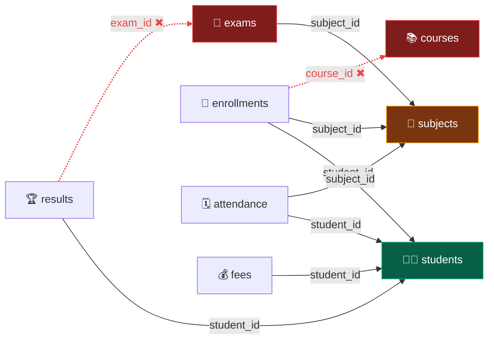
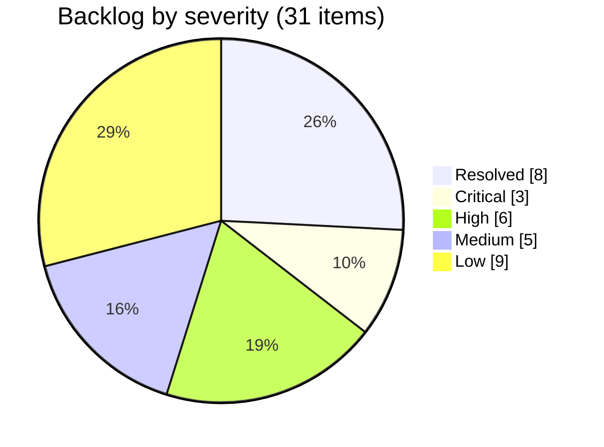
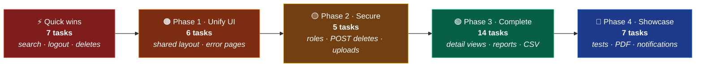

 

# 📋 Project Analysis

**Module-by-module inventory · code-health audit · engineering backlog**

*Last verified against source: **6 Oct 2026** · commit `9d957c6`*

[📘 README](README.md) · [🗺️ Roadmap](PROJECT_ROADMAP.md) · [🧪 Backlog](#-engineering-backlog) · [🚧 Remaining Work](#-remaining-work)

---

## 📑 Table of Contents

| | Section | | Section |
|:---:|---|:---:|---|
| 🩺 | [Health Check at a Glance](#-health-check-at-a-glance) | 🧪 | [Engineering Backlog](#-engineering-backlog) |
| 📐 | [Codebase by the Numbers](#-codebase-by-the-numbers) | 🧱 | [Stubs and Dead Code](#-stubs-and-dead-code) |
| 🧰 | [Tech Stack](#-tech-stack) | 📝 | [Documentation Drift](#-documentation-drift) |
| 🧩 | [Module Inventory](#-module-inventory) | 🚧 | **[Remaining Work](#-remaining-work)** |
| 🔗 | [Referential Integrity](#-referential-integrity) | 📊 | [Completion Summary](#-completion-summary) |
| 🔐 | [Security Review](#-security-review) | 🔬 | [How This Was Verified](#-how-this-was-verified) |

---

## 🩺 Health Check at a Glance

| Check | Result | Evidence |
|---|:---:|---|
| 🛠️ **Compile & package** | 🟢 Pass | `mvnw test` → `BUILD SUCCESS` |
| 🚀 **Startup** | 🟢 Pass | Context boots against MySQL · **68** request mappings (66 app + 2 Spring `/error`) |
| 🔑 **Authentication** | 🟢 Solid | BCrypt, custom `UserDetailsService`, CSRF tokens on every `th:action` form |
| 🧮 **Business logic** | 🟢 Working | Grade engine, gender split, fee totals, upcoming-exam filter all read real data |
| 🧪 **Test suite** | 🟡 Smoke only | `Tests run: 1, Failures: 0` — `contextLoads()` has no assertions |
| 🔍 **Search** | 🟡 Partial | Keyword search works in 8 of 9 modules · Student search returns 500 · date-only filters return every row |
| 🔗 **Referential integrity** | 🟡 Partial | Student delete is fully transactional · Course, Exam and Subject deletes can hit FK errors |
| 🎨 **UI consistency** | 🟡 Partial | Dashboard uses the shared layout · 9 modules are standalone pages |
| 🛡️ **Authorization** | 🔴 Missing | Single role, open self-registration, state-changing GET links |

> 🔄 **Since the 21 Sep review:** no Java, template or CSS files have changed. Only `README.md`,
> `docs/banner.svg` and the `thymeleaf-extras-springsecurity6` dependency landed. This pass was a deeper
> line-by-line audit of all 63 Java files and 36 templates. It re-checked every earlier finding and
> found **9 new issues (#23–#31)**, three of them High severity.

---

## 📐 Codebase by the Numbers

<table>
<tr>
<td width="50%" valign="top">

**☕ Backend**

| Layer | Count |
|---|:---:|
| 🎯 Controllers | `12` |
| ⚙️ Service interfaces / impls | `10` / `10` (+ `CustomUserDetailsService`) |
| 🗄️ Repositories | `10` |
| 📦 JPA entities | `10` |
| 🔗 `@ManyToOne` relationships | `9` |
| ✍️ `@Modifying` JPQL deletes | `7` |
| 📊 Aggregate `@Query`s | `4` |
| 📨 DTOs | `1` real + `3` empty stubs |
| 🧰 Utilities | `3` empty stubs |

</td>
<td width="50%" valign="top">

**🎨 Frontend & totals**

| Item | Count |
|---|:---:|
| 🌐 HTTP endpoints | `66` |
| 🖼️ Thymeleaf templates | `36` |
| 💅 CSS files | `10` *(dashboard shell only)* |
| ⚡ JS files | `3` *(dashboard, charts, notifications)* |
| 🧪 Test classes | `1` |
| 📄 Java files | `63` |
| 📏 Lines of Java | `4,405` |

</td>
</tr>
</table>

---

## 🧰 Tech Stack

| Layer | Technology | Note |
|:---:|---|---|
| ☕ | Java **21** · Spring Boot **3.5.16** | Parent POM pins all Spring versions |
| 🔐 | Spring Security 6 · `thymeleaf-extras-springsecurity6` | Form login, BCrypt; `#authentication` drives the navbar |
| 🗄️ | Spring Data JPA · Hibernate · MySQL (`sms_web`) | `ddl-auto=update`; open-in-view left at its default (`true`) |
| 🎨 | Thymeleaf · Bootstrap **5.3.3 / 5.3.8** · Bootstrap Icons 1.11.3 · Chart.js 4.4.3 | Two Bootstrap versions in use (#17); Font Awesome 6.5.2 on 3 pages (#31) |
| ✔️ | Jakarta Bean Validation | Enforced on 8 of 10 entity forms (#12) |
| 🛠️ | Maven wrapper · Lombok | ⚠️ Lombok is declared but **never imported**. All getters and setters are hand-written (#30) |

---

## 🧩 Module Inventory

Every module has the full **entity → repository → service → controller** chain. The matrix shows how far
each one goes beyond that, and the cards below list what's built. Everything still to do is collected in
[🚧 Remaining Work](#-remaining-work).

| # | Module | List | Form | Detail | Search | Paging | `@Valid` | Delete | Open issues |
|:---:|---|:---:|:---:|:---:|:---:|:---:|:---:|:---:|---|
| 1 | 🔐 Auth | — | ✅ | — | — | — | ✅ | — | #3 #24 |
| 2 | 👨‍🎓 Student | ✅ | ✅ 📷 | ✅ | ❌ 500 | ✅ | ✅ | ✅ cascade | #7 #23 |
| 3 | 👨‍🏫 Teacher | ✅ | ✅ 📷 | ✅ | ✅ | ✅ | ✅ | ✅ | #7 #27 #29 |
| 4 | 📚 Course | ✅ | ✅ | ✅ | ✅ | ✅ | ✅ | ⚠️ FK | #25 #27 |
| 5 | 📖 Subject | ✅ | ✅ | ❌ | ✅ | ✅ | ✅ | ⚠️ FK | #25 #27 |
| 6 | 📝 Enrollment | ✅ | ✅ | ❌ | ✅ | ✅ | ✅ | ✅ | #27 |
| 7 | 🗓️ Attendance | ✅ | ✅ | ❌ | ⚠️ date | ✅ | ✅ | ✅ | #13 #26 |
| 8 | 💰 Fee | ✅ | ✅ | ❌ | ✅ | ✅ | ✅ | ✅ | #28 |
| 9 | 🧾 Exam | ✅ | ⚠️ | ❌ | ⚠️ date | ⚠️ | ❌ | ⚠️ FK | #11 #12 #25 #26 |
| 10 | 🏆 Result | ✅ | ⚠️ | ❌ | ✅ | ⚠️ | ❌ | ✅ | #11 #12 #28 |
| 11 | 📊 Dashboard | — | — | — | via navbar → #23 | — | — | — | #15 |

📷 photo upload · ⚠️ FK = delete fails when child rows exist (see [Referential Integrity](#-referential-integrity)) ·
⚠️ date = date-only filter ignored · Paging ⚠️ = default list loads every row

<b>🔐 1. Authentication</b>: registration, login, session

 

- [x] `User` entity: `fullName`, `username` (unique), `email` (unique), BCrypt `password`, `role`, `enabled`, `createdAt` (`@PrePersist`)
- [x] `UserRepository`: `findByUsername`, `existsByUsername`, `existsByEmail`
- [x] `UserServiceImpl.registerUser`: duplicate username/email guards, password confirmation, BCrypt hashing, default `ROLE_STUDENT`
- [x] `AuthController`: `GET /login`, `GET /register`, `POST /register` (`@Valid` + `BindingResult`, service errors surfaced on the form)
- [x] `CustomUserDetailsService` honours the `enabled` flag; `SecurityConfig` wires `DaoAuthenticationProvider`
- [x] `auth/login.html`, `auth/register.html`

<b>👨‍🎓 2. Student</b>: CRUD, photo upload, cascade delete

 

- [x] `Student` entity: `firstName`, `lastName`, `email` (unique), `phone` (10 digits), `gender`, `course` (free text), `dateOfBirth`, `address`, `photo`
- [x] `StudentRepository`: 4-field `ContainingIgnoreCase` search, `existsByEmail`, `countByGender`, `findTop5ByOrderByIdDesc`
- [x] `StudentServiceImpl`: CRUD, 5-per-page pagination, gender stats, **`@Transactional` cascade delete** across 4 child tables
- [x] `StudentController`: 8 routes; duplicate-email check works on **both create and edit**; existing photo kept when none is uploaded
- [x] `student-list.html` · `student-form.html` (course dropdown fed from `Course`, text fallback) · `student-view.html`

<b>👨‍🏫 3. Teacher</b>: CRUD, photo upload

 

- [x] `Teacher` entity: `firstName`, `lastName`, `email`, `phone` (10 digits), `department`, `qualification`, `gender`, `photo`
- [x] `TeacherRepository`: first/last-name search, `existsByEmail`, `countDistinctDepartments`
- [x] `TeacherServiceImpl`: CRUD, pagination, department count
- [x] `TeacherController`: 6 routes; search and paging share `GET /teacher?keyword=&page=`
- [x] `teacher-list.html` · `teacher-form.html` · `teacher-view.html`

<b>📚 4. Course</b>: catalogue

 

- [x] `Course` entity: `courseCode`, `courseName`, `duration`, `fees` (`Double`, ≥ 0), `description`
- [x] `CourseRepository`: name/code search, `existsByCourseCode`
- [x] `CourseServiceImpl`: CRUD, pagination, search
- [x] `CourseController`: 6 routes including `GET /course/view/{id}`
- [x] `course-list.html` · `course-form.html` · `course-view.html`

<b>📖 5. Subject</b>: catalogue with transactional delete

 

- [x] `Subject` entity: `subjectCode`, `subjectName`, `semester`, `credits` (≥ 1), `department`. ⚠️ No `Course` relationship
- [x] `SubjectRepository`: name/code search, `existsBySubjectCode`, `sumAllCredits`
- [x] `SubjectServiceImpl`: `@Transactional` delete clears attendance → enrollments → exams first
- [x] `SubjectController`: 5 routes
- [x] `subject-list.html` · `subject-form.html`

<b>📝 6. Enrollment</b>: Student ↔ Course ↔ Subject

 

- [x] `Enrollment` entity: `student`, `course`, `subject` (all required FKs), `enrollmentDate`
- [x] `EnrollmentRepository`: 3-way search, `countDistinctStudents`, bulk deletes by student / subject
- [x] `EnrollmentServiceImpl`: CRUD, pagination, distinct-student count
- [x] `EnrollmentController`: 5 routes
- [x] `enrollment-list.html` · `enrollment-form.html`

<b>🗓️ 7. Attendance</b>: daily marking

 

- [x] `Attendance` entity: `student`, `subject`, `attendanceDate`, `status`, `remarks`
- [x] `AttendanceRepository`: keyword + date search, `countByStatus`, bulk deletes by student / subject
- [x] `AttendanceServiceImpl`: CRUD, pagination, status counts
- [x] `AttendanceController`: 8 routes (separate `/save` and `/update/{id}`)
- [x] `attendance-list.html` · `attendance-form.html`

<b>💰 8. Fee</b>: payments and status

 

- [x] `Fee` entity: `student`, `feeType`, `amount` (`BigDecimal`), `dueDate`, `paymentDate`, `paymentStatus`, `paymentMethod`
- [x] `FeeRepository`: 3-field search, `sumAllAmounts`, `countByPaymentStatus`, recent payments
- [x] `FeeServiceImpl`: CRUD, pagination, **real money total** (`getTotalFeeAmount`)
- [x] `FeeController`: 7 routes; search reports a fixed `totalPages = 1`
- [x] `fee-list.html` · `fee-form.html`

<b>🧾 9. Exam</b>: scheduling

 

- [x] `Exam` entity: `examName`, `subject`, `examDate`, `totalMarks` (≥ 1), `passingMarks` (≥ 1)
- [x] `ExamRepository`: name/subject/date search, upcoming count and top-5 (`examDate >= today`)
- [x] `ExamServiceImpl`: CRUD, pagination, upcoming exams
- [x] `ExamController`: 8 routes
- [x] `exam-list.html` · `exam-form.html`

<b>🏆 10. Result</b>: marks and auto-grading

 

- [x] `Result` entity: `student`, `exam`, `obtainedMarks` (0–1000), `grade`, `resultStatus`
- [x] `ResultRepository`: 4-field search, bulk delete by student
- [x] `ResultServiceImpl`: **auto-computes percentage, six-band grade and pass/fail** from the exam's own thresholds on every save and update
- [x] `ResultController`: 8 routes; the form binds whole `Exam` entities, so the grade engine sees real marks
- [x] `result-list.html` · `result-form.html`

<b>📊 11. Dashboard</b>: stats, charts, shared shell

 

- [x] `DashboardController` assembles 22 data attributes from 8 services and renders through `layout/layout.html`
- [x] Fragments: `welcome` · `stats-cards` · `charts` · `quick-actions` · `recent-students` · `recent-fees` · `upcoming-exams`
- [x] Stat cards show real sub-facts (₹ collected, paid/pending, departments, credits, upcoming exams)
- [x] Chart.js gender doughnut (with an "Other" slice that reconciles to the headline) and records-by-module bar chart
- [x] Live date/time card, navbar bound to the signed-in user and role, active sidebar link via `activeNav`
- [x] Design tokens in `theme.css`; CSS Grid app shell

---

## 🔗 Referential Integrity

The schema has **nine foreign keys**. A parent row can only be deleted after its children are removed,
so each `delete*()` method must clear them first. This diagram shows which keys that cleanup covers.

Arrows point from child to parent. **Solid** = cleared before the parent is deleted · **red dashed** =
not cleared, so the parent delete fails · node colour = outcome of deleting that parent.

| Delete operation | Children cleared first | Outcome |
|---|---|:---:|
| `StudentServiceImpl.deleteStudent` | attendance → enrollments → fees → results, in one `@Transactional` | 🟢 Safe |
| `SubjectServiceImpl.deleteSubject` | attendance → enrollments → exams | 🟠 Fails if any of those exams has results |
| `CourseServiceImpl.deleteCourse` | none | 🔴 Fails if the course has enrollments |
| `ExamServiceImpl.deleteExam` | none | 🔴 Fails if the exam has results |
| Teacher · Enrollment · Attendance · Fee · Result | no children | 🟢 Safe |

Each failure surfaces as a `DataIntegrityViolationException` rendered as a Whitelabel 500 page (#8, #25).

---

## 🔐 Security Review

<table>
<tr>
<td width="50%" valign="top">

**✅ In place**

| Control | Detail |
|---|---|
| Password storage | BCrypt via a `PasswordEncoder` bean |
| Login & session | Form login, custom `UserDetailsService`, `enabled` flag honoured |
| CSRF on forms | On by default; Thymeleaf injects `_csrf` into every `th:action` POST form |
| Output escaping | No `th:utext` anywhere, so all model data is HTML-escaped |
| Registration guards | Username and email uniqueness, password confirmation |
| Route protection | Everything outside the public allowlist requires a session |

</td>
<td width="50%" valign="top">

**❌ Gaps**

| Gap | Issue |
|---|:---:|
| No roles + open self-registration | #3 |
| Deletes via GET links | #4 |
| Logout via GET (silently fails) | #24 |
| DB password in source, already pushed | #5 |
| Unvalidated uploads served same-origin | #7 |
| Whitelabel errors · DEBUG/TRACE logging | #8 · #29 |

</td>
</tr>
</table>

---

## 🧪 Engineering Backlog

> Numbering continues the register in [PROJECT_ROADMAP.md](PROJECT_ROADMAP.md#-engineering-backlog), so issue
> numbers match across both documents. 🆕 marks issues first found in this audit. **Phase** refers to the
> roadmap phase that owns the fix. [Remaining Work](#-remaining-work) turns the open items into an
> ordered checklist.

<b>✅ Resolved (8)</b>

 

| # | Issue | Location | Resolved |
|:---:|---|---|:---:|
| 1 | Invalid derived query aborted Spring context at startup | `EnrollmentRepository.java` | `21 Sep 2026` |
| 2 | `deleteBySubjectId` targeted the wrong entity → FK violation | `EnrollmentRepository.java` | `21 Sep 2026` |
| 9 | "Total Fees" displayed a record count, not a currency sum | `FeeServiceImpl.java` | `21 Sep 2026` |
| 10 | "Upcoming Exams" listed the 5 oldest exams, with no date filter | `ExamServiceImpl.java` | `21 Sep 2026` |
| 14 | Navbar hardcoded "Admin User" regardless of session | `common/navbar.html` | `21 Sep 2026` |
| 16 | Gender statistics computed but never rendered | `stats-cards.html` · `charts.html` | `21 Sep 2026` |
| 21 | `footer.css` contained a copy of `footer.html`, so the footer rendered unstyled | `static/css/footer.css` | `21 Sep 2026` |
| 22 | `welcome.css` targeted markup that did not exist; live clock had no elements to update | `welcome.css` · `welcome.html` | `21 Sep 2026` |

<b>🔴 Critical (3)</b>

 

| # | Issue | Location | Phase |
|:---:|---|---|:---:|
| 3 | No role enforcement, and `/register` is public: anyone can self-register and immediately gets full create/edit/delete rights | `SecurityConfig.java:48` · `UserServiceImpl.java:55` | `2` |
| 4 | Deletes exposed as GET links, so browser prefetch, crawlers or a link on another site can trigger them, and CSRF protection doesn't cover GET | 9 `*-list.html` templates | `2` |
| 5 | Database password committed in plaintext and present on `origin/main` | `application.properties:6` | `2` |

<b>🟠 High (6)</b>

 

| # | Issue | Location | Phase |
|:---:|---|---|:---:|
| 6 | Only the dashboard renders through the shared layout, so the sidebar and navbar disappear on every other page | All non-dashboard controllers | `1` |
| 7 | Uploads have no type, size or filename checks (100 MB limit, client filename used as-is). Files are served same-origin, so an uploaded `.html`/`.svg` would run as stored XSS. Replaced photos are never deleted | `StudentController.java:107` · `TeacherController.java:97` · `application.properties:22-23` | `2` |
| 8 | No global exception handler, so a bad id (`orElseThrow()`) or FK error shows a Whitelabel 500 | *(missing `@ControllerAdvice`)* | `1` |
| 23 🆕 | **Student search returns 500**, including from the navbar search box on every page. `searchStudents` never sets `currentPage`/`totalPages`, and the list's pagination block then evaluates `null - 1` and `#numbers.sequence(1, null)` | `StudentController.java:52-61` · `student-list.html:131,141` | `1` |
| 24 🆕 | **Logout doesn't log out.** The sidebar sends `GET /logout`, but with CSRF enabled Spring Security only accepts `POST /logout`. The request falls through to a 404 and the session stays alive | `common/sidebar.html:134` | `2` |
| 25 🆕 | **Three deletes violate foreign keys** → 500: a course with enrollments, an exam with results, a subject whose exams have results | `CourseServiceImpl.java:44` · `ExamServiceImpl.java:56` · `SubjectServiceImpl.java:69` | `3` |

<b>🟡 Medium (5)</b>

 

| # | Issue | Location | Phase |
|:---:|---|---|:---:|
| 11 | Pagination bypassed: all 9 search paths return an unpaginated `List`, and `GET /exam` and `GET /result` load every row | 9 controllers · `ExamController.java:28` · `ResultController.java:30` | `3` |
| 12 | `@Valid` missing, so Exam and Result constraints never run and their forms have no `th:errors` | `ExamController.java:48,72` · `ResultController.java:51,78` | `3` |
| 13 | Magic-date sentinel `1900-01-01` stands in for "no date" | `AttendanceServiceImpl.java:63` · `ExamServiceImpl.java:67` | `3` |
| 26 🆕 | Date-only search returns every row. A blank keyword becomes `""`, `Containing("")` matches all rows, and the clauses are OR-ed, so the date is ignored (keyword + date also gives a union, not an intersection) | `AttendanceController.java:125` · `ExamServiceImpl.java:62` | `3` |
| 27 🆕 | Uniqueness is checked only on create and only in app code. Course code, subject code and teacher email can be duplicated through edit, none has a DB `unique` constraint, and duplicate enrollments are accepted | `Course.java:21` · `Subject.java:17` · `Teacher.java:28` · `CourseController.java:74` | `3` |

<b>🟢 Low (9)</b>

 

| # | Issue | Location | Phase |
|:---:|---|---|:---:|
| 15 | Notifications are three hardcoded items, and the badge is hardcoded to `3` | `common/notification.html` · `navbar.html:30` | `4` |
| 17 | Bootstrap version drift: `5.3.3` (20 refs) vs `5.3.8` (7 refs) | Module templates | `1` |
| 18 | Six empty stub classes (3 DTOs + 3 utilities) | `dto/` · `utility/` | `3–4` |
| 19 | `uploads/` (5 personal photos) committed and pushed | `.gitignore` | `2` |
| 20 | `webConfig` breaks the Java class-naming convention | `config/webConfig.java` | `1` |
| 28 🆕 | Marks and amount sanity: `obtainedMarks` isn't capped at the exam's `totalMarks`, `passingMarks` may exceed `totalMarks`, and `Fee.amount` accepts negatives. Grade bands ignore the pass mark, so "Pass · F" is possible (40/100 with a pass mark of 33) | `ResultServiceImpl.java:87` · `Exam.java:42` · `Fee.java:27` | `3` |
| 29 🆕 | Debug leftovers: `System.out.println` in two controllers, a failed teacher-photo write swallowed by `printStackTrace()`, and DEBUG/TRACE logging plus `show-sql` in the default profile | `DashboardController.java:47` · `TeacherController.java:116,156` · `application.properties:14,25-26` | `2` |
| 30 🆕 | Dead code and config: Lombok never imported; the `/uploads/**` permit rule matches nothing (photos are served at `/student-images/**` and `/teacher-images/**`); 4 unused repository methods; `getRecentStudents()` typed as `Object` | `pom.xml` · `SecurityConfig.java:44` · `StudentService.java:33` | `1` |
| 31 🆕 | External runtime dependencies: `via.placeholder.com` for missing teacher photos; Font Awesome loaded on 3 pages alongside Bootstrap Icons | `teacher-list.html:79` · `teacher-view.html:48` · enrollment and subject templates | `1` |

---

## 🧱 Stubs and Dead Code

| File | Status | Note |
|---|:---:|---|
| `utility/CscHelper.java` | ❌ Empty | Misspelled (`CsvHelper`). `student.CSV` has columns `ID, Name, Email, Course, Marks`, which don't map onto `Student`'s required phone, gender, DOB and address, so an importer needs a mapping decision first |
| `utility/FileUploadUtil.java` | ❌ Empty | Upload logic is duplicated in `StudentController` and `TeacherController` |
| `utility/DateUtil.java` | ❌ Empty | No date formatting helpers in use |
| `dto/CourseDTO.java` · `StudentDTO.java` · `TeacherDTO.java` | ❌ Empty | Entities are bound to forms directly; only `UserRegistrationDto` is real |
| Unused repository methods | ⚠️ Dead | `AttendanceRepository.findTop5ByOrderByAttendanceDateDesc` · `StudentRepository.countByCourse` · `ExamRepository.findTop5ByOrderByExamDateAsc` · `UserRepository.findByEmail` |

> ✅ Cleaned up in earlier passes: `Fees.java`, `Marks.java` and the misplaced `controller/studentService.java`
> were deleted, and `course/course-view.html` was implemented.

---

## 📝 Documentation Drift

Statements in the companion documents that no longer match the source. Fix these before sharing the repository.

| Claim | Where | Actual |
|---|---|---|
| "Eight foreign-key relationships" | README · Roadmap | **Nine**. Both documents' own ER diagrams draw nine edges |
| `courseCode`, `subjectCode`, `Teacher.email` marked `UK` | README · Roadmap ER diagrams | Only `Student.email`, `User.username` and `User.email` are unique in the database (#27) |
| "Safe Deletes: no orphan rows" · "the same pattern protects `deleteSubject()`" | README | True for Student only. Subject, Course and Exam deletes can fail (#25) |
| Lombok listed for "boilerplate reduction" | README tech stack | Declared, never used (#30) |
| `/uploads/**` listed as a public route | README routes | Photos are served at `/student-images/**` and `/teacher-images/**` and require login |
| "35 views" · "4,278 lines of Java" | Roadmap | **36** templates · **4,405** lines |
| "Search bypasses pagination in 5 modules" | Roadmap #11 | All 9 search paths, and Student's crashes (#23) |
| Sentinel at `ExamServiceImpl.java:64` | Roadmap #13 | Line **67** |

---

## 🚧 Remaining Work

> Everything still to do, in one place: **39 tasks**, made up of the 23 open backlog issues plus 16 features
> and chores. They're ordered as a plan: quick wins first, then the four [roadmap](PROJECT_ROADMAP.md) phases.
> Issue numbers point to the [Engineering Backlog](#-engineering-backlog) for file and line details. Tick
> items off here as they land.

### ⚡ Quick Wins · Do First

Pulled forward from their roadmap phases · about 70 lines of code in total

Each one is small, and the first two fix flows a reviewer is likely to click in their first minute.

- [ ] **Fix the student search crash** (#23): put `currentPage = 1` and `totalPages = 1` on the model in `searchStudents`, or guard the pagination `<nav>` with `th:if` · *~2 lines*
- [ ] **Make logout work** (#24): replace the sidebar `<a>` with a `<form method="post" th:action="@{/logout}">` and a button · *~5 lines*
- [ ] **Rotate the database password** (#5): read it from `${DB_PASSWORD}` and change the old one, which is already on GitHub · *1 line + rotation*
- [ ] **Fix the three failing deletes** (#25): clear enrollments by course and results by exam first, under `@Transactional` · *~20 lines*
- [ ] **Make date-only search filter by date** (#26): pass `null` instead of `""` for a blank keyword, or switch to an AND-semantics `@Query` · *~10 lines*
- [ ] **Validate the Exam and Result forms** (#12): add `@Valid` + `BindingResult` to the 4 handlers and `th:errors` to both forms · *~30 lines*
- [ ] **Correct the README and roadmap** to match the [Documentation Drift](#-documentation-drift) table, once the fixes above have landed · *docs only*

### 🟠 Phase 1 · Unify the UI

Roadmap estimate: ~1 week · priority High

- [ ] **Render every page through the shared layout** (#6): convert the module views to `th:fragment="content"` the way the dashboard does. The layout deliberately leaves out Bootstrap's CSS, which every module page depends on, so first decide whether to load it there or restyle the pages
- [ ] **Pin one Bootstrap version** (#17), which follows from the layout decision above
- [ ] **Add a global error handler** (#8): `@ControllerAdvice` plus styled 404 and 500 pages in place of the Whitelabel page
- [ ] **Remove external template dependencies** (#31): a local fallback avatar instead of `via.placeholder.com`, and Bootstrap Icons instead of Font Awesome
- [ ] **Clear out dead code** (#30): the unused Lombok dependency, the `/uploads/**` permit rule and 4 unused repository methods; type `getRecentStudents()` as `List<Student>`
- [ ] **Rename `webConfig` to `WebConfig`** (#20)

### 🟡 Phase 2 · Security and Data Integrity

Roadmap estimate: ~1 week · priority High

- [ ] **Add role-based access control** (#3): `ADMIN` / `TEACHER` / `STUDENT` roles, `.hasRole(...)` route rules and `sec:authorize` on the sidebar, so self-registration no longer grants full rights
- [ ] **Turn delete links into POST forms** (#4) on all 9 list pages
- [ ] **Harden photo uploads** (#7): image types only, a size cap well below 100 MB, server-generated filenames, deletion of replaced photos, and the shared logic moved into `FileUploadUtil`
- [ ] **Stop tracking `uploads/`** (#19): add it to `.gitignore` and run `git rm --cached`
- [ ] **Remove debug leftovers** (#29): the `System.out.println` calls and the swallowed upload exception; move DEBUG/TRACE logging and `show-sql` into a dev profile

### 🟢 Phase 3 · Complete the Feature Set

Roadmap estimate: ~1–2 weeks · priority Medium

<table>
<tr>
<td width="50%" valign="top">

**🔧 Correctness**

- [ ] **Paginate search results** and the `/exam` and `/result` lists (#11)
- [ ] **Drop the `1900-01-01` date sentinel** (#13)
- [ ] **Enforce uniqueness** (#27): `unique = true` on course code, subject code and teacher email, checks on edit as well as create, no duplicate enrollments
- [ ] **Sanity-check marks and amounts** (#28): obtained ≤ total, passing ≤ total, no negative fees; decide whether a pass can carry grade F
- [ ] **Implement or delete the empty stubs** (#18): the 3 DTOs and `DateUtil`
- [ ] **Widen teacher search** to email and department

</td>
<td width="50%" valign="top">

**✨ New capability**

- [ ] 📄 Detail pages for Subject, Enrollment, Attendance, Fee, Exam and Result
- [ ] 🎓 Student marksheet: all results, percentage, overall grade
- [ ] 🧾 Printable fee receipt and overdue-fee detection
- [ ] 📈 Attendance percentage per student, plus an attendance report
- [ ] 📅 Exam schedule / calendar view
- [ ] 👥 Bulk attendance entry for a whole class
- [ ] 📥 Student CSV import via `CsvHelper`, after deciding how `student.CSV`'s columns map
- [ ] 📤 CSV export for student and fee lists

</td>
</tr>
</table>

### 🔵 Phase 4 · Showcase Polish

Roadmap estimate: ~1 week · priority Low

- [ ] **Database-driven notifications** (#15) in place of the 3 hardcoded items and badge
- [ ] **Recent-activity feed** on the dashboard
- [ ] **PDF export** for marksheets and receipts
- [ ] **Profile page** with change password
- [ ] **Admin user management**: list users, enable or disable accounts (needs the Phase 2 roles)
- [ ] **Test suite**: unit tests for grade bands and cascade deletes, `@WebMvcTest` controller slices, `@DataJpaTest` query tests
- [ ] **README screenshots** of the main screens

### 🧊 Parked

Recorded but deliberately unscheduled, because each needs a schema migration or an outside service:

- `Student.course` as a real foreign key to `Course`, and a Subject → Course link. That link would also let enrollment check that a subject belongs to the chosen course
- Forgot / reset password, which needs a mail server
- The production concerns in the roadmap's [Future Scope](PROJECT_ROADMAP.md#-future-scope): migrations, REST API, Docker, CI/CD, monitoring

---

## 📊 Completion Summary

| Module | Backend | Frontend | Status | Notes |
|---|:---:|:---:|:---:|---|
| 🔐 Auth | ✅ | ✅ | 🟡 | Login/register solid; logout broken (#24); no roles (#3) |
| 👨‍🎓 Student | ✅ | ✅ | 🟡 | Full CRUD + detail view; **search returns 500** (#23) |
| 👨‍🏫 Teacher | ✅ | ✅ | 🟢 | Full CRUD + detail view; minor duplicate/upload gaps |
| 📚 Course | ✅ | ✅ | 🟡 | Full CRUD + detail view; delete fails when enrolled (#25) |
| 📖 Subject | ✅ | ⚠️ | 🟡 | View page missing; delete fails when exams have results |
| 📝 Enrollment | ✅ | ⚠️ | 🟢 | View page missing |
| 🗓️ Attendance | ✅ | ⚠️ | 🟡 | View/report missing; date filter ignored (#26) |
| 💰 Fee | ✅ | ⚠️ | 🟢 | View/receipt missing |
| 🧾 Exam | ⚠️ | ⚠️ | 🟠 | No validation, delete FK error, date filter ignored, no view |
| 🏆 Result | ⚠️ | ⚠️ | 🟡 | Grade engine works; no validation (#12); no marksheet |
| 📊 Dashboard | ✅ | ✅ | 🟢 | Real data + charts; notifications still static |
| 🎨 Shared layout | ✅ | ❌ | 🟠 | Only the dashboard renders through `layout.html` |
| 🛡️ Roles/permissions | ❌ | ❌ | 🔴 | Not implemented |
| 📥 CSV · 🖨️ PDF | ❌ | ❌ | ⚪ | Not started |
| 🧪 Tests | ⚠️ | — | 🟡 | One passing smoke test, no assertions |

> **Feature surface (~70%)** is unchanged: no code has landed since 21 Sep, and all 10 modules still have
> working backends and list/form UI. **Working as intended** drops from ~60% to **~55%** because this audit
> found failures in flows that were previously counted as done: student search (#23), logout (#24) and
> three delete paths (#25). Clearing the [quick wins](#-quick-wins--do-first) gets it back above 60%. The phased plan
> is in [PROJECT_ROADMAP.md](PROJECT_ROADMAP.md).

---

## 🔬 How This Was Verified

| Step | Method | Result |
|---|---|---|
| 🛠️ Build & tests | `mvnw -B test` against local MySQL 8 | `BUILD SUCCESS` · `Tests run: 1, Failures: 0, Errors: 0` |
| 🌐 Route count | `RequestMappingHandlerMapping` startup log | `68 mappings` = 66 app endpoints + 2 `/error` |
| 💥 #23 search crash | Called Thymeleaf 3.1.5's `Numbers.sequence(1, null)` in isolation | `NullPointerException: "to" is null` |
| 🚪 #24 logout | Spring Security `LogoutConfigurer`: with CSRF enabled the logout matcher is `POST`-only | `GET /logout` is never handled |
| 🔗 #25 deletes | Traced every `delete*()` against the 9 `@JoinColumn(nullable = false)` FKs | 3 unhandled parent → child paths |
| 📖 Everything else | Line-by-line read of all 63 Java files, 36 templates, `pom.xml`, `application.properties` | File and line references in the backlog |

The application was not exercised through a signed-in browser session, to avoid writing test accounts
into the local `sms_web` database. #23 and #24 are confirmed from framework behaviour, not from a click-through.
