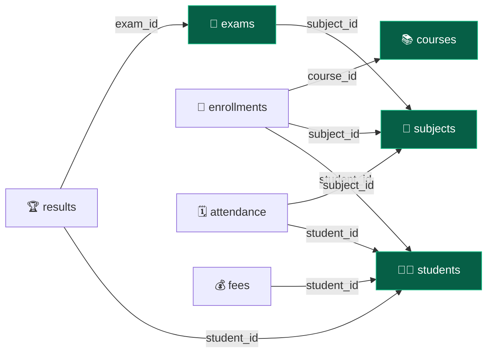
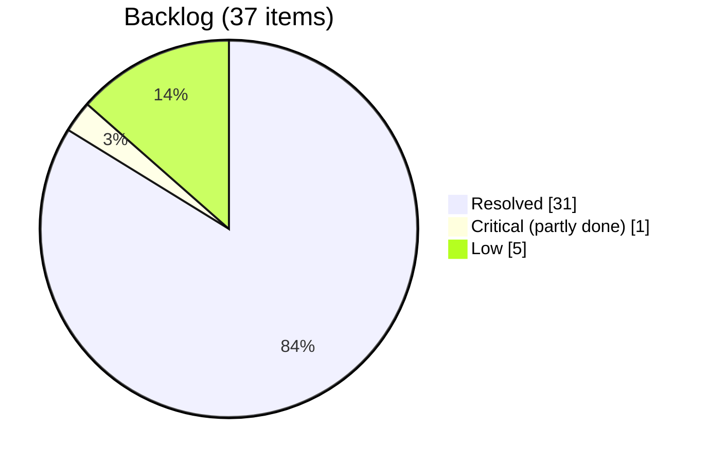
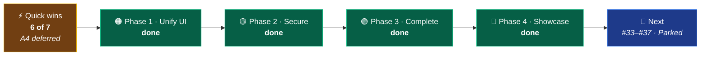

 

# 📋 Project Analysis

**Module-by-module inventory · code-health audit · engineering backlog**

*Last verified against source: **9 Oct 2026** · Stages 0–F of the [Task Board](TASKS.md) on top of commit `ab0a936`*

[📘 README](README.md) · [🗺️ Roadmap](PROJECT_ROADMAP.md) · [✅ Task Board](TASKS.md) · [🧪 Backlog](#-engineering-backlog) · [🚧 Remaining Work](#-remaining-work)

---

## 📑 Table of Contents

| | Section | | Section |
|:---:|---|:---:|---|
| 🩺 | [Health Check at a Glance](#-health-check-at-a-glance) | 🧪 | [Engineering Backlog](#-engineering-backlog) |
| 📐 | [Codebase by the Numbers](#-codebase-by-the-numbers) | 🧱 | [Stubs and Dead Code](#-stubs-and-dead-code) |
| 🧰 | [Tech Stack](#-tech-stack) | 📝 | [Documentation Drift](#-documentation-drift) |
| 🧩 | [Module Inventory](#-module-inventory) | 🚧 | **[Remaining Work](#-remaining-work)** |
| 🔗 | [Referential Integrity](#-referential-integrity) | 📊 | [Completion Summary](#-completion-summary) |
| 🔐 | [Security Review](#-security-review) | 🔬 | [How This Was Verified](#-how-this-was-verified) |

---

## 🩺 Health Check at a Glance

| Check | Result | Evidence |
|---|:---:|---|
| 🛠️ **Compile & package** | 🟢 Pass | `mvnw clean test` → `BUILD SUCCESS` |
| 🧪 **Test suite** | 🟢 55 passing | 7 classes: unit, `@DataJpaTest`, `@SpringBootTest` and `@WebMvcTest` security tests, on in-memory H2 |
| ⚙️ **CI** | 🟢 Configured | `.github/workflows/ci.yml` runs `./mvnw -B test` on Java 21 for every push and pull request |
| 🚀 **Startup** | 🟢 Pass | Boots against MySQL in under 10 s · **88** app endpoints (60 GET, 28 POST) |
| 🔑 **Authentication** | 🟢 Solid | BCrypt, `enabled` flag honoured, CSRF on every POST form, POST logout, first admin seeded from env |
| 🛡️ **Authorization** | 🟢 Solid | Admin / Teacher / Student URL rules plus `sec:authorize` in the UI · 51/51 route × role checks pass |
| 🧮 **Business logic** | 🟢 Working | One `GradeCalculator` for results and marksheets · overdue fees · attendance % · notifications from live data |
| ✔️ **Form validation** | 🟢 Working | Bean Validation on every form and every CSV row; cross-field checks for marks, pass mark and duplicates |
| 🔍 **Search & paging** | 🟢 Working | One paged query per module (5 per page, sorted by id); keyword and date filters combine |
| 🔗 **Referential integrity** | 🟢 Solid | All four parent deletes clear dependent rows; `DeleteCascadeTest` proves it against foreign keys |
| 🎨 **UI consistency** | 🟢 Complete | Every page renders through `layout.html`; one Bootstrap version; styled 403/404/409/413/500 pages |
| 📦 **Uploads** | 🟢 Hardened | JPEG/PNG decoded server-side, 2 MB cap, generated file names, old photo removed after a successful save |

> 🔄 **7–9 Oct 2026:** Stages B to F of the [Task Board](TASKS.md) closed **16 more issues**, including two of the
> three Critical ones (#3 roles, #4 GET deletes; #5 is half done), and added the whole feature set from
> roadmap phases 3 and 4. Working on them turned up **four new low-severity issues (#34–#37)**, listed open
> below.

---

## 📐 Codebase by the Numbers

<table>
<tr>
<td width="50%" valign="top">

**☕ Backend**

| Layer | Count |
|---|:---:|
| 🎯 Controllers | `14` (+ `NotificationAdvice`, `GlobalExceptionHandler`) |
| ⚙️ Service interfaces / impls | `13` / `13` (+ `CustomUserDetailsService`) |
| 🗄️ Repositories | `11` |
| 📦 JPA entities | `11` |
| 🔗 `@ManyToOne` relationships | `9` |
| 🔒 Unique constraints in the database | `7` |
| ✍️ `@Modifying` JPQL deletes | `10` |
| 📊 Aggregate `@Query`s | `6` (4 sums/counts, 2 attendance summaries) |
| 🔍 Search `@Query`s | `2` |
| 📨 DTOs and records | `7` |
| 🧰 Utilities | `4` (`GradeCalculator`, `CsvHelper`, `FileUploadUtil`, `Pages`) |

</td>
<td width="50%" valign="top">

**🎨 Frontend, tests & totals**

| Item | Count |
|---|:---:|
| 🌐 HTTP endpoints | `88` (60 GET · 28 POST) |
| 🖼️ Thymeleaf templates | `57` |
| 💅 CSS files | `11` |
| ⚡ JS files | `3` |
| 🧪 Test classes / tests | `7` / `55` |
| 📄 Java files (main) | `83` |
| 📏 Lines of Java (main) | `7,423` |
| 📏 Lines of test Java | `808` |
| 📏 Templates · CSS · JS | `5,573` · `1,505` · `235` lines |

</td>
</tr>
</table>

---

## 🧰 Tech Stack

| Layer | Technology | Note |
|:---:|---|---|
| ☕ | Java **21** · Spring Boot **3.5.16** | Parent POM pins all Spring versions |
| 🔐 | Spring Security 6 · `thymeleaf-extras-springsecurity6` | Form login, BCrypt, role rules; `sec:authorize` gates the UI |
| 🗄️ | Spring Data JPA · Hibernate · MySQL (`sms_web`) | `ddl-auto=update`; constraints declared on the entities |
| 🎨 | Thymeleaf · Bootstrap **5.3.8** · Bootstrap Icons 1.11.3 · Chart.js 4.4.3 | One Bootstrap version; no Font Awesome or external image hosts |
| ✔️ | Jakarta Bean Validation | Every form, and every row of a CSV import |
| 📄 | OpenPDF **3.0.5** · Apache Commons CSV **1.14.1** | Marksheet and receipt PDFs; student import, student and fee export |
| 🧪 | JUnit 5 · AssertJ · Mockito · H2 · Spring Security Test | Tests need no MySQL |
| 🛠️ | Maven wrapper · GitHub Actions | `./mvnw -B test` in CI; the wrapper is executable for Linux |

---

## 🧩 Module Inventory

Every module has the full **entity → repository → service → controller** chain. The matrix shows how far
each one goes beyond that, and the cards below list what's built.

| # | Module | List | Form | Detail | Search | Paging | `@Valid` | Delete | Extras |
|:---:|---|:---:|:---:|:---:|:---:|:---:|:---:|:---:|---|
| 1 | 🔐 Auth & accounts | — | ✅ | ✅ profile | — | — | ✅ | — | roles · seeding · password change · user admin |
| 2 | 👨‍🎓 Student | ✅ | ✅ 📷 | ✅ | ✅ | ✅ | ✅ | ✅ cascade | marksheet + PDF · attendance % · CSV in/out |
| 3 | 👨‍🏫 Teacher | ✅ | ✅ 📷 | ✅ | ✅ 4 fields | ✅ | ✅ | ✅ | unique email |
| 4 | 📚 Course | ✅ | ✅ | ✅ | ✅ | ✅ | ✅ | ✅ cascade | unique code |
| 5 | 📖 Subject | ✅ | ✅ | ✅ exams | ✅ | ✅ | ✅ | ✅ cascade | unique code |
| 6 | 📝 Enrollment | ✅ | ✅ | ✅ | ✅ | ✅ | ✅ | ✅ | no duplicate enrollments |
| 7 | 🗓️ Attendance | ✅ | ✅ | ✅ | ✅ +date | ✅ | ✅ | ✅ | bulk entry · report |
| 8 | 💰 Fee | ✅ | ✅ | ✅ receipt | ✅ | ✅ | ✅ | ✅ | PDF · overdue flag · CSV out |
| 9 | 🧾 Exam | ✅ | ✅ | ✅ results | ✅ +date | ✅ | ✅ | ✅ cascade | schedule by month · pass rate |
| 10 | 🏆 Result | ✅ | ✅ | ✅ | ✅ | ✅ | ✅ | ✅ | grade engine · marks ≤ total |
| 11 | 📊 Dashboard | — | — | — | via navbar ✅ | — | — | — | notifications · recent activity |

📷 photo upload · cascade = dependent rows are cleared first (see [Referential Integrity](#-referential-integrity)) ·
+date = keyword and date filters combine

<b>🔐 1. Authentication & accounts</b>: login, roles, profile, user admin

 

- [x] `User` entity: `fullName`, `username` (unique), `email` (unique), BCrypt `password`, `role`, `enabled`, `createdAt`
- [x] Registration: duplicate guards, password confirmation, BCrypt, default `ROLE_STUDENT` (view-only)
- [x] `AdminSeeder` creates the first admin from `ADMIN_USERNAME` / `ADMIN_PASSWORD` when none exists
- [x] `SecurityConfig`: role rules, first match wins; `/admin/**` and `/fee/**` admin-only
- [x] `/profile`: own details and change password (`ChangePasswordDto`, current password checked, at least 8 characters)
- [x] `/admin/users`: list accounts, enable or disable, change role, by POST; admins can't change themselves
- [x] Every change is logged to the activity log

<b>👨‍🎓 2. Student</b>: CRUD, photos, marksheet, CSV

 

- [x] `Student` entity: `firstName`, `lastName`, `email` (unique), `phone` (10 digits), `gender`, `course` (free text), `dateOfBirth`, `address`, `photo`
- [x] `StudentController`: 13 routes, including `/{id}/marksheet`, `/{id}/marksheet.pdf`, `/import` and `/export`
- [x] Marksheet: totals, overall percentage and grade from `GradeCalculator`; a pass only if every exam is passed
- [x] Profile shows attendance %, with a "Below 75%" flag
- [x] CSV import validates each row (Bean Validation, email in the database or earlier in the file, existing course) and reports the rest; export uses the same header
- [x] Photos go through `FileUploadUtil`: decoded as JPEG/PNG, 2 MB cap, server-generated names

<b>👨‍🏫 3–6. Teacher · Course · Subject · Enrollment</b>

 

- [x] Detail pages for all four; the subject page lists its exams with Held / Upcoming
- [x] Unique teacher email, course code and subject code in the database; checked on create **and** edit (`existsBy…AndIdNot`)
- [x] An enrollment is unique per (student, course, subject)
- [x] Teacher search covers first name, last name, email and department

<b>🗓️ 7. Attendance</b>: daily, bulk, report

 

- [x] Keyword + date search, each optional, both must match
- [x] Bulk entry: pick a subject and date, mark the whole class; students already recorded are shown and skipped ("Saved N · skipped M")
- [x] Report: present out of total per student, optional subject filter, under 75% highlighted; same `AttendanceSummary` as the profile

<b>💰 8. Fee</b>: receipt, PDF, overdue

 

- [x] `amount` can't be negative
- [x] Detail page is a printable receipt (Fee Statement while unpaid); print styles hide the app shell
- [x] Receipt PDF; `Fee.isOverdue()` drives the list badge, the dashboard count and the notification
- [x] CSV export for spreadsheets, Excel-safe

<b>🧾 9–10. Exam · Result</b>: schedule, grading

 

- [x] Passing marks can't exceed total marks; obtained marks can't exceed the exam's total
- [x] Exam page lists its results with passed, failed and pass rate; schedule groups upcoming exams by month
- [x] Grade and status from `GradeCalculator`: a fail is F, a pass is never below D

<b>📊 11. Dashboard</b>: stats, charts, notifications, activity

 

- [x] Real stat cards, Chart.js gender and records charts, live clock
- [x] Navbar notifications from live data: overdue fees (admin), students under 75% (admin, teacher), exams in the next 7 days (everyone); computed lazily
- [x] Recent Activity panel for admins: the last 10 create, update, delete and import entries

---

## 🔗 Referential Integrity

The schema has **nine foreign keys**. A parent row can only be deleted after its children are removed,
so each `delete*()` method clears them first.

Arrows point from child to parent. Every arrow is cleared before its parent is deleted, so all four
parents (green) delete safely.

| Delete operation | Children cleared first | Outcome |
|---|---|:---:|
| `StudentServiceImpl.deleteStudent` | attendance → enrollments → fees → results, in one `@Transactional` | 🟢 Safe · tested |
| `SubjectServiceImpl.deleteSubject` | attendance → enrollments → results of its exams → exams | 🟢 Safe · tested |
| `CourseServiceImpl.deleteCourse` | enrollments | 🟢 Safe · tested |
| `ExamServiceImpl.deleteExam` | results | 🟢 Safe · tested |
| Teacher · Enrollment · Attendance · Fee · Result | no children | 🟢 Safe |

`DeleteCascadeTest` covers the four parent deletes and fails if a child delete is removed. Any other
constraint error now shows the styled **409** page from `GlobalExceptionHandler` instead of a 500.

---

## 🔐 Security Review

<table>
<tr>
<td width="50%" valign="top">

**✅ In place**

| Control | Detail |
|---|---|
| Roles | Admin / Teacher / Student URL rules; UI gated with `sec:authorize` |
| Password storage | BCrypt; change password checks the current one |
| Accounts | Disabled accounts can't sign in; admins can't disable or demote themselves |
| CSRF | On every POST form; deletes are POST only (GET → 405) |
| Uploads | Image decoded server-side, 2 MB cap, generated names, never the browser's file name |
| Errors | Styled 403 / 404 / 409 / 413 / 500 pages, no stack traces |
| Secrets | DB credentials and the first admin come from environment variables |
| Output escaping | No `th:utext`; no user data inside inline JavaScript |
| CSV export | Formula-looking cells prefixed with `'`, so Excel shows them as text |
| Logging | SQL and DEBUG logging only in the `dev` profile |

</td>
<td width="50%" valign="top">

**⚠️ Remaining**

| Gap | Issue |
|---|:---:|
| Old DB password still in git history, not rotated | #5 |
| Sessions survive a disable or role change until they end | #37 |
| Registration accepts 6-character passwords, the change form 8 | #36 |
| Old photos and password in git history (rewrite is Parked) | — |

</td>
</tr>
</table>

---

## 🧪 Engineering Backlog

> Numbering continues the register in [PROJECT_ROADMAP.md](PROJECT_ROADMAP.md#-engineering-backlog), so issue
> numbers match across both documents. 🆕 marks issues first found during Stages E–F. [Remaining Work](#-remaining-work)
> turns the open items into a checklist.

<b>✅ Resolved (31)</b>

 

| # | Issue | Fixed by | Resolved |
|:---:|---|---|:---:|
| 1 | Invalid derived query aborted Spring context at startup | `EnrollmentRepository` | `21 Sep 2026` |
| 2 | `deleteBySubjectId` targeted the wrong entity → FK violation | `EnrollmentRepository` | `21 Sep 2026` |
| 3 | No roles; self-registration got full rights | Admin / Teacher / Student rules, `AdminSeeder` (C7–C10) | `8 Oct 2026` |
| 4 | Deletes were GET links | POST forms with CSRF on all 9 lists (C4–C6) | `8 Oct 2026` |
| 6 | Only the dashboard used the shared layout | Every page through `LayoutView` (B4–B7) | `7 Oct 2026` |
| 7 | Uploads unchecked, served same-origin | `FileUploadUtil`, 2 MB cap, generated names (C12–C14) | `8 Oct 2026` |
| 8 | Whitelabel 500 for bad ids and FK errors | `GlobalExceptionHandler`, styled error pages (B1–B3) | `7 Oct 2026` |
| 9 | "Total Fees" displayed a record count | `FeeServiceImpl` | `21 Sep 2026` |
| 10 | "Upcoming Exams" listed the oldest exams | `ExamServiceImpl` | `21 Sep 2026` |
| 11 | Search bypassed pagination | One paged query per module (D1–D5) | `8 Oct 2026` |
| 12 | Exam and Result forms lacked `@Valid` | `ExamController` · `ResultController` | `6 Oct 2026` |
| 13 | Magic-date sentinel `1900-01-01` in search | Nullable `@Query` | `6 Oct 2026` |
| 14 | Navbar hardcoded "Admin User" | `common/navbar.html` | `21 Sep 2026` |
| 15 | Notifications hardcoded, badge always 3 | `NotificationService` + `NotificationAdvice` (F1–F2) | `8 Oct 2026` |
| 16 | Gender statistics never rendered | `stats-cards.html` · `charts.html` | `21 Sep 2026` |
| 17 | Two Bootstrap versions | 5.3.8 everywhere (B4, B15) | `7 Oct 2026` |
| 18 | Six empty stub classes | Unused DTOs and `DateUtil` deleted; `CsvHelper`, `FileUploadUtil` implemented (C12, D13, E17) | `8 Oct 2026` |
| 19 | `uploads/` committed | `.gitignore` + `git rm --cached` (C3) | `8 Oct 2026` |
| 20 | `webConfig` class name | Renamed `WebConfig` (B18) | `7 Oct 2026` |
| 21 | `footer.css` held HTML | `static/css/footer.css` | `21 Sep 2026` |
| 22 | Live clock had no elements | `welcome.css` · `welcome.html` | `21 Sep 2026` |
| 23 | Student search returned 500 | `StudentController` | `6 Oct 2026` |
| 24 | Logout was a GET that 404'd | POST form | `6 Oct 2026` |
| 25 | Course, exam and subject deletes violated FKs | Child deletes in one transaction | `6 Oct 2026` |
| 26 | Date-only search returned every row | AND-semantics `@Query` | `6 Oct 2026` |
| 27 | Uniqueness only on create, only in code | DB constraints + `existsBy…AndIdNot` (D6–D8) | `8 Oct 2026` |
| 28 | Marks and amounts unchecked; "Pass · F" possible | Cross-field checks, `@PositiveOrZero`, `GradeCalculator` (D9–D12) | `8 Oct 2026` |
| 29 | Debug output and DEBUG/TRACE logging by default | SLF4J, `application-dev.properties` (C1–C2) | `8 Oct 2026` |
| 30 | Dead code and config (Lombok, `/uploads/**` rule, unused methods) | Removed (B17) | `7 Oct 2026` |
| 31 | External runtime dependencies | Local avatar SVG, Bootstrap Icons only (B9, B10, B16) | `7 Oct 2026` |
| 32 | Edit forms opened with empty date boxes | `spring.mvc.format.date=iso` | `6 Oct 2026` |

<b>🔴 Critical, partly done (1)</b>

 

| # | Issue | Location | Status |
|:---:|---|---|:---:|
| 5 | Database password committed in plaintext. Since 6 Oct it is read from `${DB_PASSWORD}`, but the old value is still in git history and has not been rotated ([task A4](TASKS.md), deferred because other local projects share the account) | `application.properties` history | 🟡 Env var done |

<b>🟢 Low (5)</b>

 

| # | Issue | Location |
|:---:|---|---|
| 33 | Non-numeric input in a number field (only possible by bypassing the browser's number box) shows Spring's raw "Failed to convert…" message | *(no `messages.properties`)* |
| 34 🆕 | The dashboard's "Fees Collected" adds up every fee, pending ones included (₹120,000 shown, ₹60,000 paid) | `FeeRepository.sumAllAmounts()` |
| 35 🆕 | The single attendance form allows two records for the same student, subject and date; only bulk entry checks | `AttendanceController.saveAttendance` |
| 36 🆕 | Registration accepts a 6-character password while changing it needs 8 | `UserRegistrationDto` · `ChangePasswordDto` |
| 37 🆕 | A disabled account, or one given a new role, keeps any session it already has until that session ends | `AdminUserController` (no session registry) |

---

## 🧱 Stubs and Dead Code

None left. Every stub found in the 6 Oct audit was implemented or deleted:

| File | Then | Now |
|---|:---:|---|
| `utility/CscHelper.java` | ❌ Empty, misspelled | ✅ `CsvHelper`: student import and export, fee export (E17–E20) |
| `utility/FileUploadUtil.java` | ❌ Empty | ✅ Image validation, generated names, safe delete (C12) |
| `utility/DateUtil.java` | ❌ Empty | 🗑️ Deleted (D13) |
| `dto/CourseDTO` · `StudentDTO` · `TeacherDTO` | ❌ Empty | 🗑️ Deleted (D13); the `dto/` package now holds 7 classes that are all used |
| Unused repository methods | ⚠️ Dead | 🗑️ Removed (B17) |

---

## 📝 Documentation Drift

Statements in the companion documents that had stopped matching the source, and when they were corrected.

| Claim | Where | Actual | Status |
|---|---|---|:---:|
| "Eight foreign-key relationships" | README · Roadmap | **Nine** | ✅ Fixed 7 Oct |
| `UK` markers on codes and teacher email | ER diagrams | Removed 7 Oct while untrue; **restored 9 Oct** now that D6 added the constraints | ✅ Fixed |
| "66 endpoints · 36 templates · 10 entities · 4.5k lines" | README · Roadmap · this file | **88 · 57 · 11 · 7.4k** after Stages B–F | ✅ Fixed 9 Oct |
| "Tests: 1 passing" · static "Build passing" badge | All three | **55 tests**; the badge is now the real GitHub Actions status | ✅ Fixed 9 Oct |
| Routes table with `GET /delete/{id}` | README | Deletes are POST since C4; table rebuilt from the controllers | ✅ Fixed 9 Oct |
| "Role-based access: planned" · "notifications still static" | README · Roadmap | Both shipped (C7–C10, F1–F2) | ✅ Fixed 9 Oct |

---

## 🚧 Remaining Work

> The [Task Board](TASKS.md)'s 101 tasks are done except **A4** (rotate the old password), which is deferred.
> What's left is the open backlog above plus the Parked items.

### ✅ Done (Stages 0–F)

- [x] **Quick wins**: student search, logout, the three failing deletes, date-only search, Exam/Result validation, docs corrected
- [x] **Phase 1 · Unify the UI** (#6, #8, #17, #20, #30, #31): shared layout, error pages, one Bootstrap, no external dependencies, dead code removed
- [x] **Phase 2 · Security** (#3, #4, #7, #19, #29): roles, POST deletes, hardened uploads, `uploads/` untracked, dev logging profile
- [x] **Phase 3 · Feature set** (#11, #18, #27, #28): paging, uniqueness, marks checks; detail pages, marksheet, receipt, overdue fees, attendance % and report, exam schedule, bulk attendance, CSV import and export
- [x] **Phase 4 · Showcase** (#15): notifications, activity log, PDFs, profile and password, user admin, 55 tests, CI, screenshots

### 🔜 Still open

- [ ] **Rotate the old database password** (#5, task A4), when the other local projects can move off the shared account
- [ ] **Small fixes** (#33–#36): a `messages.properties` type-mismatch message, "Fees Collected" summing only paid fees, a duplicate check on the single attendance form, one password length for registration and change
- [ ] **End sessions on disable or role change** (#37): a `SessionRegistry`, so the change applies at once

### 🧊 Parked

Recorded but deliberately unscheduled, because each needs a schema migration or an outside service:

- `Student.course` as a real foreign key to `Course`, and a Subject → Course link
- Students seeing only their own records, which needs a User → Student link
- Forgot / reset password, which needs a mail server
- Removing the old password and photos from git history (`git filter-repo`), which rewrites published history
- The production concerns in the roadmap's [Future Scope](PROJECT_ROADMAP.md#-future-scope): migrations, REST API, Docker, monitoring

---

## 📊 Completion Summary

| Module | Backend | Frontend | Status | Notes |
|---|:---:|:---:|:---:|---|
| 🔐 Auth & accounts | ✅ | ✅ | 🟢 | Roles, seeding, profile, password change, user admin |
| 👨‍🎓 Student | ✅ | ✅ | 🟢 | CRUD, detail, marksheet + PDF, attendance %, CSV |
| 👨‍🏫 Teacher · 📚 Course · 📖 Subject · 📝 Enrollment | ✅ | ✅ | 🟢 | Detail pages, uniqueness enforced |
| 🗓️ Attendance | ✅ | ✅ | 🟢 | Bulk entry, report, detail |
| 💰 Fee | ✅ | ✅ | 🟢 | Receipt + PDF, overdue, export; dashboard total includes pending (#34) |
| 🧾 Exam · 🏆 Result | ✅ | ✅ | 🟢 | Schedule, pass rate, grade engine, marks checks |
| 📊 Dashboard | ✅ | ✅ | 🟢 | Live data, notifications, recent activity |
| 🎨 Shared layout | ✅ | ✅ | 🟢 | Every page, print styles |
| 🛡️ Roles/permissions | ✅ | ✅ | 🟢 | 51/51 route × role checks |
| 📥 CSV · 🖨️ PDF | ✅ | ✅ | 🟢 | Import, two exports, two PDFs |
| 🧪 Tests · ⚙️ CI | ✅ | — | 🟢 | 55 tests, GitHub Actions |

-yellowgreen?style=for-the-badge)

> Every feature in roadmap phases 1–4 is built. What's open is one deferred chore (#5) and five low-severity
> issues found along the way; none of them blocks a demo.

---

## 🔬 How This Was Verified

| Step | Method | Result |
|---|---|---|
| 🛠️ Build & tests | `mvnw clean test` with `DB_PASSWORD` unset, so only H2 is reachable | `BUILD SUCCESS` · 55 tests, 0 failures, 0 errors |
| 🧬 Tests have teeth | Removed `ExamServiceImpl`'s results delete and re-ran `DeleteCascadeTest` | Fails with H2's referential-integrity error, as it should |
| 🌐 Route count | Every `@GetMapping`/`@PostMapping` in `controller/`, with class prefixes | 88 endpoints (60 GET, 28 POST); the README route table adds up to 88 |
| 🛡️ Roles | Each route requested as Admin, Teacher and Student against a second instance on `:8081` | 51/51 match the role matrix |
| 🧪 Stages B–F | Each task reproduced or exercised on `:8081`, checked in headless Edge, with made-up `@example.com` data and dedicated `qa_*` accounts | Every check passes; temporary records deleted afterwards |
| 📄 PDFs and CSV | PDFs rendered and read back; exports opened in Excel; an export imported into an empty throwaway schema | Same facts as the pages · numbers and dates typed correctly · 16 of 16 rows identical |
| 🐧 Linux readiness | Every template and static path compared with the files on disk, case-sensitively; `mvnw` checked for LF endings and given the executable bit | 111 references, 0 mismatches |

The user's own app on `:8080` and the shared MySQL `root` account were never changed. The throwaway
schema used for the import check (`sms_e19_check`) was dropped afterwards.
